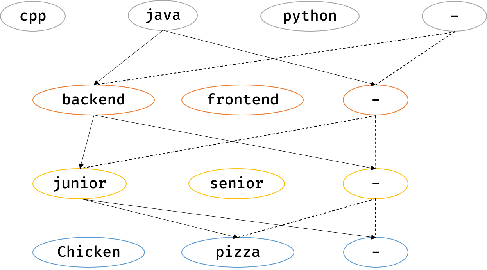

## 문제 1 - 신규 아이디 추천

### 알고리즘

문자열

### 풀이

문제 조건에 맞게 문자열을 조작하는 문제이다. 재귀 함수가 필요없어 어렵지 않은 문제이다.

### 코드

```cpp
#include <bits/stdc++.h>

using namespace std;

string solution(string new_id) {
    string temp = "";

    transform(new_id.begin(), new_id.end(), new_id.begin(), ::tolower);

    for (char c : new_id)
        if ('a' <= c && c <= 'z' || '0' <= c && c <= '9' || strchr("-_.", c))
            temp += c;

    new_id.clear();
    for (char c : temp) {
        if (!new_id.empty() && new_id.back() == '.' && c == '.') continue;
        new_id += c;
    }

    if (new_id.front() == '.') new_id.erase(new_id.begin());
    if (new_id.back() == '.') new_id.pop_back();

    if (new_id.empty()) new_id = "a";

    if (new_id.size() > 15) new_id = new_id.substr(0, 15);
    if (new_id.back() == '.') new_id.pop_back();

    while (new_id.size() < 3) new_id += new_id.back();

    return new_id;
}
```

## 문제 2 - 메뉴 리뉴얼

### 알고리즘

완전 탐색, 백트래킹, 해시, 정렬

### 풀이

코스 요리 메뉴는 최소 2가지 이상의 단품으로 구성되고 최소 2명 이상의 손님으로부터 주문된 조합이어야만 한다. 손님은 최대 20명이고 각 손님이 주문한 단품 수는 최대 10개이다.

나올 수 있는 코스 요리 조합을 완전 탐색해야 한다. 이는 반드시 각 손님의 주문(문자열)에서 나오기 때문에 요리 수에 따른 각 손님 별 메뉴 조합을 백트래킹으로 구하여 해시맵에 저장한다.

### 코드

```cpp
#include <bits/stdc++.h>

using namespace std;

unordered_map<string, int> cands;
bool chk[10];

void backTracking(int idx, string s, string& order, int num) {
    if (s.size() == num) {
        cands[s]++;
        return;
    }

    for (int i = idx; i < order.size(); i++) {
        if (!chk[i]) {
            chk[i] = true;
            backTracking(i + 1, s + order[i], order, num);
            chk[i] = false;
        }
    }
}

vector<string> solution(vector<string> orders, vector<int> course) {
    vector<string> answer;
    for (auto& order : orders) sort(order.begin(), order.end());

    for (auto num : course) {
        for (auto& order : orders) backTracking(0, "", order, num);
        int mx = 0;
        for (auto& cand : cands) mx = max(mx, cand.second);
        if (mx >= 2)
            for (auto& cand : cands)
                if (cand.second == mx) answer.push_back(cand.first);
        cands.clear();
    }

    sort(answer.begin(), answer.end());

    return answer;
}
```

## 문제 3 - 순위 검색

### 알고리즘

해시맵, 비트마스크, 이분 탐색

### 풀이

해시맵을 4개 써서 푼다면 "**- and - and - and - x**"일 경우에 최대 24개의 배열을 이분 탐색해야 한다. 최대 10만 개의 쿼리문이 있으므로 효율성 테스트를 통과하지 못한다.



만일 처음 데이터를 넣을 때 '**-**'까지 고려해준다면 공간 복잡도는 높아지겠지만 시간 복잡도는 현저히 떨어진다. "**java backend junior pizza 150**"을 넣는다고 가정하면 아래 그림과 같이 16개 경로에 점수 150을 넣는 것이다. 키 값은 "**javabackendjuniorpizza**", "**-backendjuniorpizza**", "**java-juniorpizza**", ... , "**- - - -**" 와 같이 문자열을 이어주었다. '**-**'가 나오는 형태를 보면 나올 땐 1, 안 나올 땐 0으로 생각하여 0000~1111로 비트 마스크를 이용해 문자열을 생성하였다.

마지막으로 생성된 모든 해시맵에 접근하여 정렬한 뒤, 쿼리 시에 이분 탐색하면 된다.

### 코드

```cpp
#include <bits/stdc++.h>

using namespace std;

const string ALL = "-";
unordered_map<string, vector<int>> map;

void insert(string* key, int mask, int point) {
    string s = "";
    for (int i = 0; i < 4; i++) {
        s += (mask & (1 << i)) ? ALL : key[i];
        map[s].push_back(point);
    }
}

vector<int> solution(vector<string> info, vector<string> query) {
    vector<int> answer;
    string key[4], tmp;
    int point;

    for (auto& inf : info) {
        istringstream iss(inf);
        iss >> key[0] >> key[1] >> key[2] >> key[3] >> point;
        for (int i = 0; i < 16; i++) insert(key, i, point);
    }

    for (auto& m : map) sort(m.second.begin(), m.second.end());

    for (auto& que : query) {
        istringstream iss(que);
        iss >> key[0] >> tmp >> key[1] >> tmp >> key[2] >> tmp >> key[3] >>
            point;
        string s = key[0] + key[1] + key[2] + key[3];
        vector<int>& v = map[s];
        answer.push_back(v.end() - lower_bound(v.begin(), v.end(), point));
    }

    return answer;
}
```

## 문제 4 - 합승 택시 요금

### 알고리즘

다익스트라 또는 플로이드 와셜

### 풀이

두 명이 택시를 합승하여 같이 가다가 따로 정해진 목적지를 향해 가게 되는데 이 때의 최소 비용을 구하는 문제이다.

A, B가 택시를 같이 타는 출발점을 s, 내린 지점을 e, A와 B의 목적지를 각각 a, b라 하고 cost[i][j]를 i에서 j로 가는 최소 비용이라 한다면 모든 지점 e에 대해 **min_cost = min(min_cost, cost[s][e] + cost[a][e] + cost[b][e])**와 같은 식이 성립한다. (양방향 그래프이다.)

### 코드

```cpp
#include <bits/stdc++.h>

using namespace std;

typedef pair<int, int> pii;

const int MAX = 200 + 1;
const int INF = 2e9;
vector<pii> graph[MAX];

vector<int> dijkstra(int src, int n) {
    vector<int> dist(n + 1, INF);
    priority_queue<pii, vector<pii>, greater<>> pq;
    dist[src] = 0;
    pq.push({dist[src], src});

    while (!pq.empty()) {
        int d = pq.top().first;
        int v = pq.top().second;
        pq.pop();

        if (d > dist[v]) continue;

        for (auto& adj : graph[v]) {
            int adj_v = adj.first;
            int adj_d = d + adj.second;
            if (adj_d < dist[adj_v]) {
                dist[adj_v] = adj_d;
                pq.push({dist[adj_v], adj_v});
            }
        }
    }
    return dist;
}

int solution(int n, int s, int a, int b, vector<vector<int>> fares) {
    int answer = INF;
    for (auto& fare : fares) {
        graph[fare[0]].push_back({fare[1], fare[2]});
        graph[fare[1]].push_back({fare[0], fare[2]});
    }

    vector<int> cost_ab = dijkstra(s, n);
    vector<int> cost_a = dijkstra(a, n);
    vector<int> cost_b = dijkstra(b, n);

    for (int i = 1; i <= n; i++)
        answer = min(answer, cost_ab[i] + cost_a[i] + cost_b[i]);

    return answer;
}
```

## 문제 5 - 광고 삽입

### 알고리즘

부분합

### 풀이

최대 100시간에 해당하는 재생 시간에 일정 크기의 광고를 삽입해 최대 수익을 나게 해야 한다. 100시간을 초로 환산하면 360,000초이다. 충분히 완전 탐색할 수 있는 범위이다.

1. **time[i] = i초에 시작된 구간의 개수 - i초에 끝난 구간의 개수**

   ```cpp
   for (int i = 0; i < n; i++) {
           psum[toInt(logs[i].substr(0, 8))]++;
           psum[toInt(logs[i].substr(9))]--;
   }
   ```

2. **time[i] = i~i+1초 간에 해당하는 구간의 개수**

   ```cpp
       for (int i = 1; i < playTime; i++) psum[i] += psum[i - 1];
   ```

3. **time[i] = 0~i+1초 간의 구간을 포함하는 누적 재생시간**

   ```cpp
       for (int i = 1; i < playTime; i++) psum[i] += psum[i - 1];
   ```

4. **최대 누적 재생시간을 구하여 해당 구간의 시작 시각을 구한다.**

   ```cpp
   long long mx = psum[advTime - 1], start = 0;
   for (int i = advTime; i < playTime; i++) {
       if (psum[i] - psum[i - advTime] > mx) {
           mx = psum[i] - psum[i - advTime];
           start = i - advTime + 1;
       }
   }
   ```

### 코드

```cpp
#include <bits/stdc++.h>

using namespace std;

const int MAX = 360000;
long long psum[MAX];

int toInt(string t) {
    int h, m, s;
    sscanf(t.c_str(), "%d:%d:%d", &h, &m, &s);
    return h * 3600 + m * 60 + s;
}

string toString(int t) {
    string h = to_string(t / 3600);
    string m = to_string((t % 3600) / 60);
    string s = to_string(t % 60);
    if (h.size() < 2) h = "0" + h;
    if (m.size() < 2) m = "0" + m;
    if (s.size() < 2) s = "0" + s;
    return h + ":" + m + ":" + s;
}

string solution(string play_time, string adv_time, vector<string> logs) {
    int n = logs.size();
    int playTime = toInt(play_time);
    int advTime = toInt(adv_time);

    for (int i = 0; i < n; i++) {
        psum[toInt(logs[i].substr(0, 8))]++;
        psum[toInt(logs[i].substr(9))]--;
    }

    for (int i = 1; i < playTime; i++) psum[i] += psum[i - 1];

    for (int i = 1; i < playTime; i++) psum[i] += psum[i - 1];

    long long mx = psum[advTime - 1], start = 0;
    for (int i = advTime; i < playTime; i++) {
        if (psum[i] - psum[i - advTime] > mx) {
            mx = psum[i] - psum[i - advTime];
            start = i - advTime + 1;
        }
    }

    return toString(start);
}
```

## 문제 6 - 카드 짝 맞추기

### 알고리즘

완전 탐색, 백트래킹, 너비 우선 탐색

### 풀이

완전 탐색 구현 문제로 삼성 유형과 비슷하다. 최대 6가지의 카드가 두 장씩 4x4 보드 위에 뒤집어져 있다. 동서남북으로 이동하며 같은 종류의 카드를 뒤집어 카드를 없애야 한다.

1. **모든 카드의 위치를 저장한다.**
2. **나올 수 있는 모든 순열을 만든다. (`next_permutation`)**
3. **주어진 순열을 토대로 순회한다.**
   - 만일 1, 2 카드를 순서대로 뒤집어야 한다면 나올 수 있는 경우의 수는 4가지임에 유의한다.
   - 1, 0 → 1, 1 → 2, 0 → 2, 1
   - 1, 0 → 1, 1 → 2, 1 → 2, 0
   - 1, 1 → 1, 0 → 2, 0 → 2, 1
   - 1, 1 → 1, 0 → 2, 1 → 2, 0

### 코드

```cpp
#include <bits/stdc++.h>

using namespace std;

struct Pos {
    int r, c;

    Pos() {}

    Pos(int _r, int _c) {
        r = _r;
        c = _c;
    }
} cards[7][2];

const int dr[] = {0, 1, 0, -1};
const int dc[] = {1, 0, -1, 0};
const int MAX = 4;
const int INF = 2e9;
int answer;

bool inRange(int r, int c) {
    return (0 <= r && r < MAX) && (0 <= c && c < MAX);
}

int getCost(Pos src, Pos dst, vector<vector<int>>& board) {
    bool visited[MAX][MAX];
    for (int i = 0; i < MAX; i++) memset(visited[i], 0, sizeof(visited[i]));

    int ret = INF;
    queue<pair<Pos, int>> q;
    q.push({{src.r, src.c}, 0});

    while (!q.empty()) {
        int r = q.front().first.r;
        int c = q.front().first.c;
        int cnt = q.front().second;
        q.pop();

        if (visited[r][c]) continue;
        visited[r][c] = 1;

        if (r == dst.r && c == dst.c) {
            ret = min(ret, cnt);
            break;
        }

        for (int i = 0; i < 4; i++) {
            int nr = r + dr[i];
            int nc = c + dc[i];
            if (!inRange(nr, nc)) continue;
            q.push({{nr, nc}, cnt + 1});

            if (board[nr][nc] != 0) continue;

            while (1) {
                nr += dr[i];
                nc += dc[i];
                if (inRange(nr, nc) && board[nr][nc] != 0) {
                    q.push({{nr, nc}, cnt + 1});
                    break;
                } else if (!inRange(nr, nc)) {
                    q.push({{nr - dr[i], nc - dc[i]}, cnt + 1});
                    break;
                }
            }
        }
    }
    return ret;
}

void go(int idx, Pos src, int total, vector<int>& route,
        vector<vector<int>>& board) {
    if (idx == route.size()) {
        answer = min(answer, total);
        return;
    }

    for (int i = 0; i < 2; i++) {
        Pos dst1(cards[route[idx]][i]);
        Pos dst2(cards[route[idx]][1 - i]);
        int cost = getCost(src, dst1, board) + getCost(dst1, dst2, board) + 2;
        board[dst1.r][dst1.c] = board[dst2.r][dst2.c] = 0;
        go(idx + 1, dst2, total + cost, route, board);
        board[dst1.r][dst1.c] = board[dst2.r][dst2.c] = route[idx];
    }
}

int solution(vector<vector<int>> board, int r, int c) {
    answer = INF;
    set<int> s;
    for (int i = 0; i < MAX; i++) {
        for (int j = 0; j < MAX; j++) {
            int num = board[i][j];
            if (num == 0) continue;
            if (!s.count(num))
                cards[num][0] = {i, j};
            else
                cards[num][1] = {i, j};
            s.insert(num);
        }
    }

    vector<int> route(s.begin(), s.end());

    do {
        go(0, Pos(r, c), 0, route, board);
    } while (next_permutation(route.begin(), route.end()));

    return answer;
}
```

## 문제 7 - 매출 하락 최소화

### 알고리즘

트리 DP

### 풀이

말단 노드로부터 위쪽으로 각각의 노드가 루트가 되는 서브트리에 대한 최적해를 구해야 한다. 여기서 서브트리는 팀장인 루트 노드와 팀원인 자식 노드들로 구성되어 있는데 팀장의 워크숍 참석 여부에 따라 최적해가 달라지므로 dp배열은 아래와 같이 정의할 수 있다. 최적해가 달라지는 이유는 팀장은 루트 노드인 동시에 상위 서브 트리의 자식 노드가 될 수 있기 때문이다.

**dp[i][0] : i가 루트인 서브 트리에서 i가 불참하는 경우의 최적해**

**dp[i][1] : i가 루트인 서브 트리에서 i가 참석하는 경우의 최적해**

이 문제의 조건은 각 서브 트리에서 최소 한 개 이상의 노드가 참석해야 한다는 것이다.

그렇기에 dp[i][1]은 반드시 조건에 부합하므로 모든 자식 노드의 dp합에 자신의 비용을 더하면 된다.

dp[i][0]은 두 개의 경우로 나뉘어 계산된다.

첫 번째는 모든 자식 노드 k에 대한 dp합을 구하는 과정에서 한 번이라도 dp[k][1]이 더해졌다면 dp[i][0]은 dp합이 된다.

두 번째는 자식 노드 중에 한 개의 노드도 참석하지 않았다면 강제로 한 명을 참석시켜야 하는데, 손실을 최대한 줄이려면 참석했을 때의 비용과 참석안했을 때의 비용이 최대한 적은 노드 k를 선택해야 한다.

참고 : [카카오 기술 블로그](https://tech.kakao.com/2021/01/25/2021-kakao-recruitment-round-1/)

### 코드

```cpp
#include <bits/stdc++.h>

using namespace std;

const int INF = 2e9;
const int MAX = 300000;
vector<int> tree[MAX];
int sum[MAX];
int dp[MAX][2];

void go(int root, vector<int>& sales) {
    for (auto child : tree[root]) go(child, sales);

    if (tree[root].empty()) {
        dp[root][0] = 0;
        dp[root][1] = sales[root];
        return;
    }

    int sum = 0;
    bool flag = false;
    for (auto child : tree[root]) {
        sum += min(dp[child][0], dp[child][1]);
        if (dp[child][0] >= dp[child][1]) flag = true;
    }

    dp[root][1] = sum + sales[root];

    if (flag) {
        dp[root][0] = sum;
    } else {
        int diff = INF;
        for (auto child : tree[root])
            diff = min(diff, dp[child][1] - dp[child][0]);
        dp[root][0] = sum + diff;
    }
}

int solution(vector<int> sales, vector<vector<int>> links) {
    for (auto& link : links) tree[link[0] - 1].push_back(link[1] - 1);
    go(0, sales);
    return min(dp[0][0], dp[0][1]);
}
```
