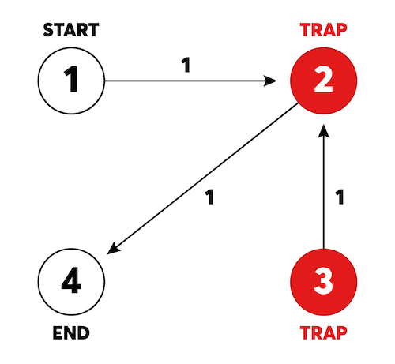
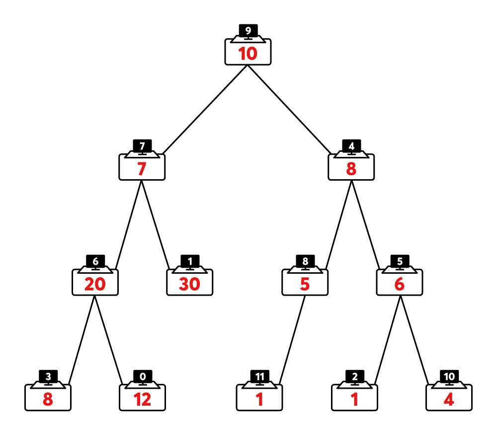

## 문제 1 - 숫자 문자열과 영단어

### 알고리즘

해시맵, 정규식

### 풀이

여러 접근 방법이 있겠지만 그 중에서도 해시맵을 이용하여 해결하였다. 올바른 입력만 주어진다고 했으니 문자열을 만들어가며 체크한다.

### 코드

```cpp
#include <unordered_map>
#include <algorithm>

using namespace std;

const string eng[] = {"zero", "one", "two", "three", "four", "five", "six", "seven", "eight", "nine"};
unordered_map<string, int> map;

void init() {
    for (int i = 0; i < 10; i++) {
        map[eng[i]] = i + 1;
    }
}

int solution(string s) {
    int answer = 0;
    init();
    string str = "";
    for (auto& c : s) {
        if (isdigit(c)) {
            answer = answer * 10 + c - '0';
            continue;
        }
        str += c;
        if (map[str]) {
            answer = answer * 10 + map[str] - 1;
            str = "";
        }
    }
    return answer;
}
```

## 문제 2 - 거리두기 확인하기

### 알고리즘

BFS, DFS, 완전 탐색

### 풀이

맨해튼 거리를 계산하며 이동하는 너비 우선 탐색 문제이다. 거리가 최대 2밖에 되지 않아서 큐를 쓰지 않고도 해결할 수 있다. 방문 배열로 재방문을 방지했고 거리가 2에 다다르면 더이상 탐색하지 않도록 했다.

### 코드

```cpp
#include <string>
#include <vector>
#include <queue>

using namespace std;

const int dx[] = {0, 1, 0, -1};
const int dy[] = {1, 0, -1, 0};

int bfs(vector<string>& place) {
    int n = (int)place.size();
    int m = (int)place[0].size();

    for (int i = 0; i < n; i++) {
        for (int j = 0; j < m; j++) {
            if (place[i][j] == 'P') {
                vector<vector<bool>> visited(n, vector<bool>(m, false));
                queue<pair<pair<int, int>, int>> q;
                q.push({{i, j}, 0});
                visited[i][j] = true;

                while (!q.empty()) {
                    int x = q.front().first.first;
                    int y = q.front().first.second;
                    int cnt = q.front().second;
                    q.pop();

                    if (place[x][y] == 'P' && 0 < cnt && cnt <= 2) return 0;

                    if (cnt == 2) continue;

                    for (int k = 0; k < 4; k++) {
                        int nx = x + dx[k];
                        int ny = y + dy[k];
                        if (nx < 0 || nx >= n || ny < 0 || ny >= m) continue;
                        if (place[nx][ny] != 'X' && !visited[nx][ny]) {
                            visited[nx][ny] = true;
                            q.push({{nx, ny}, cnt + 1});
                        }
                    }
                }
            }
        }
    }
    return 1;
}

vector<int> solution(vector<vector<string>> places) {
    vector<int> answer;
    for (auto& place : places) {
        answer.push_back(bfs(place));
    }
    return answer;
}
```

## 문제 3 - 표 편집

### 알고리즘

링크드 리스트, 세그먼트 트리, 펜윅 트리

### 풀이

행이 1,000,000개이고 명령이 200,000개이다. 여기서 명령은 위아래로 움직이는 것과 삭제, 그리고 삭제 취소가 있다. 효율성 테스트까지 통과하기 위해선 배열로 풀어선 안된다. 이 문제에서 중요한 점은 cmd에 등장하는 모든 X들의 값을 합친 결과가 1,000,000 이하인 경우만 입력으로 주어진다는 점이다. 그렇기 때문에 삽입/삭제 시간 복잡도가 O(1)인 링크드 리스트를 사용할 수 있다.

만일 위의 조건이 없다면 세그먼트 트리나 펜윅 트리를 써서 O((logN)^2) 시간에 쿼리할 수 있다.

### 코드

```cpp
#include <string>
#include <vector>

using namespace std;

struct Node {
    int data;
    Node* prev;
    Node* next;
    Node(int data) : data(data), prev(NULL), next(NULL) {}
};

struct LinkedList {
    Node* head;
    Node* tail;

    LinkedList(int n) : head(NULL), tail(NULL) {
        init(n);
    }

    void init(int n) {
        head = tail = new Node(0);
        for (int i = 1; i < n; i++) {
            Node* node = new Node(i);
            node->prev = tail;
            tail->next = node;
            tail = tail->next;
        }
    }

    Node* erase(Node* node) {
        if (node == head) {
            head = node->next;
            head->prev = NULL;
            return head;
        } else if (node == tail) {
            tail = node->prev;
            tail->next = NULL;
            return tail;
        } else {
            node->prev->next = node->next;
            node->next->prev = node->prev;
            return node->next;
        }
    }

    void insert(Node* node) {
        if (node->prev == NULL) {
            head = node;
            node->next->prev = head;
        } else if (node->next == NULL) {
            tail = node;
            node->prev->next = tail;
        } else {
            node->prev->next = node;
            node->next->prev = node;
        }
    }
};

string solution(int n, int k, vector<string> cmd) {
    string answer;
    vector<Node*> deleted;
    LinkedList* list = new LinkedList(n);
    Node* cur = list->head;
    for (int i = 0; i < k; i++) {
        cur = cur->next;
    }

    for (int i = 0; i < cmd.size(); i++) {
        switch (cmd[i][0]) {
            case 'U': {
                int cnt = stoi(cmd[i].substr(2));
                while (cnt--) {
                    cur = cur->prev;
                }
                break;
            }
            case 'D': {
                int cnt = stoi(cmd[i].substr(2));
                while (cnt--) {
                    cur = cur->next;
                }
                break;
            }
            case 'C': {
                deleted.push_back(cur);
                cur = list->erase(cur);
                break;
            }
            case 'Z': {
                if (!deleted.empty()) {
                    Node* node = deleted.back();
                    deleted.pop_back();
                    list->insert(node);
                }
                break;
            }
            default:
                break;
        }
    }

    for (int i = 0; i < n; i++) answer += 'X';
    Node* head = list->head;
    while (head != NULL) {
        answer[head->data] = 'O';
        head = head->next;
    }

    return answer;
}
```

## 문제 4 - 미로 탈출

### 알고리즘

그래프, 다익스트라, 비트마스킹, 해시맵

### 풀이



start에서 end까지의 최단 거리를 구하는 문제이다. 기본적인 다익스트라 문제와는 다르게 트랩에 방문하면 주변 간선의 방향이 반대로 바뀐다. 그러므로 트랩의 상태를 고려하며 모두 확인해주어야 한다.

트랩의 수는 최대 10개이므로 모든 경우의 수는 2^10 = 1024개이다. 즉, 그래프의 상태가 최대 1024개가 존재하므로 제한 시간 내에 문제를 해결할 수 있다. 경로에 따라 트랩 활성 상태를 쉽게 알기 위하여 비트 마스킹을 사용했고 아래와 같이 해시맵에 미리 저장해두었다.

```cpp
unordered_map<int, int> map;
...
for (int i = 0; i < traps.size(); i++) {
        map[traps[i]] = 1 << i;
    }
```

출발 지점이나 도착 지점이 트랩이라면 반대 방향으로 음수 가중치의 간선을 추가하여 이후의 다익스트라 알고리즘에서 상태를 판별하여 사용할 수 있게 해준다.

```cpp
for (auto& road : roads) {
        graph[road[0]].push_back({road[1], road[2]});
        if (map[road[0]] || map[road[1]]) {
            graph[road[1]].push_back({road[0], -road[2]});
        }
    }
```

상태별 거리를 저장하기 위해 벡터를 정의해준다.

```cpp
vector<vector<int>> costs(1 << 11, vector<int>(n + 1, INF));
```

- 현재 위치의 트랩과 다음 위치의 트랩이 모두 활성화되었거나 둘 다 활성화되지 않은 경우

  양수 가중치여야 하고 새로운 비용이 기존의 비용보다 작아야 한다.

- 현재 위치의 트랩과 다음 위치의 트랩 중 하나만 활성되었을 경우

  음수 가중치여야 하고 새로운 비용이 기존의 비용보다 작아야 한다.

```cpp
for (auto& adj : graph[cur]) {
    int next = adj.first;
    int ncost = adj.second;
    int nstate = state ^ map[next];
    if (state & map[cur] && state & map[next] ||
        !(state & map[cur]) && !(state & map[next])) {
        if (ncost > 0 && cost + ncost < costs[nstate][next]) {
            costs[nstate][next] = cost + ncost;
            pq.push({cost + ncost, {next, nstate}});
        }
    } else if (!(state & map[cur]) && state & map[next] ||
               (state & map[cur]) && !(state & map[next])) {
        if (ncost < 0 && cost - ncost < costs[nstate][next]) {
            costs[nstate][next] = cost - ncost;
            pq.push({cost - ncost, {next, nstate}});
        }
    }
}
```

### 코드

```cpp
#include <vector>
#include <string>
#include <queue>
#include <unordered_map>
#include <algorithm>

using namespace std;

typedef pair<int, int> pii;
typedef pair<int, pii> pipii;

const int INF = 2e9;
vector<vector<pii>> graph;
unordered_map<int, int> map;

int dijktra(int start, int end, int n) {
    vector<vector<int>> costs(1 << 11, vector<int>(n + 1, INF));
    priority_queue<pipii, vector<pipii>, greater<>> pq;
    costs[0][start] = 0;
    pq.push({costs[0][start], {start, 0}});

    while (!pq.empty()) {
        int cost = pq.top().first;
        int cur = pq.top().second.first;
        int state = pq.top().second.second;
        pq.pop();

        if (cur == end) return cost;

        for (auto& adj : graph[cur]) {
            int next = adj.first;
            int ncost = adj.second;
            int nstate = state ^ map[next];
            if (state & map[cur] && state & map[next] ||
                !(state & map[cur]) && !(state & map[next])) {
                if (ncost > 0 && cost + ncost < costs[nstate][next]) {
                    costs[nstate][next] = cost + ncost;
                    pq.push({cost + ncost, {next, nstate}});
                }
            } else if (!(state & map[cur]) && state & map[next] ||
                       (state & map[cur]) && !(state & map[next])) {
                if (ncost < 0 && cost - ncost < costs[nstate][next]) {
                    costs[nstate][next] = cost - ncost;
                    pq.push({cost - ncost, {next, nstate}});
                }
            }
        }
    }
    return INF;
}

int solution(int n, int start, int end, vector<vector<int>> roads,
             vector<int> traps) {
    graph.resize(n + 1);
    for (int i = 0; i < traps.size(); i++) {
        map[traps[i]] = 1 << i;
    }
    for (auto& road : roads) {
        graph[road[0]].push_back({road[1], road[2]});
        if (map[road[0]] || map[road[1]]) {
            graph[road[1]].push_back({road[0], -road[2]});
        }
    }
    return dijktra(start, end, n);
}
```

## 문제 5 - 시험장 나누기

### 알고리즘

이진 트리, 이진 탐색, DP

### 풀이



이번 풀이는 [카카오 해설](https://tech.kakao.com/2021/07/08/2021-%EC%B9%B4%EC%B9%B4%EC%98%A4-%EC%9D%B8%ED%84%B4%EC%8B%AD-for-tech-developers-%EC%BD%94%EB%94%A9-%ED%85%8C%EC%8A%A4%ED%8A%B8-%ED%95%B4%EC%84%A4/)을 참고해서 작성하였음을 미리 밝힌다.

정확성 테스트는 완전 탐색으로 풀이가 가능하지만 효율성 테스트를 통과하기 위해선 최적화 문제를 결정 문제로 바꾸어야 한다. 즉, 가장 큰 그룹의 인원을 최소화시키는 것이 아닌, 가장 큰 그룹의 인원이 L 이하가 될 수 있도록 전환하면 문제를 비교적 쉽게 이해할 수 있다.

위와 같이 문제를 변형하면 L의 최댓값은 이진 탐색을 통해 찾을 수 있다. 가능한 L의 범위는 다음과 같다.

$$max(num) <= L <= sum(num)$$

```cpp
int lo = *max_element(num.begin(), num.end());
int hi = sum;
```

이진 트리는 말단 노드에서부터 탐색하는데 메모이제이션을 통해 나눈 그룹의 수와 가중치의 합을 기록한다.

- `dp[i][0]` = *i*번 노드를 루트 노드로 하는 서브트리를 최대 그룹 인원이 L 이하가 되도록 하기 위한 최소 그룹의 수
- `dp[i][1]` = *i*번 노드를 루트 노드로 하는 서브트리를 최대 그룹 인원이 L 이하가 되도록 dp[i][0]개로 나누었을 때, *i*번 노드가 포함되는 서브트리의 가중치 합의 최솟값

```cpp
for (int i = 0; i < n; i++) {
    dp[i][0] = 1;
    dp[i][1] = 0;
}
// 말단 노드에서 사용하기 위해
dp[10000][0] = 1;
dp[10000][1] = 0;
```

임의의 노드에서 아래와 같은 상황이 발생한다.

1. 자신과 양쪽 노드의 가중치를 합하여도 L보다 작은 경우

   모두 한 그룹으로 정해지고 가중치가 합해진다.

2. 자신과 한쪽 노드의 가중치 합만 L보다 작은 경우

   가중치가 큰 그룹이 떨어져 나가고 작은 그룹의 가중치만 합해진다.

3. 자신의 가중치만 L보다 작은 경우

   양쪽 그룹과 나눠지고 자신의 가중치만 갖는다.

4. 위의 조건을 모두 부합하지 않으면 가장 큰 그룹의 인원이 L 이하가 될 수 없다.

   가능한 L의 범위를 제대로 정해준다면 이 조건을 고려할 필요가 없다.

```cpp
if (num[root] + dp[l][1] + dp[r][1] <= L) {
    dp[root][0] = dp[l][0] + dp[r][0] - 1;
    dp[root][1] = num[root] + dp[l][1] + dp[r][1];
} else if (num[root] + dp[l][1] <= L || num[root] + dp[r][1] <= L) {
    dp[root][0] = dp[l][0] + dp[r][0];
    dp[root][1] = num[root] + min(dp[l][1], dp[r][1]);
} else if (num[root] <= L) {
    dp[root][0] = dp[l][0] + dp[r][0] + 1;
    dp[root][1] = num[root];
}
```

### 코드

```cpp
#include <string>
#include <vector>
#include <algorithm>

using namespace std;

int dp[10001][2];

void init(int n) {
    for (int i = 0; i < n; i++) {
        dp[i][0] = 1;
        dp[i][1] = 0;
    }
    dp[10000][0] = 1;
    dp[10000][1] = 0;
}

void dfs(int root, int L, vector<int>& num, vector<vector<int>>& links) {
    if (root == -1) return;

    int l = links[root][0];
    int r = links[root][1];

    dfs(l, L, num, links);
    dfs(r, L, num, links);

    l = l == -1 ? 10000 : l;
    r = r == -1 ? 10000 : r;

    if (num[root] + dp[l][1] + dp[r][1] <= L) {
        dp[root][0] = dp[l][0] + dp[r][0] - 1;
        dp[root][1] = num[root] + dp[l][1] + dp[r][1];
    } else if (num[root] + dp[l][1] <= L || num[root] + dp[r][1] <= L) {
        dp[root][0] = dp[l][0] + dp[r][0];
        dp[root][1] = num[root] + min(dp[l][1], dp[r][1]);
    } else if (num[root] <= L) {
        dp[root][0] = dp[l][0] + dp[r][0] + 1;
        dp[root][1] = num[root];
    }
}

int solution(int k, vector<int> num, vector<vector<int>> links) {
    int n = (int)links.size();
    int sum = 0;
    int root = n * (n - 1) / 2;
    for (int i = 0; i < n; i++) {
        sum += num[i];
        root -= max(links[i][0], 0) + max(links[i][1], 0);
    }

    int lo = *max_element(num.begin(), num.end());
    int hi = sum;
    int answer = hi;

    while (lo <= hi) {
        init(n);
        int mid = (lo + hi) >> 1;
        dfs(root, mid, num, links);
        if (dp[root][0] <= k) {
            answer = min(answer, mid);
            hi = mid - 1;
        } else {
            lo = mid + 1;
        }
    }

    return answer;
}
```
