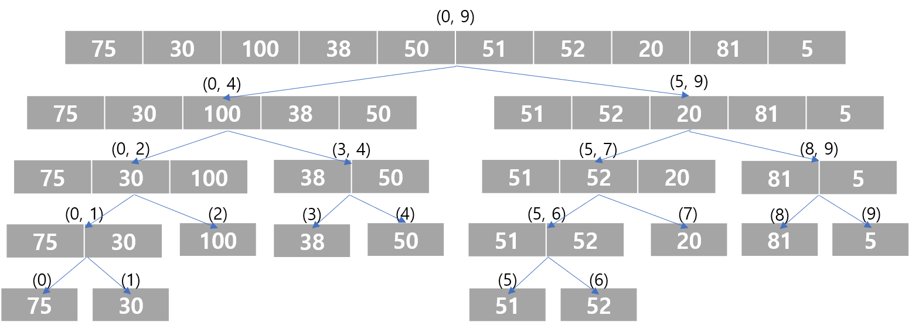
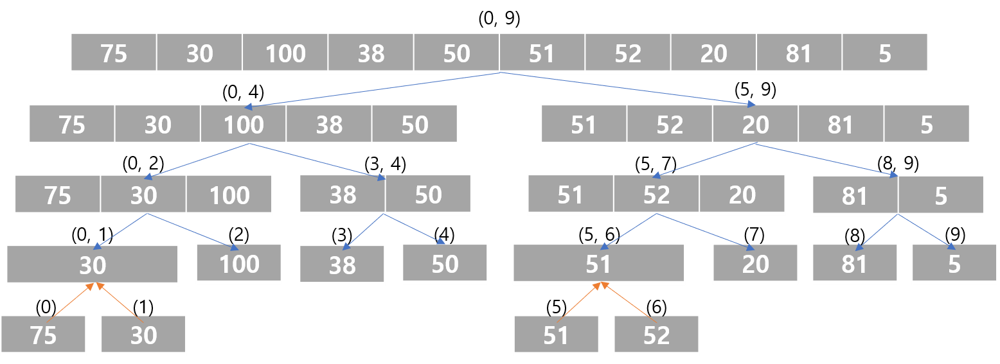
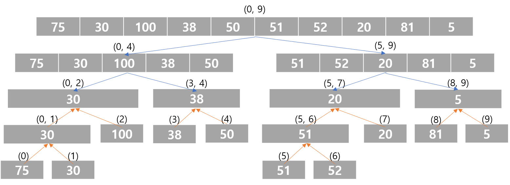
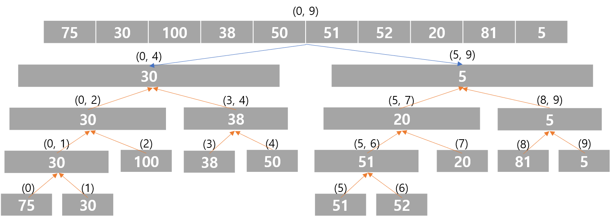
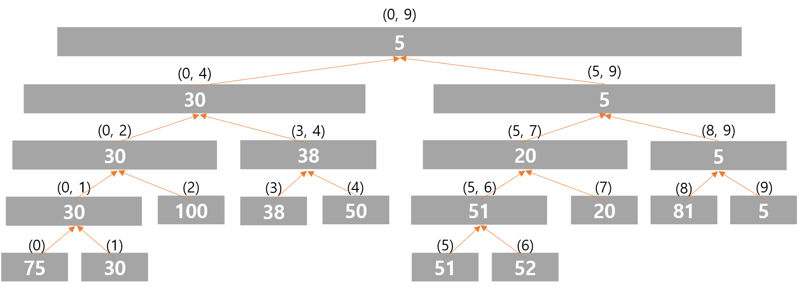

### 문제 링크

[2357번: 최솟값과 최댓값](https://www.acmicpc.net/problem/2357)

### 알고리즘

세그먼트 트리

### 풀이

세그먼트 트리는 구간에 대한 정보를 저장하는데 쓰이는 트리 자료구조이다. 저장된 구간에서 주어진 구간을 빠르게 쿼리할 수 있어 쿼리 문제에 자주 등장한다. 특히 특정 구간의 최솟값 또는 최댓값을 찾는 문제는 자주 출제되는 문제이다. 이런 문제를 구간 최소 쿼리(range minimum query, RMQ)라 부른다.



문제에 나온 예제를 위의 그림처럼 19개의 구간으로 나눌 수 있다. 이는 이진 트리 구조이지만 메모리 절약을 위해 1차원 배열로 표현한다. 초기화 과정은 아래와 같다.

<br></br>

<br></br>

<br></br>



- 배열의 길이는 N에서 가장 가까운 2의 거듭제곱으로 올림하고 2를 곱하거나 2의 제곱인 4를 곱해주면 된다.
- 트리 전체의 루트를 배열의 1번 원소로 잡고, 노드 *i*의 왼쪽 자손과 오른쪽 자손을 각각 2*i*, 2*i*+1 인덱스에 저장하도록 한다.
- query 메서드에서 `nodeLeft`와 `nodeRight`는 해당 노드의 표현 범위를 나타낸다.
  - `node`가 3이면 각각 5와 9를 가리킨다.
- 시간 복잡도는 *O(MlogN)*이다.

### 코드

```cpp
#include <algorithm>
#include <iostream>
#include <vector>
using namespace std;

const int INF = 1e9;

struct RMQ {
    int n;
    vector<int> rangeMin;

    RMQ(const vector<int>& array) {
        n = array.size();
        rangeMin.resize(n * 4);
        init(array, 1, 0, n - 1);
    }

    int init(const vector<int>& array, int node, int left, int right) {
        if (left == right) return rangeMin[node] = array[left];
        int mid = (left + right) / 2;
        return rangeMin[node] = min(init(array, node * 2, left, mid),
                                    init(array, node * 2 + 1, mid + 1, right));
    }

    int query(int left, int right, int node, int nodeLeft, int nodeRight) {
        if (right < nodeLeft || nodeRight < left) return INF;
        if (left <= nodeLeft && nodeRight <= right) return rangeMin[node];
        int mid = (nodeLeft + nodeRight) / 2;
        return min(query(left, right, node * 2, nodeLeft, mid),
                   query(left, right, node * 2 + 1, mid + 1, nodeRight));
    }

    int query(int left, int right) { return query(left, right, 1, 0, n - 1); }
};

int main() {
    ios::sync_with_stdio(false);
    cin.tie(0);
    int n, m;
    cin >> n >> m;
    vector<int> arr(n), arr2(n);
    for (int i = 0; i < n; i++) {
        cin >> arr[i];
        arr2[i] = -arr[i];
    }

    RMQ rangeMinQuery(arr);
    RMQ rangeMaxQuery(arr2);

    for (int i = 0, a, b; i < m; i++) {
        cin >> a >> b;
        cout << rangeMinQuery.query(a - 1, b - 1) << ' ';
        cout << -rangeMaxQuery.query(a - 1, b - 1) << '\n';
    }

    return 0;
}
```
