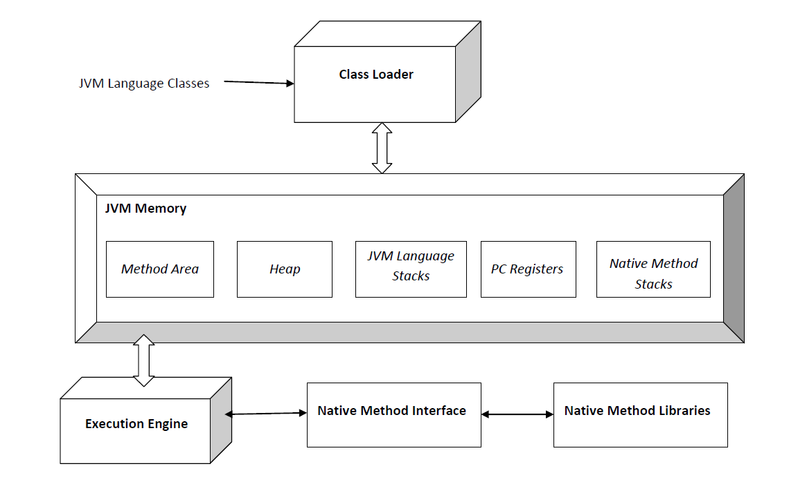

## JVM이란 무엇인가

자바는 운영체제에 독립적으로 실행가능하다. 이를 가능케 한 것이 바로 JVM(Java Virtual Machine)이다. 일반적인 프로그램이 OS만을 거치고 하드웨어로 전달되는 것과 달리, 바이트 코드로 이루어진 자바 프로그램은 OS 위에 있는 JVM을 통해 해석(interpret)되어 전달된다. 그렇기에 속도가 느리다는 단점도 존재한다. (JIT 컴파일러와 Hotspot등의 신기술로 이를 어느정도 극복할 수 있다.)

### 바이트 코드

c언어로 작성된 소스 파일(\*.c)은 gcc와 clang과 같은 컴파일러에 의해 바이너리 코드로 이루어진 목적 파일(\*.obj)로 변환된다. 물론 이진 코드이기에 컴퓨터가 읽을 수 있지만 완전한 기계어가 아니기 때문에 링커를 통해 실행 파일(\*.exe)로 변환해야 한다.

이와 반면에, 자바로 작성된 소스 파일(\*.java)은 자바 컴파일러(javac.exe)에 의해 JVM이 이해할 수 있는 바이트 코드의 클래스 파일(\*.class)로 변환된다. 이를 JVM이 해석하여 실행한다.

### JVM 구성 요소



By Michelle Ridomi - 자작, CC BY-SA 4.0, [https://commons.wikimedia.org/w/index.php?curid=35963523](https://commons.wikimedia.org/w/index.php?curid=35963523)

JVM은 크게 클래스 로더, 메모리 영역, 실행 엔진으로 구성되어 있다.

- **클래스 로더(Class Loader)**

  자바는 동적 로딩(Dynamic Loading)을 지원하기 때문에 실행 시에 모든 클래스를 불러오지 않고 임의의 클래스를 처음 참조할 때에 클래스 로더를 통해 로드한다. 불러오는데 성공하면 클래스를 분석하여 적합한 메모리 영역에 저장한다.

- **메모리 영역(JVM Memory)**
  - **메소드 영역(Method Area)** - 모든 쓰레드가 공유하는 메소드 영역엔 static 변수를 포함한 모든 class-level 데이터가 들어있다.
  - **힙 영역(Heap Area)** - 모든 객체와 해당 인스턴스 및 배열이 저장된다. 또한 힙 영역도 모든 쓰레드가 공유한다.
  - **스택 영역(Stack Area)** - 스레드가 생성됨과 동시에 각자 고유의 스택을 갖는다. 모든 지역 변수를 저장한다.
  - **PC Registers** - 각 스레드는 별도의 PC(program counter) 레지스터를 가지고 있으며, 스레드가 수행해야 할 메모리 주소를 담는다.
  - **Native Method Stacks** - 자바가 아닌 언어로 작성된 메서드를 지원하기 위한 스택이다. 스택 영역과 마찬가지로 별도의 스택을 갖는다.
- **실행 엔진(Execution Engine)**

  메모리 영역에 할당된 바이트 코드는 실행 엔진에 의해 실행된다. 실행 엔진에는 인터프리터, JIT 컴파일러, GC가 있다.

  - **인터프리터(Interpreter)** - 인터프리터는 바이트 코드를 한 줄씩 읽고 실행한다.
  - **JIT 컴파일러** - 인터프리터 방식은 반복되는 코드를 매번 새롭게 읽어야 한다는 단점이 있다. JIT 컴파일러는 반복된 코드가 있을 때 바이트 코드를 네이티브 코드로 컴파일 하는 역할을 수행한다. 아래에서 자세히 설명한다.
  - **GC(Garbage Collector)** - 자바는 메모리를 수동으로 관리해야 하는 C언어와 다르게 자동으로 메모리를 관리한다. GC는 메모리에 있는 모든 객체를 검사하여 어느 곳에서도 참조되지 않는 객체를 찾아내어 제거한다. 핫스팟 JVM에서는 힙 영역을 Young Generation(eden, survivor0, survivor1), Old Generation, Permanent Generation으로 나누고 minorGC와 majorGC로 관리한다. 이에 관한 내용은 [오라클 공식 문서](https://www.oracle.com/webfolder/technetwork/tutorials/obe/java/gc01/index.html)에 잘 정리되어 있다.

### JIT 컴파일러

설명에 앞서, 프로그램을 만드는 전통적인 방법은 정적 컴파일 방식과 인터프리터 방식으로 나눌 수 있다. 정적 컴파일 방식은 C언어와 같이 실행하기 전에 프로그램 코드를 기계어로 번역하는 반면, 인터프리터 방식은 실행하는 중에 코드를 한 줄씩 읽어가며 해당 기계어 코드를 실행한다.

JIT 컴파일러는 이들을 혼합한 방식이라 생각할 수 있는데, 실행 시점에서 인터프리터 방식으로 기계어 코드를 생성하면서 그 코드를 캐싱하여, 같은 코드가 여러 번 반복될 때 매번 기계어 코드를 생성하는 것을 방지한다.

## 컴파일 및 실행

컴파일 및 실행을 하기 위해선 JDK와 JRE를 다운로드 해야 한다.

**JDK(Java Development Kit)** - Java 환경에서 실행되는 프로그램을 개발하기 위한 툴들을 모아놓은 소프트웨어 패키지이다. JRE, 컴파일러(javac.exe), 역어셈블러(javap.exe), 디버거 등을 포함한다. 현재 오라클을 포함한 여러 기업 또는 단체에서 JDK를 배포하고 있다.

**JRE(Java Runtime Environment)** - 자바 런타임 환경은 컴퓨터 운영체제 위에서 실행되면서 자바를 위한 부가적인 서비스를 제공하는 소프트웨어 계층이다. JRE에는 클래스 라이브러리, JVM 등이 포함된다.

따라서 [JDK](https://www.oracle.com/java/technologies/javase-downloads.html)를 설치하면 호환 버전의 JRE가 포함되고, JRE에는 기본 스펙의 JVM이 포함된다. 상업적 용도의 개발을 위해선 오라클을 포함한 여러 써드 파티 업체의 openJDK를 설치할 수 있다.

```java
package com.company;

public class Main {

    public static void main(String[] args) {
        int a = 100;
        System.out.println(a);
    }
}
```

위의 _com.company.Main.java_ 파일을 컴파일(javac)하면 _com.company.Main.class_ 파일이 생성되고, 이를 역어셈블(javap)하면 어셈블리어 같은 바이트 코드를 볼 수 있다.

```bash
$ javac -d . com/company/Main.java
$ javap -c com.company.Main
Compiled from "Main.java"
public class com.company.Main {
  public com.company.Main();
    Code:
       0: aload_0
       1: invokespecial #1          // Method java/lang/Object."<init>":()V
       4: return

  public static void main(java.lang.String[]);
    Code:
       0: bipush        100
       2: istore_1
       3: getstatic     #7          // Field java/lang/System.out:Ljava/io/PrintStream;
       6: iload_1
       7: invokevirtual #13         // Method java/io/PrintStream.println:(I)V
      10: return
}
$ java com.company.Main
100
```

마지막으로 java를 실행하면 정수 *a*의 값인 100이 성공적으로 출력된다.
