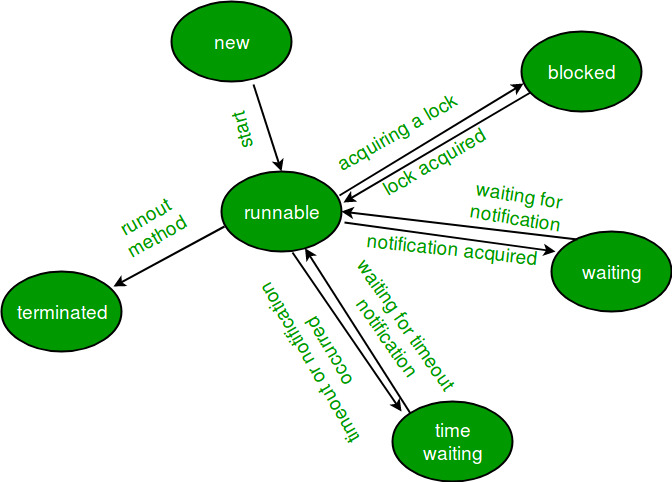

## 프로세스와 쓰레드

**프로세스**는 실행 환경을 포함하며 연속적으로 실행되고 있는 프로그램을 말한다.

**쓰레드**는 경량 프로세스라고도 불리는 만큼 적은 자원을 필요로 하며 프로세스의 자원을 공유한다.

모든 자바 어플리케이션은 적어도 한 개 이상의 쓰레드를 갖는다. 메모리 관리, 시스템 관리, 신호 처리 등과 같은 백그라운드에서 실행되는 많은 쓰레드도 분명 존재하지만 프로그램 관점에서 볼 때 **main** 메서드가 첫 번째 쓰레드이며, 이로부터 여러 다른 쓰레드를 생성할 수 있다.

멀티쓰레딩은 단일 프로그램에서 두 개 이상의 쓰레드를 동시에 실행하는 것을 의미한다. 멀티쓰레드 환경에서는 CPU 코어 수가 중요한데, 코어 개수만큼의 쓰레드를 실행할 수 있기 때문이다.

### 쓰레드의 장점

- 프로세스에 비해 가볍고 생성 시 소요되는 시간과 자원이 적다.
- 속한 프로세스의 데이터와 코드를 공유한다.
- 프로세스보다 컨텍스트 스위칭(Context Switching) 비용이 적다.
- 쓰레드 간의 통신이 프로세스 통신보다 상대적으로 쉽다.

## Thread 클래스와 Runnable 인터페이스

자바에서의 쓰레드 생성 방법은 크게 두 가지가 있다.

### **Thread 클래스 상속**

**java.lang.Thread** 클래스를 상속받아 `run()` 메서드를 오버라이딩하여 쓰레드 클래스를 만들 수 있다. 그런 다음 객체를 생성하고 `start()` 메서드를 호출하면 쓰레드가 실행된다.

```java
public class ExtendsThread extends Thread {

    public ExtendsThread(String name) {
        super(name);
    }

    @Override
    public void run() {
        System.out.println("Extends-START " + Thread.currentThread().getName());
        try {
            Thread.sleep(1000L);
            doDBProcessing();
        } catch (InterruptedException e) {
            e.printStackTrace();
        }
        System.out.println("Extends-END " + Thread.currentThread().getName());
    }

    private void doDBProcessing() throws InterruptedException {
        Thread.sleep(5000L);
    }
}
```

### **Runnable 인터페이스 구현**

**java.lang.Runnable** 함수형 인터페이스의 `public void run()` 메서드를 구현하여 runnable 클래스를 만들 수 있다. 쓰레드를 사용하기 위해선 이 클래스의 객체를 쓰레드 객체에 넘겨주어 `start()` 메서드를 실행하면 된다.

```java
public class ImplementsRunnable implements Runnable {

    public void run() {
        System.out.println("Implements-START " + Thread.currentThread().getName());
        try {
            Thread.sleep(1000L);
            doDBProcessing();
        } catch (InterruptedException e) {
            e.printStackTrace();
        }
        System.out.println("Implements-END " + Thread.currentThread().getName());
    }

    private void doDBProcessing() throws InterruptedException {
        Thread.sleep(5000L);
    }
}
```

테스트 코드는 다음과 같다.

```java
public class ThreadTest {

    public static void main(String[] args) {
        Thread t1 = new ExtendsThread("t1");
        Thread t2 = new ExtendsThread("t2");
        System.out.println("Start ExtendsThread");
        t1.start();
        t2.start();
        System.out.println("ExtendsThread has been started");
        Thread t3 = new Thread(new ImplementsRunnable(), "t3");
        Thread t4 = new Thread(new ImplementsRunnable(), "t4");
        System.out.println("Start ImplementsRunnable");
        t3.start();
        t4.start();
        System.out.println("ImplementsRunnable has been started");
    }
}
```

실행 결과 :

```
Start ExtendsThread
ExtendsThread has been started
Extends-START t2
Extends-START t1
Start ImplementsRunnable
ImplementsRunnable has been started
Implements-START t4
Implements-START t3
Implements-END t4
Extends-END t2
Extends-END t1
Implements-END t3
```

쓰레드를 시작하면 JVM의 쓰레드 스케쥴러에 의해 실행되고 우리가 직접 제어할 수 없게 된다. 쓰레드마다 우선순위 정도는 지정할 수 있지만 반드시 높은 우선순위의 쓰레드가 먼저 실행된다고는 확언할 수 없다.

위의 코드에서 `sleep(Long millis)` 메서드는 해당 쓰레드가 대기 상태로 들어갔다가 깨어나지 못할 때 `InterruptedException` 예외를 던진다. try-catch 문을 써도 되지만 이 대신에 아래 코드와 같이 롬복의 어노테이션인 `@SneakyThrows`를 사용할 수도 있다.

```java
@Override
@SneakyThrows
public void run() {
    System.out.println("Extends-START " + Thread.currentThread().getName());
    Thread.sleep(1000L);
    doDBProcessing();
    System.out.println("Extends-END " + Thread.currentThread().getName());
}
```

### Thread vs Runnable

클래스가 일반적인 쓰레드로만 실행되는 것이 아니라 더 많은 기능을 제공해야 할 경우 Runnable 인터페이스를 구현하여 쓰레드로 실행하는 방법을 강구해야 한다. 반대로 단지 쓰레드로써의 기능만을 원한다면 쓰레드 클래스를 상속하는 것이 좋을 것이다.

자바에선 다중 상속이 불가능하기 때문에 상속이 필요한 경우나 이를 대비해 Runnable 인터페이스를 구현하는 것이 바람직하다.

## 쓰레드의 상태



> Core Java Vol 1, 9th Edition, Horstmann, Cay S. & Cornell, Gary_2013

쓰레드는 항상 다음과 같은 상태 중 하나로 존재한다.

1. **New** - 새로운 쓰레드가 생성되고 아직 시작하지 않은 상태
2. **Runnable** - 실행할 준비가 되었거나 실행중인 상태
3. **Blocked** - 락(lock)이 풀릴 때까지 기다리는 상태
4. **Waiting** - 다른 쓰레드가 특정 작업을 수행할 때까지 대기중인 상태
5. **Timed waiting** - 일정 시간동안 대기중인 상태
6. **Terminated** - 모든 실행을 마친 상태

### 쓰레드 스케쥴링 관련 메서드

- **sleep()** - 쓰레드를 일정 시간(ms)동안 멈추게 한다.
- **run()** - 쓰레드에 할당된 runnable을 실행한다.
- **start()** - 쓰레드를 시작한다.
- **interrupt()** - 쓰레드에게 작업을 멈추라고 요청한다.
- **yield()** - 자신에게 주어진 실행 시간을 다른 쓰레드에게 양보한다.
- **join()** - 자신이 하던 작업을 멈추고 다른 쓰레드가 지정된 시간동안 작업을 수행할 때 사용한다.

## 쓰레드의 우선순위

쓰레드는 우선순위(priority)라는 속성(멤버 변수)을 가지고 있는데, 우선순위 값이 높을수록 더 많은 작업시간을 갖게 된다.

```java
void setPriority(int newPriority);
int getPriority();

public static final int MAX_PRIORITY  = 10;   // 최대 우선순위
public static final int MIN_PRIORITY  = 1;    // 최소 우선순위
public static final int NORM_PRIORITY = 5;    // 보통 우선순위
```

우선순위의 값은 1~10이 있으며 기본값은 5이다. 우선순위에 따라 실행 결과가 어떻게 달라지는지 확인해보자.

```java
class App {

    public static void main(String[] args) {
        Thread th1 = new Thread(new MyRunnable(1, "-"));
        Thread th2 = new Thread(new MyRunnable(10, "|"));
        System.out.println("Priority of th1(-) : " + th1.getPriority());
        System.out.println("Priority of th2(|) : " + th2.getPriority());
        th1.start();
        th2.start();
    }
}

class MyRunnable implements Runnable {

    String mark;

    public MyRunnable(int priority, String mark) {
        Thread.currentThread().setPriority(priority);
        this.mark = mark;
    }

    @Override
    public void run() {
        for (int i = 0; i < 100; i++) {
            System.out.print(mark);
            for (int j = 0; j < 1_000_000_000; j++) {
                ;
            }
        }
    }
}
```

```
Priority of th1(-) : 1
Priority of th2(|) : 10
-||----|||||||||-----------------------------------------------------------------------------------------------|||||||||||||||||||||||||||||||||||||||||||||||||||||||||||||||||||||||||||||||||||||||||
```

위의 실행 결과는 맥OS 듀얼 코어를 통해 나온 결과이다. 쓰레드의 우선순위에 따른 차이가 전혀 없음을 볼 수 있는데, OS의 스케쥴링 정책과 JVM의 구현에 따라 우선순위 정책이 달라지기 때문이다. 굳이 쓰레드에 우선순위를 두고 싶다면 우선순위 큐를 활용하는 것이 나을 수 있다.

### Main 쓰레드

앞서 말했듯이 모든 자바 응용 프로그램은 한 개 이상의 쓰레드를 갖는다. 이 중 하나는 반드시 메인 쓰레드여야만 한다. 잘 알고 있겠지만 우리가 자주 보는 `public static void main(String[] args)` 메인 메서드가 바로 메인 쓰레드에서 실행되는 메서드이다.

### Daemon 쓰레드

데몬 쓰레드는 다른 일반 쓰레드(데몬 쓰레드가 아닌)의 작업을 돕는 보조적인 역할을 수행하는 쓰레드이다. 당연히 일반 쓰레드가 종료되면 데몬 쓰레드 또한 종료된다. 일반적으로 가비지 컬렉터, 화면 갱신 등의 작업을 실행하는 데 쓰이며, 해당 쓰레드에 `setDaemon()` 메서드를 사용해 데몬 쓰레드로 만들 수 있다.

## 동기화

쓰레드 세이프(thread safety)는 멀티 쓰레드 환경에서 굉장히 중요한 주제이다. 위키피디아에서는 이를 아래와 같이 정의한다.

> 스레드 안전(thread safety)은 멀티 스레드 프로그래밍에서 일반적으로 어떤 함수나 변수, 혹은 객체가 여러 스레드로부터 동시에 접근이 이루어져도 프로그램의 실행에 문제가 없음을 뜻한다.

즉, 이는 쓰레드A의 함수가 실행중일 때, 쓰레드B의 함수를 동시에 실행하더라도 각 함수의 수행 결과가 올바르게 나오는 것이라 볼 수 있다.

필드 값을 변경하는 것이 원자적(atomic) 연산이 아니기 때문에 데이터 불일치(data inconsistency)가 발생한다.

```java
public class ThreadSafety {

    public static void main(String[] args) throws InterruptedException {

        ProcessingThread pt = new ProcessingThread();
        Thread t1 = new Thread(pt, "t1");
        t1.start();
        Thread t2 = new Thread(pt, "t2");
        t2.start();
        //wait for threads to finish processing
        t1.join();
        t2.join();
        System.out.println("Processing count=" + pt.getCount());
    }

}

class ProcessingThread implements Runnable {

    private int count;

    @Override
    public void run() {
        for (int i = 1; i < 5; i++) {
            processSomething(i);
            count++;
        }
    }

    public int getCount() {
        return this.count;
    }

    private void processSomething(int i) {
        // processing some job
        try {
            Thread.sleep(i * 1000L);
        } catch (InterruptedException e) {
            e.printStackTrace();
        }
    }

}
```

위의 코드에서 각 쓰레드에서 1씩 네 번 증가해 쓰레드가 종료된 후에 8이 나와야 한다. 하지만 실제로 실행해보면 count는 5, 6, 7, 8 중 하나임을 볼 수 있다. 이 연산이 원자적 연산이 아니기에 발생하는 현상이다.

자바에선 쓰레드 세이프하게 멀티 쓰레딩을 실행할 수 있도록 여러 방법을 지원한다.

- **synchronized** 키워드를 활용한 동기화는 가장 쉽고 널리 쓰이는 방법이다.

  ```java
  @Override
  public synchronized void run() {
      for (int i = 1; i < 5; i++) {
          processSomething(i);
          count++;
      }
  }

  또는

  @Override
  public void run() {
      for (int i = 1; i < 5; i++) {
          processSomething(i);
          synchronized (this) {
              count++;
          }
      }
  }
  ```

- **java.util.concurrent.atomic** 패키지의 AtomicInteger와 같은 Atomic 래퍼 클래스를 사용한다.

  ```java
  private final AtomicInteger count = new AtomicInteger(0);

  @Override
  public void run() {
      for (int i = 1; i < 5; i++) {
          processSomething(i);
          count.incrementAndGet();
      }
  }
  ```

- **java.util.concurrent.locks** 패키지의 락(lock)을 활용한다.

  ```java
  private int count;
  private final Lock lock = new ReentrantLock();

  @Override
  public void run() {
      lock.lock();
      for (int i = 1; i < 5; i++) {
          processSomething(i);
          count++;
      }
      lock.unlock();
  }
  ```

- **ConcurrentHashMap**과 같은 쓰레드 세이프한 컬렉션을 사용한다.

### synchronized 키워드

JVM은 동기화된 코드를 한 번에 단 하나의 쓰레드만 실행시키도록 보장하므로, 동기화를 통해 멀티쓰레딩 환경을 안전하게 구현할 수 있다. `synchronized` 키워드를 통해 내부적으로 객체 또는 클래스에 락을 걸어 하나의 쓰레드만 접근 허용한다.

- 쓰레드가 동기화된 코드를 실행하기 전에는 반드시 공유 객체의 락(lock)을 획득해야 하고 코드 실행이 끝나면 락을 해제하여 다른 쓰레드가 접근할 수 있게 한다. 이 과정이 진행될 동안 다른 쓰레드는 대기 상태에 머물게 된다.
- `synchronized` 키워드를 두 가지 방법으로 사용할 수 있는데, 하나는 메서드 자체를 동기화로 만드는 것이고, 다른 하나는 동기화 블록을 생성하는 것이다.
- 메서드 자체를 동기화로 만들면 기본적으로 객체에 락을 걸고, 만일 static 메서드라면 클래스에 락을 건다. **best practice**는 동기화 블록을 사용해 메서드에서 동기화가 필요한 부분만 처리하는 것이다.
- 동기화 블록을 생성하는 동안 락을 획득할 리소스, 즉 클래스 또는 객체를 제공해야 한다.
- `synchronized(this)`로 동기화 블록에 들어가기 전에 객체에 락을 걸 수 있다.
- 만약 한 클래스에 여러 개의 동기화 블록이 있고 그 중 하나가 객체에 락을 건 경우, 다른 동기화 블록은 절대 동시에 실행될 수 없다. 왜냐하면 객체를 잠그면 객체의 모든 필드가 잠기기 때문이다.
- 동기화는 데이터의 무결성을 제공하는 만큼 이에 상응하는 비용이 생기기 때문에 반드시 필요한 경우에만 사용해야 한다.
- 동기화로 인해 **데드락(deadlock)**이 발생할 수 있으므로 사용에 유의해야 한다.
- 생성자 및 변수에는 `synchronized` 키워드를 사용할 수 없다.
- 다른 코드에서 참조를 변경할 수 없도록 동기화 블록에서 사용할 **더미 객체(dummy private object)**를 만드는 것이 좋다. 예를 들어 동기화 객체에 대한 setter 메서드가 있는 경우 다른 코드로 인해 참조가 변경되어 동기화 블록이 병렬로 실행될 수 있다.

  ```java
  // 동기화에 쓰일 더미 객체
  private Object mutex=new Object();
  ...
  @Override
  public void run() {
      for (int i = 1; i < 5; i++) {
          processSomething(i);
          synchronized (mutex) { // 동기화 블록
              count++;
          }
      }
  }
  ```

다음은 여러 쓰레드가 동일한 문자열 배열을 처리하고 해당 배열 원소에 쓰레드 이름을 추가하는 예이다.

```java
public class Synchronized {

    public static void main(String[] args) throws InterruptedException {
        String[] arr = {"1", "2", "3", "4", "5", "6"};
        HashMapProcessor hmp = new HashMapProcessor(arr);
        Thread t1 = new Thread(hmp, "t1");
        Thread t2 = new Thread(hmp, "t2");
        Thread t3 = new Thread(hmp, "t3");
        // 쓰레드 실행
        t1.start(); t2.start(); t3.start();
        // 쓰레드 종료 대기
        t1.join(); t2.join(); t3.join();
        // 공유 객체 확인
        System.out.println(Arrays.asList(hmp.getMap()));
    }

}

class HashMapProcessor implements Runnable {

    private final String[] strArr;

    public HashMapProcessor(String[] m) {
        this.strArr = m;
    }

    public String[] getMap() {
        return strArr;
    }

    @Override
    public void run() {
        processArr(Thread.currentThread().getName());
    }

    private void processArr(String name) {
        for (int i = 0; i < strArr.length; i++) {
            processSomething(i);
            addThreadName(i, name);
        }
    }

    private void addThreadName(int i, String name) {
        strArr[i] = strArr[i] + ":" + name;
    }

    @SneakyThrows
    private void processSomething(int index) {
        Thread.sleep(index * 1000L);
    }

}
```

```
[1:t3, 2:t1, 3:t3, 4:t2:t1, 5:t2, 6:t2]
```

공유 객체에 대한 비동기적인 접근으로 문자열 배열이 골고루 읽히지 않았다. 이 코드를 쓰레드 세이프하게 만들기 위해선 여러 방법이 있지만 간단히 `addThreadName()` 메서드에 동기화 블록을 추가할 수 있다.

```java
private final Object lock = new Object();
private void addThreadName(int i, String name) {
    synchronized(lock){
    strArr[i] = strArr[i] +":"+name;
    }
}
```

코드를 변경하고 실행하면 멀티 쓰레드 환경에서 공유 객체를 안전하게 다룰 수 있다.

```
[1:t1:t2:t3, 2:t1:t2:t3, 3:t2:t1:t3, 4:t2:t1:t3, 5:t1:t2:t3, 6:t2:t1:t3]
```

### Reference

- 자바의 정석 3/E
- JournalDev
