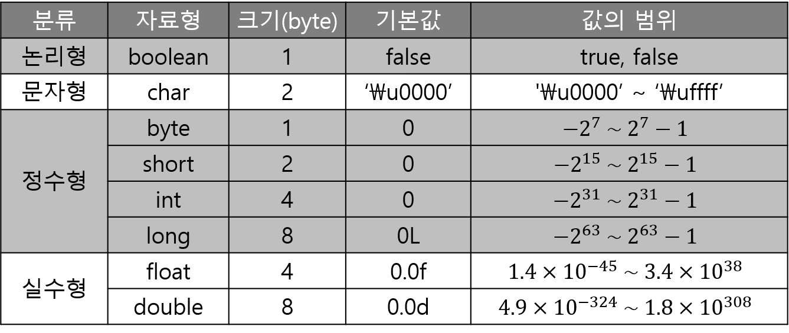
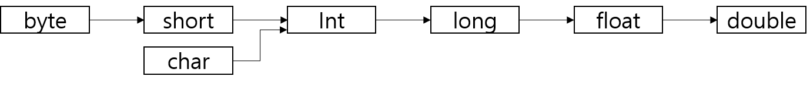

## 프리미티브 타입 종류와 값의 범위 그리고 기본 값

primitive type. 기본형이라고도 한다. 우리가 주로 다루는 데이터 타입(자료형)은 문자와 숫자이며, 숫자는 정수형과 실수형으로 나뉜다. 효율적인 프로그래밍을 위해선 자료형을 알맞게 선택하여 값이 저장되는 메모리를 잘 관리해야 한다.

프리미티브 타입은 자바에서 가장 기본적인 자료형으로 다음과 같은 8개의 타입을 갖는다.



다른 프로그래밍 언어도 마찬가지지만 기본 자료형에 대해선 언젠가 알아야하는 내용이므로 어느정도 숙지할 필요가 있다. 각 자료형의 특징은 다음과 같다.

- **boolean** - 1bit로도 충분히 표현할 수 있지만 메모리 주소 크기가 1byte이기에 모든 자료형의 크기는 최소 1byte여야 한다.
- **char** - C언어의 char형이 ASCII코드를 사용하는 것과 달리, 자바의 char형은 Unicode를 지원하므로 2byte의 크기를 갖는다.
- **byte, short, int, long** - _1byte = 8bit_ 이므로 2의 8승(=256)개의 수를 표현할 수 있다. 정수는 음수도 포함하며, 이를 2의 보수법으로 표현한다.

  byte의 최대값과 최소값을 예로 들면, 01111111은 십진수로 127이고, 10000000은 십진수로 -128이다. 최상위 비트인 0과 1을 MSB(Most Significant Bit)라 하며 부호를 나타낸다. 즉, 0이면 양수를, 1이면 음수를 나타낸다.

  마지막으로 크기가 N bits인 정수형의 범위는 다음의 식을 만족한다.

        $$-2^{N-1}\sim 2^{N-1}-1$$

- **float, double** - 실수를 지수와 가수로 나누어 소수점을 움직이며 표현하는 부동 소수점 방식을 사용한다. 부호는 마찬가지로 0이면 양수, 1이면 음수를 나타낸다.

  

  실수 -50.625를 float형으로 나타내보자.

  우선 음수이기 때문에 부호 비트는 1이 된다. 그리고 실수를 이진수로 변환하면 110010.101이 되며, 이를 1.10010101 x 2^5과 같이 표현할 수 있다. 여기서 지수는 5이고 가수는 1.10010101이 된다. 그렇다면 5의 이진수인 00000101을 지수부(8bits)에 바로 넣으면 끝일까? 답은 ❌이다. 지수가 음수(실수 0.625 같은 경우, 1.01 x 2^-1이 된다)도 될 수 있기에 2의 보수가 아닌 0~255 중간값인 127을 더한다. 이를 바이어스법이라 하며, float형에선 127이 bias가 된다. 결국 지수부는 132의 이진수인 10000100이 된다. 가수부는 간단하다. 가수는 특수 숫자나 0이 아닌 이상 1.xxxx와 같은 형태를 띄므로 소수점 아래 23비트까지 가수부에 넣으면 된다.

  

  > double형의 bias는 1023임을 쉽게 알 수 있을 것이다.

  > ⚠️ float의 정밀도는 소수점 이하 6~9자리이고, double은 15~17자리이다.

## 레퍼런스 타입

reference type. 참조형이라고도 한다. 위의 프리미티브 타입을 제외한 나머지 타입을 레퍼런스 타입이라 일컫는다. 클래스 타입, 인터페이스 타입, 배열 타입, 열거 타입이 있다. 앞서 다룬 기본형 변수는 실제 값을 저장하지만, 참조형 변수는 실제 값이 저장되어 있는 주소의 참조값(해시코드)을 갖는다.

아래의 예제를 통해 좌표를 나타내는 점 두 개를 생성해보자. `new` 연산자는 객체를 생성하고 생성된 객체의 참조값을 반환한다. `a`는 처음에 `null`로 초기화하였고, 이는 어떠한 것도 참조하지 않음을 나타낸다. `null`의 해시코드는 항상 0이다. 이제 `a`와 `b`에 객체를 생성하면 참조값이 할당된다.

```java
class Pos {
    int x;
    int y;
}

public class Main {
    public static void main(String[] args) {
        Pos a = null;
        System.out.println(a);  // null
        a = new Pos();
        Pos b = new Pos();
        System.out.println(a);  // com.foo.Pos@27d6c5e0
        System.out.println(b);  // com.foo.Pos@4f3f5b24
    }
}
```

## 상수와 리터럴

**상수(constant)**는 변수와 마찬가지로 값을 저장하는 공간이지만 처음 값을 저장하면 이후에 다른 값으로 변경할 수 없다. 다른 프로그래밍 언어에서 상수를 정의하는데 보통 `const` 키워드를 사용하는 것과 달리 자바에선 `final` 키워드를 사용한다. 상수는 아래 코드와 같이 선언과 동시에 초기화하는 것이 좋고 대문자로 이루어진 스네이크 표기법을 일반적으로 사용한다.

```java
final int MAX_VALUE = 1000;
```

**리터럴(literal)**은 한마디로 값 자체를 의미한다. 상수는 값을 저장할 수 있는 공간인 반면에 리터럴은 그 값 자체이다. 따라서 위 코드에서 `MAX_VALUE`는 상수이고 `1000`은 리터럴이 되는 것이다. 리터럴 타입으로 논리형, 정수형, 실수형, 문자형, 문자열이 있다. 아래 코드의 각 행의 대입 연산자 오른쪽 항이 모두 리터럴이다.

```java
boolean bool = true;
int bin = 0b101;                // 2진수로 101
int oct = 017;                  // 8진수로 17
int hex = 0xff;                 // 16진수로 ff
long bigNum = 9_876_543_210L;   // L 생략 불가
float e = 2.71828f;             // f 생략 불가
double pi = 3.141592d;          // d 생략 가능
char ch = 'A';
String str = "Hello World!";
```

## 변수의 스코프와 라이프타임

```java
public class Class {    // 클래스 영역
    String globalVar = "globalVar";         // 객체 변수
    static String staticVar = "staticVar";  // 클래스 변수

    public void method() {  // 메서드 영역
        String localVar = "localVar";
        System.out.println(localVar);
        System.out.println(staticVar);
        System.out.println(globalVar);
    }

    public static void main(String[] args) {
        System.out.println(staticVar);
//        System.out.println(globalVar); // 에러
//        System.out.println(localVar);  // 에러
        Class instance = new Class();
        instance.method();
        System.out.println(instance.globalVar);
    }
}
```

변수의 **스코프(scope)**란 쉽게 말해 변수를 사용할 수 있는 범위이다. 자바는 블록 스코프를 사용하기에 해당하는 중괄호 안에서 선언된 대부분의 변수는 마음껏 사용 가능하다.

클래스 영역에 선언된 `staticVar`와 `globalVar`를 **전역 변수(global variable)**라 하고, 이들은 객체 변수와 클래스 변수로 나뉜다. 객체 변수는 객체 생성 시에 해당 객체만의 객체 변수가 생성되기 때문에 메인 함수에서 불러올 수 없지만 메서드 영역에선 호출 가능하다. 클래스 변수는 객체화 없이 사용 가능하며, 생성된 모든 객체가 동일한 클래스 변수를 갖는다. 반면에 메서드 영역에 선언된 `localVar`는 **지역 변수(local variable)**라 하고 해당 지역에만 머물 수 있다.

객체는 항상 동적으로 할당된다. 객체에 할당된 메모리의 라이프타임은 스코프가 아닌 프로그램의 로직에 의해 결정된다. 즉, 레퍼런스 타입의 수명은 생성될 때부터 **GC(Garbage Collector)**에 의해 메모리 해제될 때까지이다. 이와 반면에, 프리미티브 타입은 스코프에 의존적이라 해당 스코프가 끝나면 소멸한다.

## 타입 프로모션과 타입 캐스팅

코드를 작성하다 보면 서로 다른 자료형 간의 연산을 수행해야 하는 경우도 있다. 이럴 경우에 자료형을 일치시켜야 하는데, 이를 형변환이라 하고 두 가지의 형변환을 지원한다.

- **타입 프로모션(type promotion)** - 자동 형변환이라고도 한다. 컴파일러는 서로 다른 자료형 중에 값의 범위가 더 넓은 쪽으로 스스로 알아서 형변환시킨다.

  ```java
  public class TypePromotion {
      public static void main(String[] args) {
          byte b = 127;
          int i = b;
          System.out.println("i = " + i);
          long l = 1_000_000L;
          double d = l;
          System.out.println("d = " + d);
          /*
          i = 127
          d = 1000000.0
           */
      }
  }
  ```

  위의 코드를 보면 `int`형에 `byte`형 값을 대입하였고 `double`형에 `long`형 값을 대입하였다. 만일 이와 반대로 코드를 작성하고 실행하면 컴파일 에러가 날 것이다. 이렇게 명시적인 형변환이 없어도 컴파일러가 자동으로 타입을 변환하며, 아래 그림과 같이 값 범위가 더 넓은 쪽으로 형변환이 이루어질 수 있다.

  

- **타입 캐스팅(type casting)** - 강제 형변환이라 불리기도 한다. 이는 말 그대로 변수명 앞에 타입을 명시적으로 작성하여 강제로 형변환을 수행한다. 그렇기 때문에 타입 프로모션과 반대로 값 범위가 더 좁은 쪽으로의 형변환도 가능하다. 이로 인해 생기는 값 손실은 책임지지 않기 때문에 타입 캐스팅 사용에 있어서 유의해야 한다.

  ```java
  public class TypeCasting {
      public static void main(String[] args) {
          short s = 279;
          byte b = (byte)s;
          System.out.println(b);  // 23
      }
  }
  ```

  

## 1차 및 2차 배열 선언 및 생성

배열(Array)이란 동일한 자료형을 갖는 여러 변수를 연속된 메모리에 저장하기 위한 자료구조이다. 참고로 파이썬과 자바스크립트에서의 배열은 서로 다른 자료형도 지원한다.

```java
public class ArrayExam {
    public static void main(String[] args) {
        int[] array1D_a;
        array1D_a = new int[3];             // {0, 0, 0}
        int[] array1D_b = {1, 2, 3};
        int[][] array2D_a = {{1, 2}, {3, 4, 5}};
        int[][] array2D_b = new int[2][3];  // {{0, 0, 0},
                                            //  {0, 0, 0}}
        // java.lang.ArrayIndexOutOfBoundsException
        // System.out.println(array2D_a[0][2]);
    }
}
```

- `array1D_a`는 먼저 배열로 선언되고, 다음 줄에서 길이가 3인 int배열로 생성되었다.
- 나머지는 배열 선언과 동시에 생성되었다.
- 배열 생성 시에 초기화를 명시적으로 하지 않으면 모두 0으로 초기화된다.
- 3차원 이상의 다차원 배열도 위와 같은 규칙으로 선언 및 생성할 수 있다.
- `array2D_a`는 `array2D_b`의 두 행이 3열로 이루어진 것과 달리, 첫째 행이 2열로 구성되었다. 따라서 인덱스 `[0][2]`에 접근하면 배열의 인덱스를 벗어날 때 생기는 오류가 발생한다.

## 타입 추론, var

자바 10부터 컴파일러가 지역 변수에 대해 타입 추론할 수 있는 `var`타입을 사용할 수 있다. 반드시 추론 가능한 정보가 충분해야 한다.

```java
public class TypeInference {
    public static void main(String[] args) {
        var s = "Hello World!";
        int[] array = new int[10];
        for (var e : array)
            System.out.println(e);
    }
}
```
