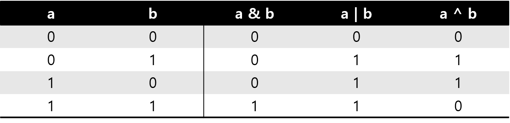
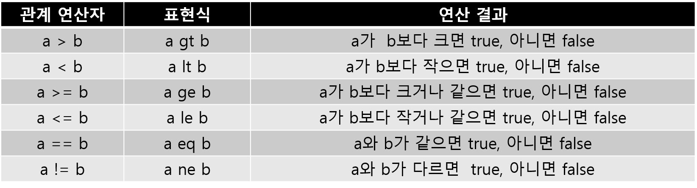
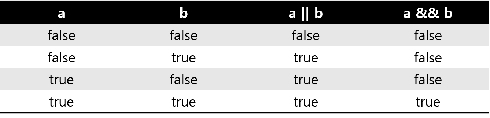
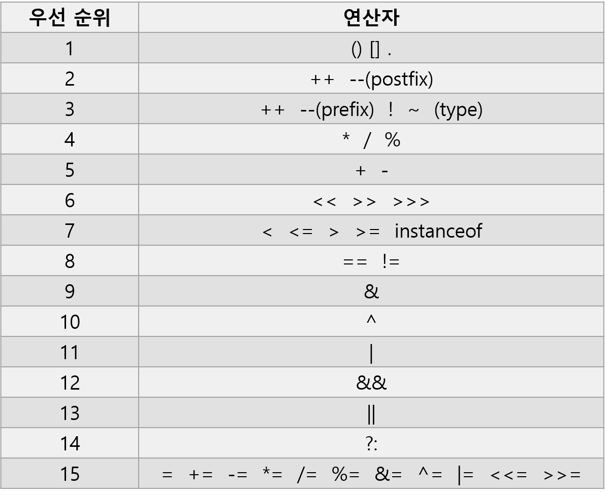

## 산술 연산자

산술 연산자에는 사칙 연산자(`+`, `-`, `*`, `/`)와 나머지 연산자(`%`)가 있다. 산술 연산에선 자동 형변환(promotion) 또는 강제 형변환(casting)이 발생하거나, 자료값에 따라 예외(Exception)가 생길 수 있기 때문에 주의해야 한다.

```java
public class Main {
    public static void main(String[] args) {
        int a = 7;
        int b = 3;
        System.out.println(a + b);  // 10
        System.out.println(a - b);  // 4
        System.out.println(a * b);  // 21
        System.out.println(a / b);  // 2
        System.out.println(a % b);  // 1
    }
}
```

위의 코드는 정수형 변수의 산술 연산을 보여준다.

`+`, `-`, `*`은 우리가 알고 있는 연산과 동일하게 진행되는 반면에, `/`은 몫을 출력하고, `%`는 나머지를 출력함을 볼 수 있다. 몫을 출력하는 이유는 `a / b`의 결과가 정수형이기 때문이다. 만일 둘 중 하나라도 double형이라면 2.333···을 출력할 것이다.

```java
public class Main {
    public static void main(String[] args) {
        double a = 7;
        double b = 0;
        double c = 0;
        System.out.println(a / b);  // Infinity
        System.out.println(a % b);  // NaN
        System.out.println(b / c);  // NaN
        System.out.println(b % c);  // NaN
        int d = 7;
        int e = 0;
        System.out.println(d / e);  // ArithmeticException
        System.out.println(d % e);  // ArithmeticException
    }
}
```

분모가 0이면 안된다는 것을 모두 알 것이다. 만일 0으로 나누게 되면 무슨 일이 발생할까?

- 정수형으로 나눌 경우, ArithmeticException, 즉 산술 연산 관련 예외가 발생한다.
- 실수형으로 나눌 경우, Infinity 또는 NaN(Not a Number)가 출력된다. 이는 부동소수점과 관련이 있다. 이전에는 정수형과 마찬가지로 산술 연산 관련 예외가 발생했는데 지금은 이와 같이 연산한다. 그렇기 때문에 예외 처리를 달리 해야 한다.

## 비트 연산자

비트 연산자는 피연산자를 비트(bit) 단위로 논리 연산을 할 때 사용하는 연산자이다. 피연산자는 반드시 정수여야 한다.

`~` - 비트를 1이면 0으로, 0이면 1로 반전(NOT 연산)

`&` - 양쪽의 비트가 모두 1이면 1을 반환(AND 연산)

`|` - 하나라도 비트가 1이라면 1을 반환(OR 연산)

`^` - 비트가 서로 다르면 1을 반환(XOR 연산)

`<<` - 지정된 수만큼 비트를 왼쪽으로 이동(left shift 연산)

`>>` - 지정된 수만큼 비트를 오른쪽으로 이동(right shift 연산)



```java
public class Main {
    public static void main(String[] args) {
        int a = 29;
        int b = 22;
        System.out.printf("     a = %32s %n", Integer.toBinaryString(a));
        System.out.printf("     b = %32s %n", Integer.toBinaryString(b));
        System.out.printf("    ~a = %32s %n", Integer.toBinaryString(~a) + '(' + ~a + ')');
        System.out.printf(" a & b = %32s %n", Integer.toBinaryString(a & b));
        System.out.printf(" a | b = %32s %n", Integer.toBinaryString(a | b));
        System.out.printf(" a ^ b = %32s %n", Integer.toBinaryString(a ^ b));
        System.out.printf("a << 2 = %32s %n", Integer.toBinaryString(a << 2));
        System.out.printf("a >> 3 = %32s %n", Integer.toBinaryString(a >> 3));
    }
}
```

```bash
     a =                            11101
     b =                            10110
    ~a = 11111111111111111111111111100010(-30)
 a & b =                            10100
 a | b =                            11111
 a ^ b =                             1011
a << 2 =                          1110100
a >> 3 =                               11
```

위 코드의 출력 결과는 모두 이진수이다. int형이기 때문에 32자리지만 앞의 0은 생략되었음에 유의한다. 참고로 `~a`에 2의 보수를 취하면 -30이란 값이 나온다.

## 관계 연산자

관계 연산자는 두 피연산자를 비교하는 데 사용되는 연산자이며, 다음과 같은 6개의 연산자가 존재한다.



```java
public class Main {
    public static void main(String[] args) {
        System.out.println(2 == 2.0f);          // true
        System.out.println('A' == 65);          // true
        System.out.println('A' > 'Z');          // false
        System.out.println(0.1f == 0.1);      // false
        System.out.println(0.1 + 0.2 == 0.3);   // false
    }
}
```

관계 연산자도 이항 연산자이기 때문에 연산 수행 전에 형변환이 이루어진다. 위 코드를 살펴보면, 정수 2를 float 타입으로 변환한 다음에 비교 연산이 진행된다. 마지막 두 실수형은 근사값으로 저장되므로 오차가 발생할 수 밖에 없어 정확히 비교할 수 없게 된다. 따라서 실수형의 대소 비교는 주의해야 한다.

```java
public class Main {
    public static void main(String[] args) {
        String s1 = "apple";
        String s2 = new String("apple");
        System.out.println(s1 == "apple");          // true
        System.out.println(s2 == "apple");          // false
        System.out.println(s1 == s2);               // false
        System.out.println(s1.equals("apple"));     // true
        System.out.println(s2.equals("apple"));     // true
    }
}
```

`s1`에는 문자열 리터럴 "apple"의 주소가 저장되기에 결과가 true이다. 반면에, `s2`에는 String 인스턴스의 주소가 저장되므로 false를 결과로 얻는다. 내용은 같지만 서로 다른 객체이기 때문이다.

따라서 두 문자열을 비교할 때는 관계 연산자 `==`가 아닌 `equals`메서드를 사용해야 한다.

## 논리 연산자

논리 연산자는 둘 이상의 조건을 AND(`&&`), OR(`||`), NOT(`!`)으로 연결하여 공식으로 구성할 수 있게 해준다.



논리 연산자는 비트 연산자와 달리 피연산자가 boolean형이다. 또한 논리 연산자는 논리 연산자로 이루어진 식 앞에서 이미 조건을 충족하면 뒤의 연산은 무시하고 결과를 출력한다.

## instanceof

instanceof 연산자는 참조 변수가 참조하고 있는 인스턴스의 실제 타입을 알아볼 수 있도록 해준다.

> a instanceof b - a는 참조 변수, b는 타입(클래스명)이다. 참조 변수가 타입으로 형변환이 가능한지에 대한 여부를 결과로 반환한다.

```java
public class Main {
    public static void main(String[] args) {
        A a = new A();
        B b = new B();
        System.out.println(a instanceof A); // true
        System.out.println(b instanceof A); // true
        System.out.println(a instanceof B); // false
        System.out.println(b instanceof B); // true
    }
}
class A {}
class B extends A {}
```

객체 b는 클래스 A의 자식 객체이기에 형변환이 가능하지만, 객체 a는 클래스 B의 부모 객체이기 때문에 형변환이 불가능하다.

## 대입 연산자

할당 연산자라고도 한다. 대입 연산자(`=`)는 변수와 같은 저장 공간에 값 또는 계산 결과를 할당하는데 쓰인다.

> a = b - 여기서 좌변 피연산자 a를 lvalue, 우변 피연산자 b를 rvalue라 칭한다. lvalue는 항상 값이 변할 수 있는 것이 와야 한다. rvalue는 제약이 없다.

복합 대입 연산자(`op=`)는 산술 연산자(`+`, `-`, `*`, `/`, `%`) 또는 비트 연산자(`&`, `|`, `^`, `<<`, `>>`)와 결합하여 식을 간결하게 표현할 수 있다.

> ✔ _a <<= b + 2 ———> a = a << (b + 2)_

## 화살표 연산자

화살표 연산자는 자바8에 등장한 람다 표현식을 표현하기 위해 등장하였다. 여기서 람다 표현식(Lambda Expression)이란 메서드를 하나의 식으로 간결히 표현한 것이다. 이를 통해 함수형 프로그래밍이 가능하다.

> (Lambda Parameters) → { Lambda Body }

```java
interface PrintFunc {
    void print();
}
public class Main {
    public static void main(String[] args) {
        PrintFunc printFunc = () -> System.out.println("Print Success!");
        printFunc.print();
    }
}
```

람다식에 대한 자세한 내용은 15주차에 다룰 예정이다.

## 3항 연산자

조건 연산자라고도 한다. 3항 연산자를 이용하면 if-else 구조를 아주 간결히 표현할 수 있지만, 자칫하다 가독성이 떨어질 수도 있기 때문에 사용에 유의해야 한다.

> condition ? expression1 : expression2

조건이 true이면 expression1을 반환하고, false이면 expression2를 반환한다.

`a ? b : c ? d : e`와 같이 중첩도 가능하다. 이는 `a ? b : (c ? d : e)`와 같은데, 짧은 만큼 좋지 못한 표현이다.

## 연산자 우선 순위

컴퓨터 세계에서도 연산자에 따른 우선 순위가 존재한다. 여러 연산자들의 우선 순위는 아래와 같으며 굳이 외울 필요는 없다. 자연스레 외워지기도 하고, 헷갈린다면 우선 순위가 가장 높은 괄호를 사용하면 된다.


