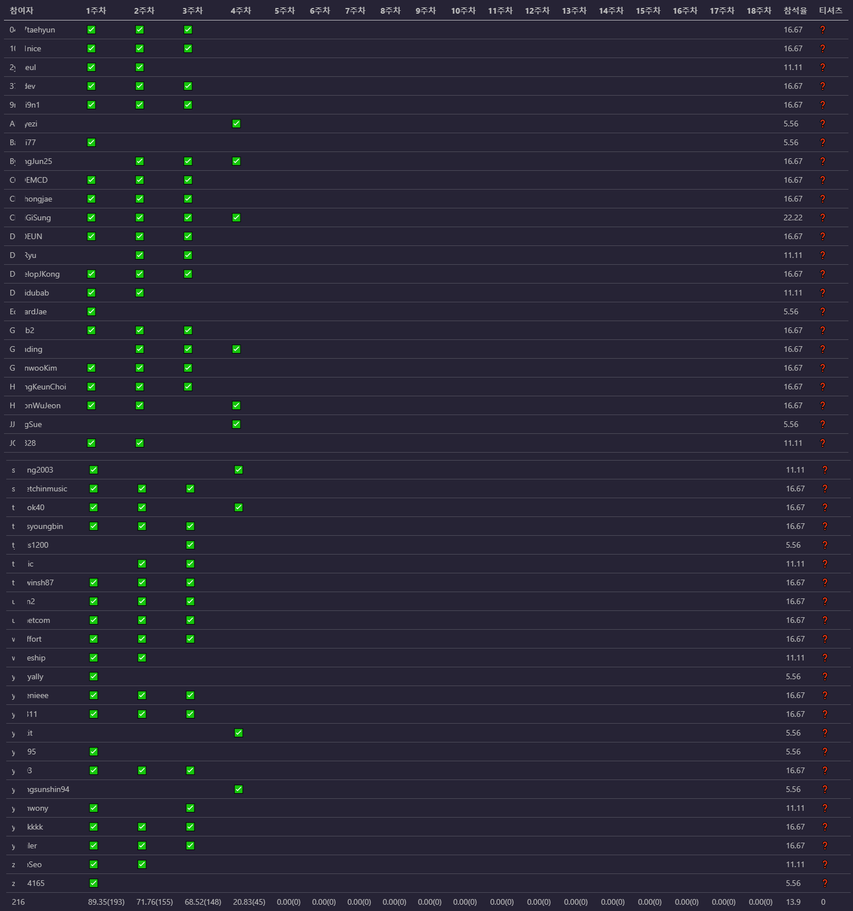

## 조건문(if else)

- if

  ```java
  if (condition) {
      /* code */
  }
  ```

  `condition`의 값이 `true`이면 해당 코드가 실행된다.

- if / else

  ```java
  if (condition) {
      /* code1 */
  } else {
      /* code2 */
  }
  ```

  `condition`의 값이 `true`이면 *code1*이 실행되고, `false`이면 *code2*가 실행된다.

- if / else if / else

  ```java
  if (x == 1) {
      /* code1 */
  } else if (x == 2) {
      /* code2 */
  } else if (x == 3) {
      /* code3 */
  } else {
      /* code4 */
  }
  /* code5 */
  ```

  - `x = 1` - *code1*이 실행되고 바로 *code5*로 넘어간다
  - `x != 1`, `x = 2` - *code2*가 실행되고 바로 *code5*로 넘어간다
  - `x != 1`, `x != 2`, `x = 3` - *code3*이 실행되고 *code5*로 넘어간다
  - `x != 1`, `x != 2`, `x != 3` - *code4*가 실행된다
  - 물론 `else`문 없이 `if / else`만으로 여러 개의 조건을 판별할 수 있지만 실행 속도에 영향을 줄 수 있다.

## 선택문(switch)

선택문은 조건문과 다르게 변수의 값에 따른 코드 블록을 실행할 수 있다. 여기서 변수는 정수 또는 문자(열)을 가르킨다. 또한 컴파일러에 의해 점프 테이블(jump table)이 생성 및 기록되어 속도 향상을 기대할 수 있다.

위의 if / else if / else 코드를 switch문으로 변경하면 다음과 같다. `case`마다 `break`를 넣어주지 않으면 모든 분기를 다 실행할 수 있기 때문에 상황에 맞게 `break`를 넣어줘야 한다.

```java
switch (x) {
    case 1:
        /* code1 */
        break;
    case 2:
        /* code2 */
        break;
    case 3:
        /* code3 */
        break;
    default:
        /* code4 */
        break;   // 생략 가능
}
/* code5 */
```

## 반복문

여러 반복문을 통해 1~100까지의 합을 구해보자.

### while 문

```java
while (조건식) {
    실행문
}

int i = 1, sum1 = 0;
while (i <= 100) {
    sum1 += i++;
}

int j = 1, sum2 = 0;
while (1) {
    sum2 += j;
    if (j == 100) break;
    j++;
}
```

### do-while 문

```java
do {
    실행문
} while (조건문);

int i = 1, sum = 0;
do {
    sum += i++;
} while (i <= 100);
```

do-while 문은 최소 한 번 이상 실행된다. 세미콜론 주의

### for 문

```java
for (초기화식; 조건식; 증감식) {
    실행문
}

int sum = 0;
for (int i = 1; i <= 100; i++) {
    sum += i;
}

int sum2 = 0;
for (int i = 1, j = 0; i <= 100; i++) {
    j += i;
    sum2 = j;
}

int sum3 = 0;
for (int i = 1; i <= 100; sum3 += i, i++) {
}
```

### Enhanced for 문

```java
for (element : array) {
    실행문
}

int sum = 0;
int[] arr = new int[100];
for (int i = 0; i < 100; i++) {
    arr[i] = i + 1;
}
for (int i : arr) {
    sum += i;
}
```

- 장점
  - 배열의 크기를 몰라도 순회 가능하다.
  - 코드가 간결하다.
  - 보통 실행 속도가 for문에 비해 약간 빠르다.
  - 타입 추론이 가능하다.
- 단점
  - 배열의 값을 수정할 수 없다.
  - 인덱스에 접근할 수 없다.
  - 역순으로 순회할 수 없다.

## 과제

### 과제 0. JUnit 5 학습하세요.

### 과제 1. live-study 대시 보드를 만드는 코드를 작성하세요.

- 깃헙 이슈 1번부터 18번까지 댓글을 순회하며 댓글을 남긴 사용자 체크
- 총 18회 중에 몇 번 참가했는지 참여율 계산(소수점 이하 둘째 자리)
- [Github 자바 라이브러리](https://github-api.kohsuke.org/) 사용
- (추가) 링크 포함 확인
- (추가) 과제별 참석율 및 평균 참석율
- (추가) 티셔츠 수령 가능 여부

```java
package week4.github;

import org.kohsuke.github.*;

import java.io.IOException;
import java.util.*;

public class Application {
    final private String TOKEN = "<YOUR TOKEN>";
    final private String ADDRESS = "whiteship/live-study";
    final private float MIN_PERCENTAGE = 80.0f;
    private GitHub github;

    public static void main(String[] args) throws IOException {
        Application app = new Application();
        app.run();
    }

    void run() throws IOException {
        github = new GitHubBuilder().withOAuthToken(TOKEN).build();
        GHRepository repo = github.getRepository(ADDRESS);
        List<GHIssue> issues = repo.getIssues(GHIssueState.ALL);
        int weeks = issues.size();
        int latestLockedIssue = 0;

        Map<String, List<Integer>> users = new TreeMap<>();

        for (int i = weeks - 1, j = 1; i >= 0; i--, j++) {
            List<GHIssueComment> comments = issues.get(i).getComments();
            if (issues.get(i).isLocked()) {
                latestLockedIssue = j;
            }
            Set<String> nicknames = new HashSet<>();
            for (GHIssueComment comment: comments) {
                String nickname = comment.getUser().getLogin();
                String body = comment.getBody();
                if (body.contains("http://") || body.contains("https://")) {
                    nicknames.add(nickname);
                }
            }
            for (String nickname : nicknames) {
                List<Integer> list;
                if (users.containsKey(nickname)) {
                    list = users.get(nickname);
                } else {
                    list = new ArrayList<>();
                }
                list.add(j);
                users.put(nickname, list);
            }
        }

        print(users, weeks, latestLockedIssue);

    }

    void print(Map<String, List<Integer>> users, int weeks, int latestLockedIssue) {
        StringBuilder str = new StringBuilder();
        int[] statistics = new int[weeks + 3];   // 통계 저장
        statistics[0] = users.size();

        // 첫째 줄
        str.append("| 참여자 ");
        for (int i = 1; i <= weeks; i++) {
            str.append("| ").append(i).append("주차 ");
        }
        str.append("| 참석율 ").append("| 티셔츠 |\n");

        for (int i = 1; i <= weeks + 3; i++) {
            str.append("| --- ");
        }
        str.append("|\n");

        // 1주차 ~ weeks주차 과제 및 참석율
        for (Map.Entry<String, List<Integer>> entry : users.entrySet()) {
            String name = entry.getKey();
            List<Integer> list = entry.getValue();
            str.append("| ").append(name).append(" ");
            for (int i = 1, j = 0; i <= weeks; i++) {
                str.append("|");
                if (j < list.size() && i == list.get(j)) {
                    str.append("✅");
                    statistics[i]++;
                    j++;
                }
            }
            int rest = weeks - Math.max(latestLockedIssue, list.get(list.size() - 1));
            float percentage = (float)list.size() / weeks * 100;
            statistics[weeks + 1] += percentage * 100;
            str.append(" | ").append(String.format("%.2f", percentage));
            str.append(" | ");
            if ((float)(rest + list.size()) / weeks * 100 < MIN_PERCENTAGE) {
                str.append("❌ |\n");   // 불가
            } else if (percentage >= MIN_PERCENTAGE) {
                str.append("⭕ |\n");    // 확실
                statistics[weeks + 2]++;
            } else {
                str.append("❓ |\n");   // 불확실
            }
        }

        // 마지막 줄
        str.append("| ");
        for (int i = 0; i < statistics.length; i++) {
            if (i == 0 || i == statistics.length - 1) {
                str.append(statistics[i]);
            } else if (i == statistics.length - 2) {
                str.append((float)(statistics[i] / statistics[0]) / 100);
            } else {
                float percentage = (float)statistics[i] / statistics[0] * 100;
                str.append(String.format("%.2f", percentage));
                str.append("(").append(statistics[i]).append(")");
            }
            str.append(" | ");
        }

        System.out.println(str);
    }
}
```



실행 후 출력 결과를 마크다운 파일에 복붙하면 위와 같은 표가 생긴다. 2020-12-08 기준으로 3주차 이슈까지 닫혔기 때문에 아직 모두에게 티셔츠를 얻을 기회가 있다는 것을 알 수 있다.(커트라인 80% 가정)

### 과제 2. LinkedList를 구현하세요.

- _ListNode.java_

```java
package week4.linkedlist;

public class ListNode {
    private int value;
    private ListNode next;

    public ListNode() {}

    public ListNode(int value) {
        this.value = value;
    }

    public ListNode add(ListNode head, ListNode nodeToAdd, int position) {
        ListNode node = head;
        if (position < 0) return null;
        for (int i = 0; i < position; i++) {
            if (node.next == null) break;
            node = node.next;
        }
        nodeToAdd.next = node.next;
        node.next = nodeToAdd;
        return nodeToAdd;
    }

    public ListNode remove(ListNode head, int positionToRemove) {
        if (positionToRemove < 0 || positionToRemove >= getSize(head)) {
            return null;
        }
        for (int i = 0; i < positionToRemove; i++) {
            head = head.next;
        }
        ListNode deletedNode = head.next;
        head.next = head.next.next;
        return deletedNode;
    }

    public boolean contains(ListNode head, ListNode nodeToCheck) {
        if (nodeToCheck == null) return false;
        while (head != null) {
            if (head == nodeToCheck)
                return true;
            head = head.next;
        }
        return false;
    }

    public int getSize(ListNode head) {
        int size = 0;
        while (head.next != null) {
            size++;
            head = head.next;
        }
        return size;
    }

    public int getValue() {
        return this.value;
    }

    public String toString(ListNode head) {
        StringBuilder sb = new StringBuilder();
        sb.append("[");
        int size = getSize(head);
        for (int i = 0; i < size; i++) {
            sb.append(head.next.getValue());
            if (i != size - 1) sb.append(", ");
            head = head.next;
        }
        sb.append("]");
        return sb.toString();
    }
}
```

- _ListNodeTest.java_

```java
package week4.linkedlist;

import org.junit.jupiter.api.BeforeEach;
import org.junit.jupiter.api.Test;

import static org.junit.jupiter.api.Assertions.*;

class ListNodeTest {
    ListNode head = new ListNode();

    @BeforeEach
    public void makeList() {
        for (int i = 0; i < 10; i++) {
            head.add(head, new ListNode(i), i);
        }
    }

    @Test
    void add() {
        assertEquals(10, head.getSize(head));
        ListNode nodeToAdd = new ListNode(10);
        assertEquals(nodeToAdd, head.add(head, nodeToAdd, 3));
        assertNull(head.add(head, new ListNode(100), -1));
    }

    @Test
    void remove() {
        assertNull(head.remove(head, -1));
        assertNull(head.remove(head, 10));
        assertEquals(2, head.remove(head, 2).getValue());
        assertEquals(9, head.getSize(head));
    }

    @Test
    void contains() {
        ListNode nodeToCheck = new ListNode(10);
        head.add(head, nodeToCheck, 0);
        head.add(head, new ListNode(20), 1);
        assertTrue(head.contains(head, nodeToCheck));
        assertFalse(head.contains(head, null));
        assertFalse(head.contains(head, new ListNode(20)));
    }
}
```

### 과제 3. Stack을 구현하세요.

- _MyStack.java_

```java
package week4.stack;

import java.util.Arrays;

public class MyStack {
    int[] myStack = new int[10];
    int size = 0;

    public int push(int data) {
        if (size >= myStack.length) {
            myStack = Arrays.copyOf(myStack, myStack.length * 2);
        }
        myStack[size++] = data;
        return data;
    }

    public int pop() {
        if (empty()) {
            throw new ArrayIndexOutOfBoundsException();
        } else {
            return myStack[--size];
        }
    }

    public boolean empty() {
        return size == 0;
    }

    public int search(int data) {
        for (int i = size - 1, j = 0; i >= 0; i--, j++) {
            if (myStack[i] == data) {
                return j;
            }
        }
        return -1;
    }

    @Override
    public String toString() {
        int[] strStack = new int[size];
        System.arraycopy(myStack,0,strStack,0,size);
        for(int i = size - 1; i >= size / 2; i--){
            int temp = strStack[i];
            strStack[i] = strStack[size-1-i];
            strStack[size-i-1] = temp;
        }
        return Arrays.toString(strStack);
    }
}
```

- _MyStackTest.java_

```java
package week4.stack;

import org.junit.jupiter.api.*;

import static org.junit.jupiter.api.Assertions.*;

@TestMethodOrder(MethodOrderer.OrderAnnotation.class)
class MyStackTest {
    static MyStack stack = new MyStack();

    @BeforeAll
    public static void makeStack() {
        for (int i = 0; i < 11; i++) {
            assertEquals(i, stack.push(i));
        }
    }

    @Test
    @Order(1)
    void push() {
        assertEquals(20, stack.myStack.length);
        assertEquals(11, stack.size);
    }

    @Test
    @Order(2)
    void search() {
        assertEquals(5, stack.search(5));
        assertEquals(-1, stack.search(20));
    }

    @Test
    @Order(3)
    void pop() {
        for (int i = 10; i >= 0; i--) {
            assertEquals(i, stack.pop());
        }
        assertThrows(ArrayIndexOutOfBoundsException.class, stack::pop);
    }

    @Test
    @Order(4)
    void empty() {
        assertTrue(stack.empty());
        stack.push(1);
        assertFalse(stack.empty());
    }
}
```

### 과제 4. 앞서 만든 ListNode를 사용해서 Stack을 구현하세요.

- _ListNodeStack.java_

```java
package week4.stack;

import week4.linkedlist.ListNode;

public class ListNodeStack {
    static ListNode head = new ListNode();
    int size;

    void push(int data) {
        head.add(head, new ListNode(data), size++);
    }

    int pop() {
        if (size == 0) {
            throw new ArrayIndexOutOfBoundsException();
        } else {
            return head.remove(head, --size).getValue();
        }
    }
}
```

- _ListNodeStackTest.java_

```java
package week4.stack;

import org.junit.jupiter.api.Test;
import week4.linkedlist.ListNode;

import static org.junit.jupiter.api.Assertions.*;

class ListNodeStackTest {

    @Test
    void push() {
        ListNodeStack stack = new ListNodeStack();
        stack.push(100);
        stack.push(200);
    }

    @Test
    void pop() {
        ListNodeStack stack = new ListNodeStack();
        assertThrows(ArrayIndexOutOfBoundsException.class, stack::pop);
        stack.push(10);
        assertEquals(10, stack.pop());
    }
}
```

### 과제 5. Queue를 구현하세요.

- _MyQueue.java(배열)_

```java
package week4.queue;

import java.util.Arrays;

public class MyQueue {
    int[] myQueue = new int[10];
    int left;
    int right;

    public int push(int data) {
        if (right >= myQueue.length) {
            myQueue = Arrays.copyOf(myQueue, myQueue.length * 2);
        }
        return myQueue[right++] = data;
    }

    public int pop() {
        if (left == right) {
            throw new ArrayIndexOutOfBoundsException();
        } else {
            return myQueue[left++];
        }
    }
}
```

- _MyQueueTest.java(배열)_

```java
package week4.queue;

import org.junit.jupiter.api.Test;

import static org.junit.jupiter.api.Assertions.*;

class MyQueueTest {

    @Test
    void push() {
        MyQueue queue = new MyQueue();
        queue.push(100);
        queue.push(200);
    }

    @Test
    void pop() {
        MyQueue queue = new MyQueue();
        assertThrows(ArrayIndexOutOfBoundsException.class, queue::pop);
        queue.push(10);
        assertEquals(10, queue.pop());
    }
}
```

- _ListNodeQueue.java(ListNode)_

```java
package week4.queue;

import week4.linkedlist.ListNode;

public class ListNodeQueue {
    ListNode head = new ListNode();
    int size;

    public void push(int data) {
        head.add(head, new ListNode(data), head.getSize(head));
        size++;
    }

    public int pop() {
        ListNode deletedNode = head.remove(head, --size);
        if (deletedNode == null) {
            throw new IndexOutOfBoundsException();
        } else {
            return deletedNode.getValue();
        }
    }
}
```

- _ListNodeQueueTest.java(ListNode)_

```java
package week4.queue;

import org.junit.jupiter.api.Test;

import static org.junit.jupiter.api.Assertions.*;

class ListNodeQueueTest {

    @Test
    void push() {
        ListNodeQueue queue = new ListNodeQueue();
        queue.push(100);
        queue.push(200);
    }

    @Test
    void pop() {
        ListNodeQueue queue = new ListNodeQueue();
        queue.push(10);
        assertEquals(10, queue.pop());
        assertThrows(IndexOutOfBoundsException.class, queue::pop);
    }
}
```
