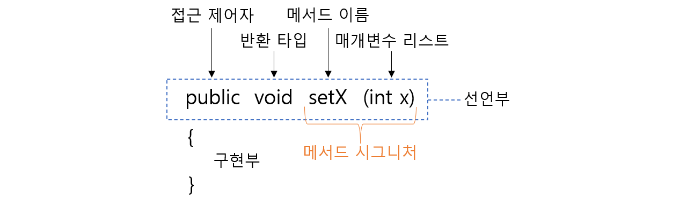
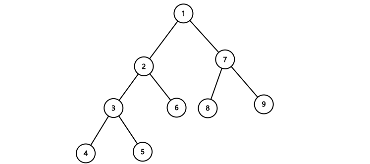

## 클래스와 객체

클래스는 객체지향 프로그래밍(Object-oriented programming)에서 객체를 생성하기 위해 상태(state)와 행동(behavior)을 정의하는 일종의 설계도이다. 여기서 객체란 어플리케이션의 기능을 구현하기 위해 서로 협력하는 개별적인 실체로써 물리적일 수도 있고 개념적일 수도 있다. 앞으로 배울 객체지향의 4대 특성(추상화, 캡슐화, 상속, 다형성)을 통해 프로그램 개발 및 유지보수를 더욱 쉽고 빠르게 할 수 있을 것이다.

## 클래스 정의

객체의 상태와 행동이 정의된 하나의 클래스로 비슷한 구조를 갖되 상태는 서로 다른 여러 객체를 만들 수 있다. 그렇다면 어떻게 정의해야 할까? 먼저 클래스의 구조를 살펴보자.

- **필드(field)** - 필드는 해당 클래스 객체의 상태 속성을 나타내며, 멤버 변수라고도 불린다. 여기서 초기화하는 것을 필드 초기화 또는 명시적 초기화라고 한다.
  - **인스턴스 변수** - 이름에서 알 수 있듯이 인스턴스가 갖는 변수이다. 그렇기에 인스턴스를 생성할 때 만들어진다. 서로 독립적인 값을 갖으므로 heap 영역에 할당되고 gc에 의해 관리된다.
  - **클래스 변수** - 정적을 의미하는 `static`키워드가 인스턴스 변수 앞에 붙으면 클래스 변수이다. 해당 클래스에서 파생된 모든 인스턴스는 이 변수를 공유한다. 그렇기 때문에 heap 영역이 아닌 static 영역에 할당되고 gc의 관리를 받지 않는다. 또한 `public` 키워드까지 앞에 붙이면 전역 변수라 볼 수 있다.
- **메서드(method)** - 메서드는 해당 객체의 행동을 나타내며, 보통 필드의 값을 조정하는데 쓰인다.
  - **인스턴스 메서드** - 인스턴스 변수와 연관된 작업을 하는 메서드이다. 인스턴스를 통해 호출할 수 있으므로 반드시 먼저 인스턴스를 생성해야 한다.
  - **클래스 메서드** - 정적 메서드라고도 한다. 일반적으로 인스턴스와 관계없는 메서드를 클래스 메서드로 정의한다.
- **생성자(constructor)** - 생성자는 객체가 생성된 직후에 클래스의 객체를 초기화하는 데 사용되는 코드 블록이다. 메서드와 달리 리턴 타입이 없으며, 클래스엔 최소 한 개 이상의 생성자가 존재한다.
- **초기화 블록(initializer)** - 초기화 블록 내에서는 조건문, 반복문 등을 사용해 명시적 초기화에선 불가능한 초기화를 수행할 수 있다.
  - **클래스 초기화 블록** - 클래스 변수 초기화에 쓰인다.
  - **인스턴스 초기화 블록** - 인스턴스 변수 초기화에 쓰인다.
    > 클래스 변수 초기화: 기본값 → 명시적 초기화 → 클래스 초기화 블록  
    > 인스턴스 변수 초기화: 기본값 → 명시적 초기화 → 인스턴스 초기화 블록 → 생성자

위의 구조를 토대로 클래스를 정의한다면 다음과 같이 코드를 작성할 수 있다.

```java
class Class {               // 클래스
    String constructor;
    String instanceVar;     // 인스턴스 변수
    static String classVar; // 클래스 변수

    static {                // 클래스 초기화 블록
        classVar = "Class Variable";
    }

    {                       // 인스턴스 초기화 블록
        instanceVar = "Instance Variable";
    }

    Class() {                // 생성자
        constructor = "Constructor";
    }

    void instanceMethod() {       // 인스턴스 메서드
        System.out.println(instanceVar);
    }

    static void classMethod() {   // 클래스 메서드
        System.out.println(classVar);
    }
}
```

> 접근 제어자 - `public`, `protected`, `default`, `private`  
> 그 외 - `static`, `final`, `abstract`, `transient`, `synchronized`, `volatile` etc.

`static`이나 `public`같은 키워드를 제어자(modifier)라고 하며, 클래스나 멤버 선언 시 부가적인 의미를 부여한다.

- 접근 제어자 - 접근 제어자는 해당 클래스 또는 멤버를 정해진 범위에서만 접근할 수 있도록 통제하는 역할을 한다. 클래스는 `public`과 `default`밖에 쓸 수 없다. 범위는 다음과 같다. 참고로 `default`는 아무것도 덧붙이지 않았을 때를 의미한다.

  

- `static` - 변수, 메서드는 객체가 아닌 클래스에 속한다.
- `final`
  - 클래스 앞에 붙으면 해당 클래스는 상속될 수 없다.
  - 변수 또는 메서드 앞에 붙으면 수정되거나 오버라이딩 될 수 없다.
- `abstract`
  - 클래스 앞에 붙으면 추상 클래스가 되어 객체 생성이 불가하고, 접근을 위해선 상속받아야 한다.
  - 변수 앞에 지정할 수 없다. 메서드 앞에 붙는 경우는 오직 추상 클래스 내에서의 메서드밖에 없으며 해당 메서드는 선언부만 존재하고 구현부는 상속한 클래스 내 메서드에 의해 구현되어야 한다. 상속과 관련된 내용은 6주차에 다룰 예정이다.
- `transient` - 변수 또는 메서드가 포함된 객체를 직렬화할 때 해당 내용은 무시된다.
- `synchronized` - 메서드는 한 번에 하나의 쓰레드에 의해서만 접근 가능하다.
- `volatile` - 해당 변수의 조작에 CPU 캐시가 쓰이지 않고 항상 메인 메모리로부터 읽힌다.

## 객체 생성

클래스에서 객체를 생성하려면 아래와 같이 `new`키워드를 생성자 중 하나와 함께 사용하면 된다.

```java
public class Point {
    private int x = 1;
    private int y = 2;

    Point() {}  // 기본 생성자

    Point(int x, int y) {
        setX(x);
        setY(y);
    }

    public int getX() {
        return x;
    }

    public int getY() {

        return y;
    }

    public void setX(int x) {
        this.x = x;
    }

    public void setY(int y) {
        this.y = y;
    }
}
```

```java
public class PointMain {
    public static void main(String[] args) {
        Point p1 = new Point();
        Point p2 = new Point(3, 4);
        System.out.println("" + p1.getX() + ", " + p1.getY());  // 1, 2
        System.out.println("" + p2.getX() + ", " + p2.getY());  // 3, 4
        p1.setX(3);
        p1.setY(4);
        System.out.println("" + p1.getX() + ", " + p1.getY());  // 3, 4
    }
}
```

`new`키워드는 새 객체에 메모리를 할당하고 해당 메모리에 대한 참조값을 반환하여 클래스를 인스턴스화한다. 일반적으로 객체가 메모리에 할당되면 인스턴스라 부른다. 참고로 인스턴스 `p1`과 `p2`은 서로 다른 생성자에 의해 생성되었다.

## 메서드 정의

```java
public int getX() {
    return x;
}

public int getY() {
    return y;
}

public void setX(int x) {
    this.x = x;
}

public void setY(int y) {
    this.y = y;
}
```



- **접근 제어자 및 기타 제어자** - 해당 메서드에 접근할 수 있는 범위를 명시하거나 위에서 언급했듯이 부가적인 의미를 부여한다.
- **반환 타입** - 메서드가 모든 작업을 수행한 뒤에 반환할 타입을 명시한다.
- **메서드 이름** - 메서드명은 동사여야 하고 lowerCamelCase를 따르며 뜻이 명확해야 한다. 위의 메서드는 getter/setter 메서드이다.
- **매개변수 리스트** - 메서드에서 사용할 매개변수들을 명시한다.
- **메서드 시그니처** - 컴파일러는 메서드 시그니처를 보고 오버로딩(overloading)을 구별한다. 물론 리스트의 순서도 동일해야 한다.

## 생성자 정의

```java
Point() {}  // 기본 생성자

Point(int x, int y) {
    setX(x);
    setY(y);
}
```

앞서 말했듯이 생성자를 명시하지 않으면 컴파일러가 자동으로 기본 생성자를 생성한다. 하지만 기본 생성자가 아닌 다른 형태의 생성자만 명시했다면 기본 생성자는 컴파일시에 생성되지 않는다.

## this 키워드

```java
public void setX(int x) {
    this.x = x;
}

public void setY(int y) {
    this.y = y;
}
```

`this`키워드는 인스턴스 자신을 가르킨다. 위 코드에서 `this`를 사용함으로써 지역변수 `x`, `y`와 구분할 수 있다. 당연한 말이지만 클래스 메서드에서는 `this`를 쓸 수 없다. 왜냐하면 인스턴스가 생성되지 않았을 수도 있기 때문이다.

`this()`는 해당 클래스 생성자를 호출할 수 있다. 그렇기 때문에 생성자를 재사용하는 데 쓰인다. (생성자 체이닝)

```java
public class Point {
    int x;
    int y;
    int z;

    Point(int x, int y) {
        this.x = x;
        this.y = y;
    }

    Point(int x, int y, int z) {
        this(x, y);
        this.z = z;
    }
}
```

## 과제

- int 값을 가지고 있는 이진 트리를 나타내는 Node 라는 클래스를 정의하세요.
- int value, Node left, right를 가지고 있어야 합니다.

```java
public class Node {
    private int value;
    private Node left;
    private Node right;

    Node(int value) {
        this.value = value;
        this.left = null;
        this.right = null;
    }

    public Node addLeftNode(int value) {
        Node node = new Node(value);
        setLeft(node);
        return node;
    }

    public Node addRightNode(int value) {
        Node node = new Node(value);
        setRight(node);
        return node;
    }

    public int getValue() {
        return value;
    }

    public Node getLeft() {
        return left;
    }

    public Node getRight() {
        return right;
    }

    public void setValue(int value) {
        this.value = value;
    }

    public void setLeft(Node left) {
        this.left = left;
    }

    public void setRight(Node right) {
        this.right = right;
    }
}
```

- BinrayTree라는 클래스를 정의하고 주어진 노드를 기준으로 출력하는 bfs(Node node)와 dfs(Node node) 메소드를 구현하세요.
- DFS는 왼쪽, 루트, 오른쪽 순으로 순회하세요.

```java
import java.util.*;

public class BinaryTree {
    public List<Integer> bfsList = new ArrayList<>();
    public List<Integer> dfsList = new ArrayList<>();

    public void bfs(Node node) {
        Queue<Node> queue = new LinkedList<>();
        queue.offer(node);
        while (!queue.isEmpty()) {
            Node n = queue.poll();
            bfsList.add(n.getValue());
            if (n.getLeft() != null) {
                queue.offer(n.getLeft());
            }
            if (n.getRight() != null) {
                queue.offer(n.getRight());
            }
        }
    }

    public void dfs(Node node) {
        if (node == null) return;
        if (node.getLeft() != null) {
            dfs(node.getLeft());
        }
        dfsList.add(node.getValue());
        if (node.getRight() != null) {
            dfs(node.getRight());
        }
    }
}
```



```java
package week5.binarytree;

import org.junit.jupiter.api.*;
import static org.junit.jupiter.api.Assertions.*;
import java.util.*;

class BinaryTreeTest {
    static BinaryTree tree;
    static Node root;

    @BeforeAll
    static void createBinaryTree() {
        tree = new BinaryTree();
        root = new Node(1);

        Node temp = root.addLeftNode(2);
        temp.addRightNode(6);
        temp = temp.addLeftNode(3);
        temp.addLeftNode(4);
        temp.addRightNode(5);

        temp = root.addRightNode(7);
        temp.addLeftNode(8);
        temp.addRightNode(9);
    }

    @Test
    void bfs() {
        tree.bfs(root);
        List<Integer> answer = Arrays.asList(1, 2, 7, 3, 6, 8, 9, 4, 5);
        assertArrayEquals(answer.toArray(), tree.bfsList.toArray());
    }

    @Test
    void dfs() {
        tree.dfs(root);
        List<Integer> answer = Arrays.asList(4, 3, 5, 2, 6, 1, 8, 7, 9);
        assertArrayEquals(answer.toArray(), tree.dfsList.toArray());
    }
}
```
