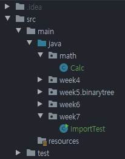
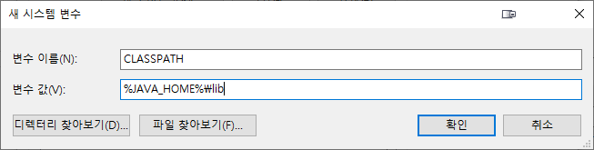
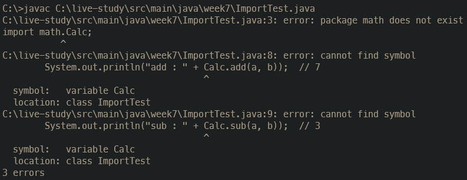
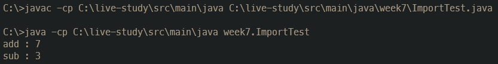
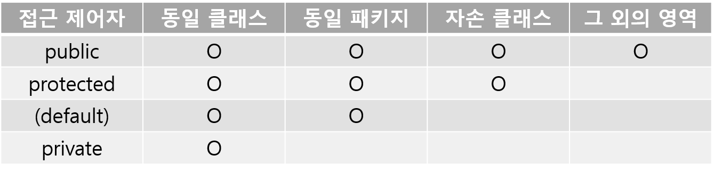

## package 키워드

자바에서 패키지는 클래스, 인터페이스 및 하위 패키지를 연관되게 묶어놓은 것으로, 클래스를 효율적으로 관리할 수 있다.

### 특징

- 네이밍 충돌을 방지할 수 있다. 따라서 이름이 같더라도 다른 패키지에 위치한다면 문제없다.
- 계층 구조를 갖기 때문에 클래스, 인터페이스, 열거형, 어노테이션을 쉽게 찾고 사용할 수 있다.
- `protected`, `default` 접근 제어자는 같은 패키지 내에서만 접근 가능하기 때문에 캡슐화가 가능하다.
- 패키지명은 폴더명과 같아야 하고 클래스명과 구분하기 위해 소문자로 한다.
- 소스 코드 첫 줄에 자신이 속한 패키지명을 선언해야 한다. ex) `package com.company`

### 주요 패키지

- **java.lang**
  - 자바 프로그래밍에 필요한 기본적인 기능을 위한 패키지
  - import문 없이 사용할 수 있다.
- **java.util**
  - 프로그래밍에 유용한 유틸리티를 위한 패키지
  - 시간, 날짜, 자료구조와 관련된 다양한 클래스들을 포함한다.
- **java.io**
  - 키보드, 모니터, 프린터, 디스크 등에 입출력을 위한 패키지
- **java.awt, javax.swing**
  - GUI 프로그래밍을 위한 패키지

## import 키워드

다른 패키지의 클래스를 사용하려면 패키지명이 포함된 클래스 이름을 작성해야 한다. 하지만 import문으로 사용할 클래스의 패키지를 미리 명시하면 패키지명을 생략할 수 있다.

이렇게 import문을 작성하면 컴파일 시에 컴파일러가 알아서 클래스 앞에 패키지명을 붙여 준다.



```java
// Calc.java
package math;

public class Calc {
    public static int add(int a, int b) {
        return a + b;
    }
    public static int sub(int a, int b) {
        return a - b;
    }
}
```

```java
// ImportTest.java
package week7;

import math.Calc;

public class ImportTest {
    public static void main(String[] args) {
        int a = 5, b = 2;
        System.out.println("add : " + Calc.add(a, b));  // 7
        System.out.println("sub : " + Calc.sub(a, b));  // 3
    }
}
```

- 만일 `import math.*;`로 선언하면 math 패키지에 있는 모든 클래스를 사용할 수 있다. 그렇다고 하위 패키지까지 포함하진 않는다.
- static import문으로 선언하면 static멤버를 호출할 때 클래스 이름을 생략할 수 있어 코드가 간결해진다.

  ```java
  package week7;

  import static math.Calc.add;
  import static math.Calc.sub;

  public class ImportTest {
      public static void main(String[] args) {
          int a = 5, b = 2;
          System.out.println("add : " + add(a, b));  // 7
          System.out.println("sub : " + sub(a, b));  // 3
      }
  }
  ```

## 클래스패스

클래스패스(class path)란 JVM이 클래스의 위치를 찾는데 사용되는 경로를 의미한다.

[1주차 포스트](https://jeeneee.dev/java-live-study/week1-JVM/)에서도 언급했듯이, 자바로 작성된 소스 파일(.java)은 자바 컴파일러(javac.exe)에 의해 JVM이 이해할 수 있는 바이트 코드의 클래스 파일(.class)로 변환된다. 그리고 런타임 시에 JVM의 클래스로더는 클래스패스를 참조해 클래스를 불러오고 적합한 메모리 영역에 저장한다.

클래스로더는 3개로 나뉘고 차례대로 실행된다. JAVA8 기준.

1. **Bootstrap Class Loader** - 부트스트랩 클래스로더는 클래스로더 중 최상위 클래스로더로, `$JAVA_HOME/jre/lib/rt.jar`에 담긴 핵심 클래스를 로드한다. Native C로 구현되었다.
2. **Extensions Class Loader** –익스텐션 클래스로더는 보통 `$JAVA_HOME/lib/ext`디렉토리에 담긴 클래스를 로드한다. 자바로 구현되었다.
3. **Application Class Loader** – 어플리케이션 클래스로더는 `$CLASSPATH`에서 클래스를 로드한다. 자바로 구현되었다.

클래스패스를 지정할 수 있는 두 가지 방법이 있다.

### CLASSPATH 환경 변수

컴퓨터 환경 변수에서 지정할 수 있다.

여기서 `%JAVA_HOME%`는 jdk의 상대 경로이다.



### classpath 옵션

런타임 시에 옵션을 통해 클래스패스를 지정하면 프로그램마다 개별적인 경로를 갖기 때문에 다른 프로그램에 영향을 끼치지 않는다.

클래스패스는 `-classpath` 혹은 `-cp`플래그로 옵션을 추가할 수 있다.

위에서 다룬 예제를 컴파일하고 실행시켜보자.



클래스패스를 지정하지 않으면 위와 같이 패키지를 찾을 수 없다는 컴파일 에러가 발생한다.



클래스패스 옵션을 추가하니 제대로 동작하는 것을 볼 수 있다.

## 접근 제어자

접근 제어자는 해당 클래스 또는 멤버를 정해진 범위에서만 접근할 수 있도록 통제하는 역할을 한다. 클래스와 인터페이스는 `public`과 `default`밖에 쓸 수 없다. 범위는 다음과 같으며 `default`는 아무것도 덧붙이지 않았을 때를 의미한다.



접근 제어자를 사용하는 이유는 외부로부터 데이터를 보호하기 위한 목적이 가장 크다. 값의 변경을 막거나 민감한 정보를 밖에 노출시키지 않으려면 데이터의 접근성을 단계별로 둬야 한다. 이를 데이터 감추기(data hiding)이라 하며, 객체지향의 정보은닉 및 캡슐화에 해당하는 개념이다. 따라서 접근 제어자를 상황에 맞게 쓰는 것이 중요하다.
