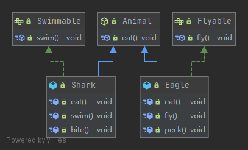
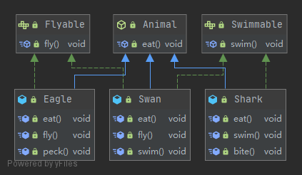
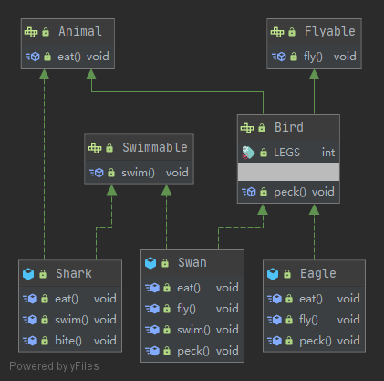

## 인터페이스란

자바에서 인터페이스(interface)는 메서드와 상수를 포함하는 추상 타입이다. 자바의 핵심 개념 중 하나이며, 이를 통해 **추상화**, **다형성**, 그리고 **다중 상속**을 구현할 수 있다.

다중 구현을 제외한 추상화, 다형성은 추상 클래스로도 구현할 수 있는데 무슨 차이점이 있을까?

1. 인터페이스의 모든 메서드는 추상 메서드이고 public 메서드이다.
   - 자바8부터 default, static 메서드를 지원한다.
   - 자바9부터 private 메서드를 지원한다.
2. 추상 클래스를 상속받은 자손 클래스는 자신 또한 추상 클래스가 될 수 있어 모든 추상 메서드를 구현하지 않아도 되지만, 인터페이스를 구현한 클래스는 인터페이스의 모든 추상 메서드를 반드시 구현해야만 한다.
   - 추상 클래스의 상속은 `extends`, 인터페이스의 구현은 `implements`키워드를 사용한다.
3. 인터페이스는 추상 클래스와 달리 생성자를 가질 수 없다.
   - 하지만 둘 다 객체를 생성할 수 없고, 추상 클래스의 생성자는 필드 초기화에 쓰인다.
4. 인터페이스는 추상 클래스와 달리 멤버 변수를 가질 수 없다. 상수는 가능.
5. 추상 클래스를 포함한 클래스는 단 하나의 추상 클래스만 상속받거나 여러 개의 인터페이스를 구현할 수 있다. (다중 구현)
   - 인터페이스는 오직 한 개 이상의 인터페이스를 **상속**받을 수 있다. (다중 상속)
   - `extends`, `implements` 동시에 사용 가능하다.

> 그렇다면 추상 클래스와 인터페이스 중 무엇을 사용해야 하나?  
> 다중 구현이 가능하고 자바8 이후에 default, static 메서드를 지원하므로 웬만해선 인터페이스를 구현하는 것이 좋다. 단, 인터페이스는 멤버 변수를 가질 수 없기 때문에 이를 잘 판단하여 선택해야겠다.

## 인터페이스 정의하는 방법

추상 클래스가 **A is kind of B**라면 인터페이스는 **A is able to B**이다. 어떠한 기능 및 행위를 하기 위한 메소드를 제공한다는 의미를 강조하기 위해서이다. 따라서 일반적으로 `Comparable`과 같이 able이 붙곤 한다.

인터페이스 정의의 특징은 다음과 같다.

- 모든 메서드의 접근 제어자는 `public`이며 생략이 가능하다.
- 모든 멤버 변수의 제어자는 `public static final`이며 생략이 가능하다.

편의상 생략하는 경우가 많은데, 생략하여도 어차피 컴파일 시에 컴파일러가 자동으로 추가한다.

```java
public interface Interface {
    public static final int ONE = 1;
    public abstract void abstractMethod();
    public static void staticMethod() {}
    public default void defaultMethod() {}
}
```

## 인터페이스 구현하는 방법

인터페이스를 구현할 클래스 뒤에 `implements`키워드를 붙이고 구현부에서 메서드를 오버라이딩하여 구현하면 된다.

```java
public abstract class Animal {
    public abstract void eat();
}

public interface Swimmable {
    void swim();
}

public interface Flyable {
    void fly();
}

public class Shark extends Animal implements Swimmable {
    @Override
    public void eat() {
        System.out.println("shark-eat");
    }

    @Override
    public void swim() {
        System.out.println("shark-swim");
    }

    public void bite() {
        System.out.println("shark-bite");
    }
}

public class Eagle extends Animal implements Flyable {
    @Override
    public void eat() {
        System.out.println("eagle-eat");
    }

    @Override
    public void fly() {
        System.out.println("eagle-fly");
    }

    public void peck() {
        System.out.println("eagle-peck");
    }
}
```



만일 수영도 하고 날 수도 있는 동물인 백조를 추가하려면 어떻게 할까?

인터페이스는 아래와 같이 다중 구현이 가능하다.

> 이하 어노테이션은 생략하도록 하겠다.

```java
public class Swan extends Animal implements Flyable, Swimmable{
    public void eat() {
        System.out.println("swan-eat");
    }

    public void fly() {
        System.out.println("swan-fly");
    }

    public void swim() {
        System.out.println("swan-swim");
    }
}
```



## 인터페이스 레퍼런스를 통해 구현체를 사용하는 방법

앞서 말했듯이 인터페이스는 객체를 생성할 수 없다. 허나 인터페이스도 다형성이 적용되기 때문에 구현한 인터페이스의 타입으로 형변환이 가능하다. 우리가 알고있는 상속과 같은 메커니즘이다.

```java
public class Main {
    public static void main(String[] args) {
        Flyable flyable = new Eagle();
        Swimmable swimmable = new Shark();
        flyable.fly();              // eagle-fly
        swimmable.swim();           // shark-swim
        ((Eagle)flyable).peck();    // eagle-peck
        ((Shark)swimmable).bite();  // shark-bite
    }
}
```

## 인터페이스 상속

인터페이스도 클래스와 마찬가지로 상속이 가능하다. 다른 점은 클래스의 최고 조상이 `Object`이지만 인터페이스의 최고 조상은 없고, 한 개 이상의 인터페이스를 상속받을 수 있어 다중 상속이 가능하다.

위의 코드에서 `Animal`추상 클래스를 인터페이스로 바꾸고 `Bird`인터페이스를 추가하였다.

```java
public interface Animal {
    public abstract void eat();
}

public interface Flyable {
    void fly();
}

public interface Swimmable {
    void swim();
}

public interface Bird extends Flyable, Animal {
    int LEGS = 2;
    void peck();
}

public class Shark implements Swimmable, Animal {
    public void eat() {
        System.out.println("shark-eat");
    }
    public void swim() {
        System.out.println("shark-swim");
    }
    public void bite() {
        System.out.println("shark-bite");
    }
}

public class Eagle implements Bird {
    public void eat() {
        System.out.println("eagle-eat");
    }
    public void fly() {
        System.out.println("eagle-fly");
    }
    public void peck() {
        System.out.println("eagle-peck");
    }
}

public class Swan implements Bird, Swimmable {
    public void eat() {
        System.out.println("swan-eat");
    }
    public void fly() {
        System.out.println("swan-fly");
    }
    public void swim() {
        System.out.println("swan-swim");
    }
    public void peck() {
        System.out.println("swan-peck");
    }
}
```



## 인터페이스의 default 메서드, 자바8

> 자바8부터 default 메서드를 지원한다.

기존의 추상 메서드는 같은 구현부라 하더라도 각 클래스에서 구현을 해줘야했다. 그럼 변경이 있을 때마다 모두 수정해줘야 하는 번거로움이 생겼다. 따라서 효율적인 유지보수를 위해 default 메서드를 활용할 수 있다. 참고로 `default`는 생략할 수 없다.

위의 예제에서 상어와 백조의 수영법이 같다고 하면 어떻게 코드를 변경할 수 있을까?

```java
public interface Swimmable {
    default void swim() {
        System.out.println("swim");
    }
}

public class Shark implements Swimmable {}

public class Swan implements Swimmable {}

public class Main {
    public static void main(String[] args) {
        Swan swan = new Swan();
        Shark shark = new Shark();
        swan.swim();    // swim
        shark.swim();   // swim
    }
}
```

> ⚠️ 여러 인터페이스의 메서드 시그니처가 같다면 인터페이스를 구현한 클래스에서 default 메서드를 오버라이딩 해야 한다.  
> ⚠️ 조상 클래스의 메서드 시그니처와 구현한 인터페이스의 default 메서드 시그니처가 같다면 조상 클래스의 메서드가 상속된다.

## 인터페이스의 static 메서드, 자바8

> 자바8부터 static 메서드를 지원한다.

인터페이스에 접근하여 사용하는 메서드이다. 그렇기에 인터페이스를 구현한 클래스에서 static 메서드를 오버라이딩 할 수 없다. `Bird`인터페이스에서 새의 다리 수를 가져오는 `static`메서드를 정의하고 호출해보자.

```java
public interface Bird extends Flyable, Animal {
    int LEGS = 2;

    default void peck() {
        System.out.println("bird-peck");
    }

    static int getLegs() {
        return LEGS;
    }
}

public class Main {
    public static void main(String[] args) {
        Swan swan = new Swan();
        swan.peck();    // swan-peck
        System.out.println(Bird.getLegs()); // 2
    }
}
```

## 인터페이스의 private 메서드, 자바9

> 자바9부터 private 메서드를 지원한다.

private 메서드를 사용함으로써 정보 은닉이 가능해진다. 다른 메서드는 외부에서 접근할 수 있는데 반해 private 메서드는 인터페이스에서만 사용 가능하다.

```java
public interface Bird extends Flyable, Animal {
    int LEGS = 2;

    default void peck() {
        System.out.println("bird-peck");
    }

    default void info() {
        System.out.println("bird has " + getLegs() + "legs");
    }

    private int getLegs() {
        return LEGS;
    }
}

public class Main {
    public static void main(String[] args) {
        Swan swan = new Swan();
        swan.peck();    // swan-peck
        swan.info();    // bird has 2legs
    }
}
```
