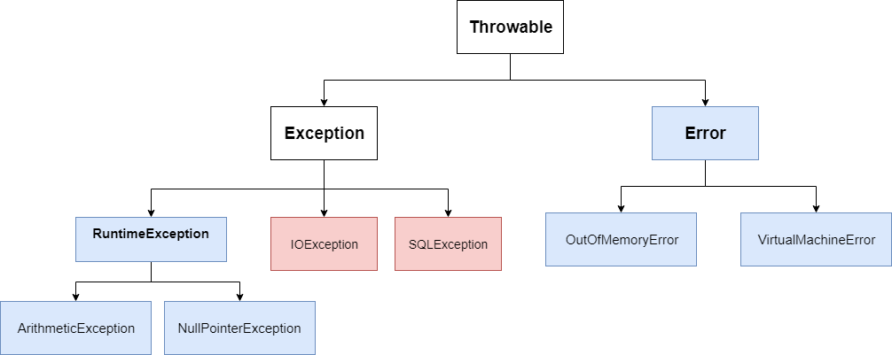

자신이 작성한 코드가 한번에 컴파일되고 실행된다면 좋겠지만 항상 뜻대로 되진 않는다. 이때 발생할 수 있는 것들이 바로 에러(Error)와 예외(Exception)이다. 예외처리는 어플리케이션이 처리되는 과정에서 특정한 문제가 발생했을 때 처리를 중단하고 다른 처리를 하는 것을 의미한다. 이번 기회에 예외처리에 대해 알아보자.

## Error과 Exception의 차이

에러와 예외가 같다고 생각할 수 있지만 서로 간에 큰 차이가 있다.

- **에러(Error)** : 에러는 어플리케이션 범위를 벗어나는 하드웨어의 문제, JVM 충돌 또는 메모리 부족과 같은 극히 예외적인 상황에 발생하며 이를 예측하거나 복구할 수 없다. 그렇기 때문에 자바에선 오류의 계층 구조를 따로 제공하고 이러한 상황을 직접 다루려고 해선 안된다. 대표적으로 메모리 부족`OutOfMemoryError`과 스택 오버플로우`StackOverflowError`가 있다.
- **예외(Exception)** : 예외는 에러와 달리 다소 미약한 오류로써 개발자가 다룰 수 있다. 예측 가능하지만 대처할 수 없는 Checked Exception과 프로그래머의 실수로 발생하는 Runtime Exception(또는 Unchecked Exception)으로 나뉜다. 대표적으로 각각 입출력 예외`IOException`와 산술 연산 예외`ArithmeticException`가 있다.

## 예외 처리 방법

```java
public class Test {

    public static void main(String[] args) {
        TryCatch.method();
    }
}

public class TryCatch {

    static void method() {
        Object[] arr = {1, 0, 3, null};
        for (int i = 0; i < arr.length; i++) {
            System.out.print(6 / (Integer)arr[i] + " ");
        }
        System.out.println("finish");
    }
}
```

```
6, Exception in thread "main" java.lang.ArithmeticException: / by zero
```

### try-catch

코드에서 예외 처리를 위해 `try-catch` 블록을 사용하는데, try는 블록의 시작이며 catch는 예외를 처리하기 위해 try 블록의 끝에 있다. 게다가 여러 개의 캐치 블록 또는 try-catch 블록도 중첩될 수 있다. 캐치 블록에는 Exception 유형의 매개 변수가 필요하다.

예제 코드를 실행하면 보다시피 0으로 나누기 때문에 `ArithmeticException`이 발생한다. 우선 이를 예외처리해보자.

```java
Object[] arr = {1, 0, 3, null};
for (int i = 0; i < arr.length; i++) {
    try {
        System.out.print(6 / (Integer)arr[i] + " ");
    } catch (ArithmeticException e) {
        System.out.print("ArithmeticException ");
    }
}
System.out.println("finish");
```

```
6 ArithmeticException 2 Exception in thread "main" java.lang.NullPointerException: Cannot invoke "java.lang.Integer.intValue()" because "arr[i]" is null
```

`ArithmeticException`은 예외처리 됐지만 `NullPointerException`이 발생했다. 멀티 캐치 블록으로 이 또한 예외처리해보자.

```java
Object[] arr = {1, 0, 3, null};
for (int i = 0; i < arr.length; i++) {
    try {
        System.out.print(6 / (Integer)arr[i] + " ");
    } catch (ArithmeticException e) {
        System.out.print("ArithmeticException ");
    } catch (NullPointerException e) {
        System.out.print("NullPointerException ");
    }
}
System.out.println("finish");
```

```
6 ArithmeticException 2 NullPointerException finish
```

두 예외는 `RuntimeException`에 속하므로 아래와 같이 작성할 수도 있다. 또한, JDK1.7부터 여러 개의 예외를 하나의 catch 블록으로 합칠 수 있게 되었다.

```java
} catch (RuntimeException e) {
    e.printStackTrace();
}

또는

} catch (ArithmeticException | NullPointerException e) {
    e.printStackTrace();
}
```

```
6 2 finish
java.lang.ArithmeticException: / by zero
	at week9.TryCatch.method(TryCatch.java:9)
	at week9.Test.main(Test.java:5)
java.lang.NullPointerException: Cannot invoke "java.lang.Integer.intValue()" because "arr[i]" is null
	at week9.TryCatch.method(TryCatch.java:9)
	at week9.Test.main(Test.java:5)
```

여기서 `printStackTrace()` 메서드를 통해 예외발생 당시의 호출스택에 있었던 메서드의 정보와 예외 메시지를 출력했다. `Exception` 클래스의 부모 클래스인 `Throwable` 클래스에서 다음과 같은 유용한 메서드를 제공한다.

- **public String getMessage() -** 발생한 예외 클래스의 인스턴스에 저장된 메시지를 반환한다.
- **public synchronized Throwable getCause()** - 예외의 원인을 반환한다.
- **public void printStackTrace()** - 예외 발생 당시의 호출스택에 있었던 메서드의 정보와 예외 메시지를 출력한다.

### throw

`throw`키워드를 통해 예외를 강제적으로 발생시킬 수 있다. 만일 0~10 사이의 숫자를 입력받아야 하는데 이 범위를 벗어나는 숫자를 입력한 경우 아래와 같이 예외처리할 수 있다.

```java
public class Throw {

    public static void main(String[] args) {
        Scanner sc = new Scanner(System.in);
        System.out.println("0~10 사이의 정수를 입력하세요");
        try {
            int x = sc.nextInt();
            if (x < 0 || x > 10) {
                throw new IllegalArgumentException("0~10 사이의 정수가 아닙니다.");
            }
        } catch (InputMismatchException e) {
            System.out.println("정수만 입력 가능합니다.");
        } catch (IllegalArgumentException e) {
            System.out.println(e.getMessage());
        }
    }
}
```

입력한 값이 정수가 아니면 `InputMismatchException`이 발생하고, 0~10 사이의 정수가 아니면 `IllegalArgumentException`을 던지게 된다. 이를 통해 프로그래머가 원하는 로직대로 프로그램이 흘러가게 할 수 있다.

### throws

`throws`키워드를 통해 메서드에 예외를 선언함으로써 해당 메서드가 쓰일 때 어떠한 예외들이 처리되어야 하는지 명확히 알 수 있다. 메서드 시그니쳐 오른쪽에 처리할 예외들을 나열하면 된다. 앞에서 다뤘던 예제를 아래 코드와 같이 바꿀 수 있다.

```java
public class Test2 {

    public static void main(String[] args) {
        try {
            TryCatch2.method();
        } catch (ArithmeticException | NullPointerException e) {
            System.out.println(e.getMessage());
        }
    }
}

public class TryCatch2 {

    static void method() throws ArithmeticException, NullPointerException {
        Object[] arr = {1, 0, 3, null};
        for (int i = 0; i < arr.length; i++) {
            System.out.print(6 / (Integer)arr[i] + " ");
        }
        System.out.println("finish");
    }
}
```

### finally

`finally`블록에 있는 코드는 예외의 발생 여부에 상관없이 실행된다. `try-catch`블록 끝에 덧붙여 쓰이므로 `try-catch-finally`블록이라 볼 수 있다.

```java
int[] arr = new int[1];
try {
    System.out.println("try block :" + arr[1]);
} catch (ArrayIndexOutOfBoundsException e) {
    System.out.println("catch block : " + e.getMessage());
} finally {
    System.out.println("finally block");
}
```

```
catch block : Index 1 out of bounds for length 1
finally block
```

> ⚠️ try문에서 `return`을 하더라도 finally문은 실행된다.

### try-with-resources

JDK1.7부터 `try-with-resources`문이라는 try-catch문의 변형 구문을 지원한다. 입출력과 관련된 클래스를 사용하다보면 사용한 후에 반드시 닫아줘야 하는 객체들이 있는데 이 구문을 통해 예외가 발생하더라도 자동으로 닫아줘 자원을 반환할 수 있다.

```java
public class TryWithResources {

    public static void main(String[] args) {
        FileInputStream is = null;
        BufferedInputStream bis = null;
        try {
            is = new FileInputStream("data.txt");
            bis = new BufferedInputStream(is);
            int data = -1;
            while ((data = bis.read()) != -1) {
                System.out.print((char) data);
            }
        } catch (IOException e) {
            e.printStackTrace();
        } finally {
            if (is != null) {
                try {
                    is.close();
                } catch (IOException e) {
                    e.printStackTrace();
                }
            }
            if (bis != null) {
                try {
                    bis.close();
                } catch (IOException e) {
                    e.printStackTrace();
                }
            }
        }
    }
}
```

위와 같이 input stream을 사용하고 명시적으로 닫아줘야 하는데, 이 구문을 사용하면 아래의 코드처럼 간결해진다.

```java
public class TryWithResources {

    public static void main(String[] args) {
        try (FileInputStream is = new FileInputStream("data.txt");
            BufferedInputStream bis = new BufferedInputStream(is)) {
            int data = -1;
            while ((data = bis.read()) != -1) {
                System.out.print((char) data);
            }
        } catch (IOException e) {
            e.printStackTrace();
        }
    }
}
```

## 예외 계층 구조



> [https://learnjava.co.in/checked-vs-unchecked-exceptions/](https://learnjava.co.in/checked-vs-unchecked-exceptions/)

자바8에서는 예외 클래스와 에러 클래스를 따로 두고 모두 `Throwable` 클래스를 상속받는다.

파란 박스는 Unchecked Exception을 나타내고 분홍 박스는 Checked Exception을 나타낸다.

## Unchecked vs Checked

예외 계층 구조를 보면 `Exception` 클래스는 **RuntimeException**과 **RE가 아닌 클래스**로 나뉜다.

`RuntimeException`은 null 참조 또는 0으로 나누는 것과 같이 프로그래밍 실수로 인해 발생하는 예외들을 모아둔 클래스이다. 컴파일 시에 예상할 수 없는 예외이기 때문에 Unchecked Exception이라 불린다. `Error`도 예상할 수 없기에 이에 속한다.

Unchecked Exception이 아닌 예외는 모두 Checked Exception이다. Unchecked와 달리 예상할 수 있지만 방지할 수 없는 예외이며 `IOException`, `SQLException` 등이 이에 속한다. 컴파일 시에 예상 가능하기에 반드시 예외처리를 해줘야 한다. 더 많은 Checked Exception은 [여기서](https://docs.oracle.com/javase/8/docs/api/java/lang/Exception.html) 볼 수 있다.

## 사용자 정의 예외

사용자 정의 예외는 보통 Exception 클래스 또는 RuntimeException 클래스로부터 상속받아 예외 클래스를 만들지만, 필요에 따라 상황에 적절한 예외 클래스를 선택할 수 있다.

```java
public class InvalidInputException extends Exception {
    InvalidInputException(String s) {
        super(s);
    }
}

public class Throw2 {

    static void validate(int value) throws InvalidInputException {
        if (value < 0 || value > 10) {
            throw new InvalidInputException("0~10 사이의 정수가 아닙니다.");
        } else {
            System.out.println(value);
        }
    }

    public static void main(String[] args) {
        try {
            validate(12);
        } catch (InvalidInputException e) {
            e.printStackTrace();
        }
    }
}
```

```
InvalidInputException: 0~10 사이의 정수가 아닙니다.
```
