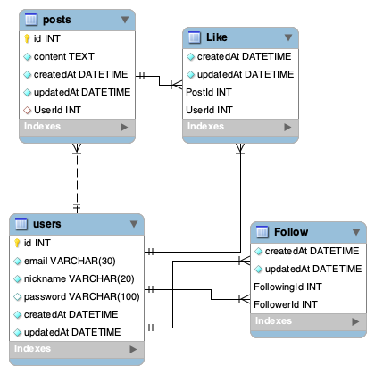

시퀄라이즈(Sequelize)는 Postgres, MySQL, MariaDB, SQLite 및 MSSQL을 위한 Promise 기반의 ORM(Object Relational Mapping) 라이브러리이다. 이를 이용하면 SQL문을 잘 알지 못해도 쉽게 데이터베이스를 조작할 수 있어 생산성이 향상된다. 여기서는 시퀄라이즈를 이용해 MySQL 데이터베이스를 생성하고 모델을 만들어 볼 것이다.

---

## 버전

mysql2: 2.2.5

sequelize: 6.3.5

sequelize-cli: 6.2.0

---

우선 express로 구성된 프로젝트 루트 경로에서 mysql과 sequelize를 설치한다. 여기서 sequelize-cli는 cli(command line interface)에서 실행되므로 전역 설치 해준다.

```bash
$ npm i mysql2 sequelize
$ npm i -g sequelize-cli
$ sequelize init
```

`sequelize init`을 실행하면 여러 폴더 및 파일이 생성되는데, 기본적으로 데이터베이스 설정 및 모델 정의를 하고 sequelize-cli를 통해 데이터베이스를 생성하여 이를 express에서 연결한다.

## DB 설정 및 모델 정의

- config/config.json

dotenv환경을 사용하려면 js파일로 변환하고 아래와 같이 설정한다.

```jsx
const dotenv = require('dotenv')

dotenv.config()

module.exports = {
  development: {
    username: process.env.DB_USERNAME,
    password: process.env.DB_PASSWORD,
    database: 'database_development',
    host: '127.0.0.1',
    dialect: 'mysql',
    operatorsAliases: false,
  },
  test: {
    username: process.env.DB_USERNAME,
    password: process.env.DB_PASSWORD,
    database: 'database_test',
    host: '127.0.0.1',
    dialect: 'mysql',
    operatorsAliases: false,
  },
  production: {
    username: process.env.DB_USERNAME,
    password: process.env.DB_PASSWORD,
    database: 'database_production',
    host: '127.0.0.1',
    dialect: 'mysql',
    operatorsAliases: false,
  },
}
```

- models/

여기서는 User 모델과 Post 모델을 예시로 생성할 것이다.

- user.js

  ```jsx
  const DataTypes = require('sequelize')
  const { Model } = DataTypes

  module.exports = class User extends Model {
    static init(sequelize) {
      return super.init(
        {
          email: {
            type: DataTypes.STRING(30),
            allowNull: false,
            unique: true,
          },
          nickname: {
            type: DataTypes.STRING(20),
            allowNull: false,
            unique: true,
          },
          password: {
            type: DataTypes.STRING(100),
            allowNull: true,
          },
        },
        {
          modelName: 'User',
          tableName: 'users',
          charset: 'utf8',
          collate: 'utf8',
          sequelize,
        }
      )
    }
    static associate(db) {
      db.User.hasMany(db.Post)
      db.User.belongsToMany(db.Post, { through: 'Like', as: 'Liked' })
      db.User.belongsToMany(db.User, {
        through: 'Follow',
        as: 'Followers',
        foreignKey: 'FollowingId',
      })
      db.User.belongsToMany(db.User, {
        through: 'Follow',
        as: 'Followings',
        foreignKey: 'FollowerId',
      })
    }
  }
  ```

- post.js

  ```jsx
  const DataTypes = require('sequelize')
  const { Model } = DataTypes

  module.exports = class Post extends Model {
    static init(sequelize) {
      return super.init(
        {
          content: {
            type: DataTypes.TEXT,
            allowNull: false,
          },
        },
        {
          modelName: 'Post',
          tableName: 'posts',
          charset: 'utf8mb4',
          collate: 'utf8mb4_general_ci',
          sequelize,
        }
      )
    }
    static associate(db) {
      db.Post.belongsTo(db.User)
      db.Post.belongsToMany(db.User, { through: 'Like', as: 'Likers' })
    }
  }
  ```

보통 `sequelize.define(modelName, {...})`을 이용해 테이블을 정의하지만 추후에 추가될지도 모르는 associate에 능동적으로 대응하기 위해 class로 정의되었음을 볼 수 있다. 유저와 게시물 간의 ERD는 아래와 같다.



유저-유저: _N:M(Follow)_

유저-게시물: _1:N, N:M(Like)_

- index.js

  ```jsx
  const Sequelize = require('sequelize')
  const post = require('./post')
  const user = require('./user')

  const env = process.env.NODE_ENV || 'development'
  const config = require('../config/config')[env]
  const db = {}

  const sequelize = new Sequelize(
    config.database,
    config.username,
    config.password,
    config
  )

  db.Post = post
  db.User = user

  Object.keys(db).forEach(modelName => {
    db[modelName].init(sequelize)
  })

  Object.keys(db).forEach(modelName => {
    if (db[modelName].associate) {
      db[modelName].associate(db)
    }
  })

  db.sequelize = sequelize
  db.Sequelize = Sequelize

  module.exports = db
  ```

## DB생성 및 연결

mysql을 실행하고 아래의 명령어를 실행하면 현재 환경에 맞는 데이터베이스가 생성된다.

```bash
npx sequelize db:create
```

```jsx
const express = require('express')
const dotenv = require('dotenv')
const db = require('./models')
const app = express()
dotenv.config()
db.sequelize
  .sync()
  .then(() => {
    console.log('db 연결 성공')
  })
  .catch(console.error)

const { User, Post } = require('./models')

User.create({
  email: 'jeeneee@abc.com',
  nickname: 'jeeneee',
  password: '1111',
})
  .then(result => console.log(result))
  .catch(error => console.error(error))

User.findAll()
  .then(result => console.log(result))
  .catch(error => console.error(error))
```

위의 코드(app.js)는 앞서 정의한 테이블을 생성하고 유저 데이터를 INSERT하고 모든 유저를 SELECT하는 코드이다. 결과는 다음과 같다. (일부 생략)

```jsx
User {
  dataValues: {
    id: 1,
    email: 'jeeneee@abc.com',
    nickname: 'jeeneee',
    password: '1111',
  },
  _previousDataValues: {
    email: 'jeeneee@abc.com',
    nickname: 'jeeneee',
    password: '1111',
    id: 1,
  },
	...
}
```

보다시피 User라는 객체를 받아올 수 있다. 이와 같이 ORM을 사용하면 DB조작이 굉장히 쉬워진다. 하지만 프로젝트가 복잡해짐에 따라 구현하기가 어려워지고 제대로 구현하지 못하면 성능이 떨어지므로 ORM을 선택하는데 있어서 신중해야 한다.
