# 스프링 프로젝트 생성(IntelliJ)

인텔리제이(IntelliJ)에서 스프링 MVC 프로젝트를 생성해본다.

프로젝트를 구성하는 방법은 여러 가지가 있겠지만, 여기선 우선 Maven으로 프로젝트를 생성하고 Spring MVC 프레임워크를 추가하여 기본 틀을 만든 뒤에 라이브러리를 Maven으로 관리할 수 있도록 설정할 것이다.

**Windows10 & macOS Big Sur**

**IntelliJ IDEA Ultimate 2020.3.2**

1. **New Project에서 Maven을 선택하고 archetype은 체크하지 않는다.**

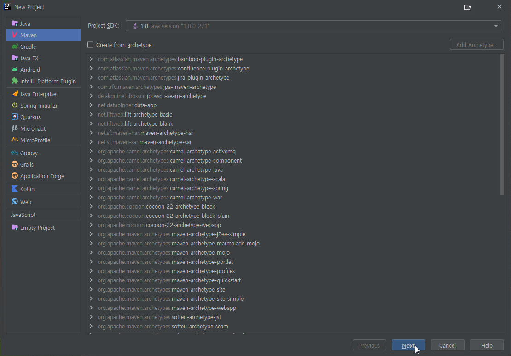

**2. 프로젝트명과 GroupId를 작성한다.**

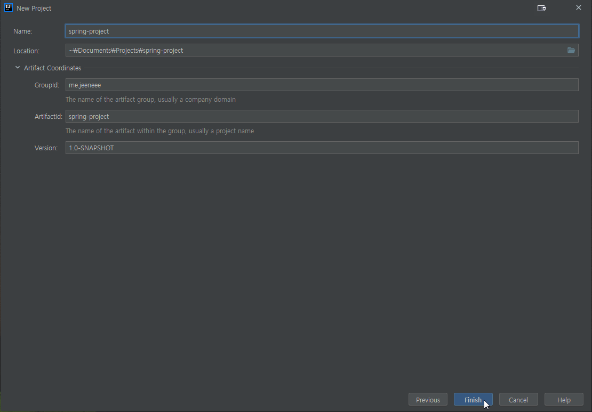

**3. 프레임워크를 추가한다.**

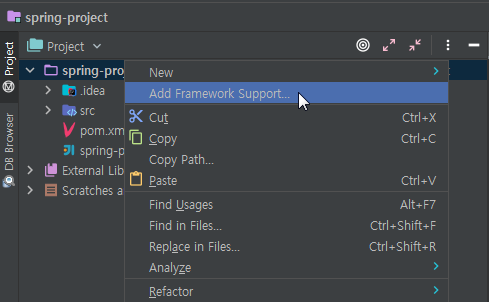

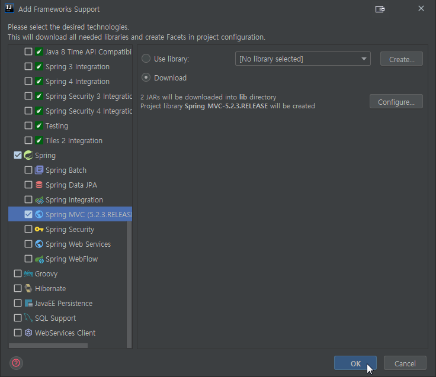

**4. pom.xml을 이용할 것이기에 lib폴더를 삭제하고 Project Structure-Libraries에서 프레임워크를 통해 받아진 라이브러리를 삭제한다.**

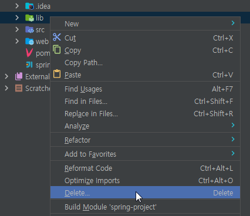

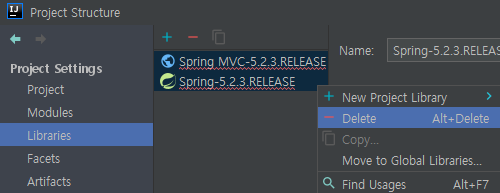

**5. pom.xml에서 필수적인 의존 라이브러리를 추가한다.**

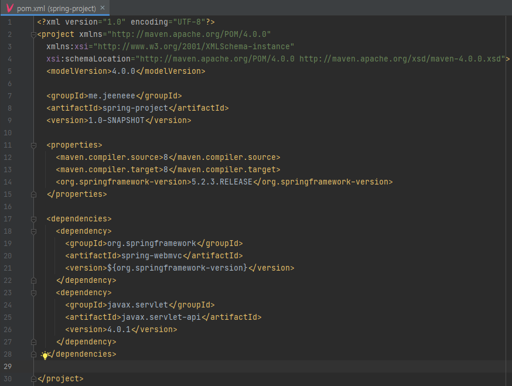

```xml
<properties>
    <maven.compiler.source>8</maven.compiler.source>
    <maven.compiler.target>8</maven.compiler.target>
    <org.springframework-version>5.2.3.RELEASE</org.springframework-version>
  </properties>

  <dependencies>
    <dependency>
      <groupId>org.springframework</groupId>
      <artifactId>spring-webmvc</artifactId>
      <version>${org.springframework-version}</version>
    </dependency>
    <dependency>
      <groupId>javax.servlet</groupId>
      <artifactId>javax.servlet-api</artifactId>
      <version>4.0.1</version>
    </dependency>
  </dependencies>
```

**6. Project Structure-Artifacts에서 아티팩트를 /WEB-INF/lib에 넣는다.**

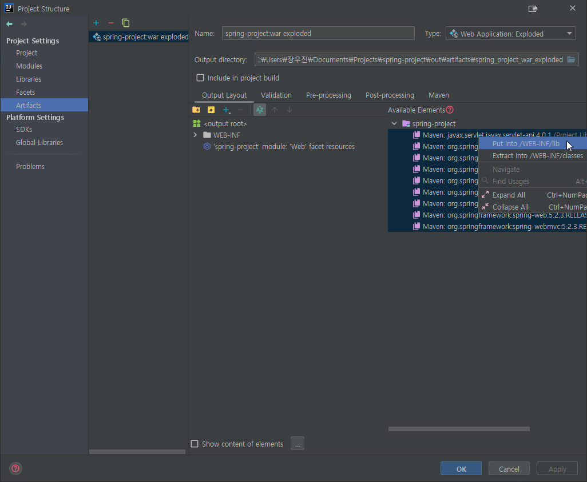

**7. 간단한 컨트롤러를 만든다.**

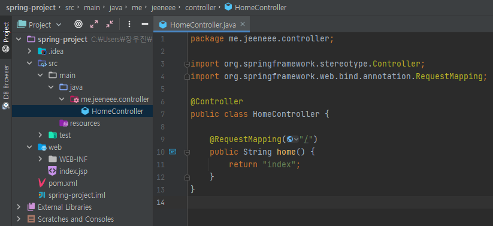

```java
package me.jeeneee.controller;

import org.springframework.stereotype.Controller;
import org.springframework.web.bind.annotation.RequestMapping;

@Controller
public class HomeController {

    @RequestMapping("/")
    public String home() {
        return "index";
    }
}
```

**8. (optional)**

- web → src/main/webapp
- web/index.jsp → src/main/webapp/views/index.jsp

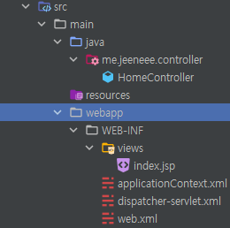

**9. xml 설정**

- **web.xml**

  ```xml
  <?xml version="1.0" encoding="UTF-8"?>
  <web-app xmlns="http://xmlns.jcp.org/xml/ns/javaee"
           xmlns:xsi="http://www.w3.org/2001/XMLSchema-instance"
           xsi:schemaLocation="http://xmlns.jcp.org/xml/ns/javaee http://xmlns.jcp.org/xml/ns/javaee/web-app_4_0.xsd"
           version="4.0">
    <context-param>
      <param-name>contextConfigLocation</param-name>
      <param-value>/WEB-INF/applicationContext.xml</param-value>
    </context-param>
    <listener>
      <listener-class>org.springframework.web.context.ContextLoaderListener</listener-class>
    </listener>
    <servlet>
      <servlet-name>dispatcher</servlet-name>
      <servlet-class>org.springframework.web.servlet.DispatcherServlet</servlet-class>
      <load-on-startup>1</load-on-startup>
    </servlet>
    <servlet-mapping>
      <servlet-name>dispatcher</servlet-name>
      <url-pattern>/</url-pattern>
    </servlet-mapping>
  </web-app>
  ```

- **dispatcher-servlet.xml**

  ```xml
  <?xml version="1.0" encoding="UTF-8"?>
  <beans xmlns="http://www.springframework.org/schema/beans"
    xmlns:xsi="http://www.w3.org/2001/XMLSchema-instance"
    xmlns:mvc="http://www.springframework.org/schema/mvc"
    xmlns:context="http://www.springframework.org/schema/context"
    xsi:schemaLocation="http://www.springframework.org/schema/beans http://www.springframework.org/schema/beans/spring-beans.xsd http://www.springframework.org/schema/mvc https://www.springframework.org/schema/mvc/spring-mvc.xsd http://www.springframework.org/schema/context https://www.springframework.org/schema/context/spring-context.xsd">

    <mvc:annotation-driven />
    <context:component-scan base-package="me.jeeneee.controller" />

    <bean class="org.springframework.web.servlet.view.InternalResourceViewResolver">
      <property name="prefix" value="/WEB-INF/views/" />
      <property name="suffix" value=".jsp" />
    </bean>
  </beans>
  ```

**10. 8번에서 프로젝트 구조를 변경했다면 web resource 디렉토리를 다음과 같이 수정해야 한다.**

> **만일 Spring, Web 모듈이 뜨지 않는다면 프로그램을 다시 실행하여 알람창을 확인한다.**

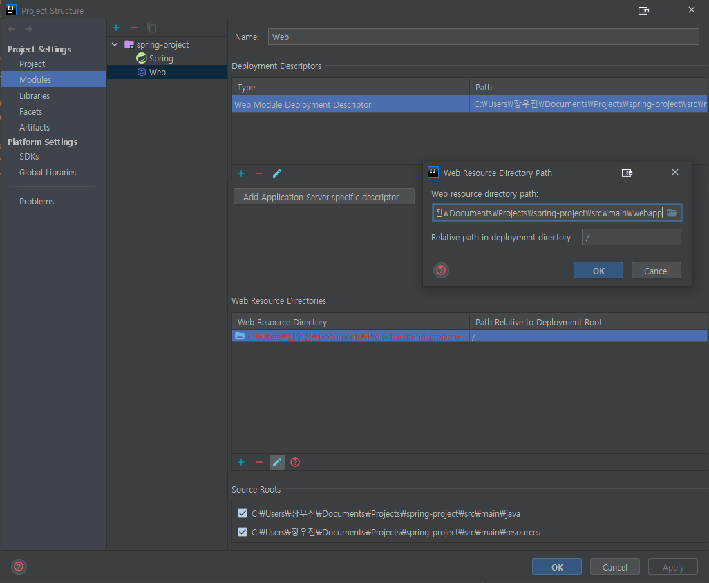

**11. tomcat 설정**

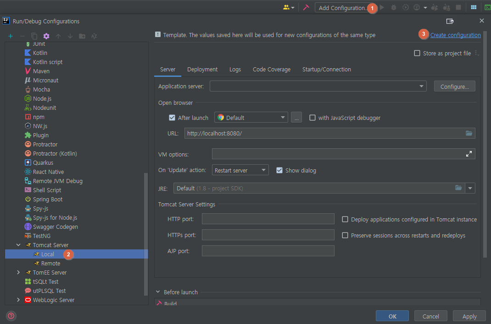

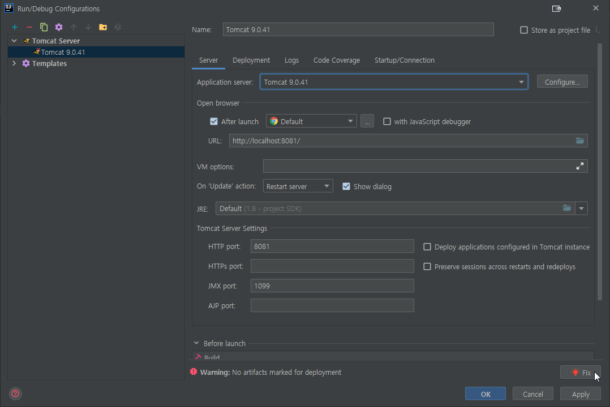

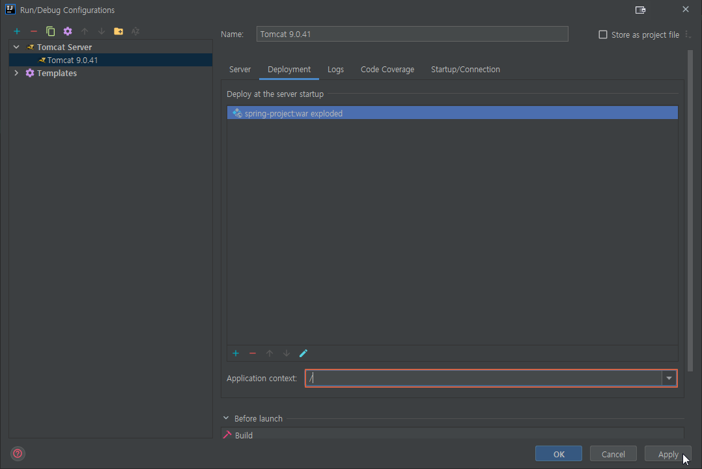

---

마지막으로 톰캣을 실행한다.

⚠️ 만일 404 에러가 발생하고 **{project_name}.iml** 파일에 아래와 같은 코드가 있다면 지운 후에 정상적으로 실행될 것이다. (또는 **target** 폴더가 제대로 생성되는지 확인한다.)

```xml
<component name="NewModuleRootManager" inherit-compiler-output="true">
    <exclude-output />
    <content url="file://$MODULE_DIR$" />
    <orderEntry type="inheritedJdk" />
    <orderEntry type="sourceFolder" forTests="false" />
  </component>
</module>
```
