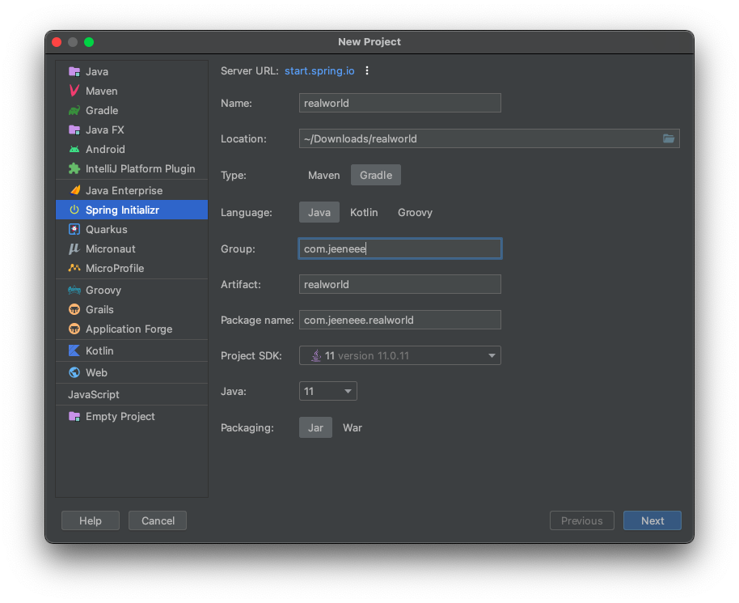
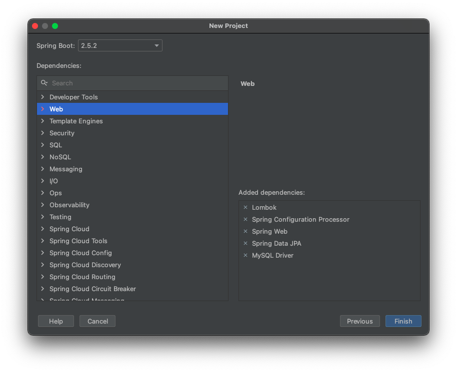
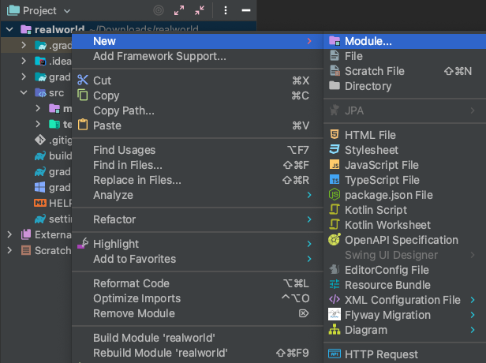
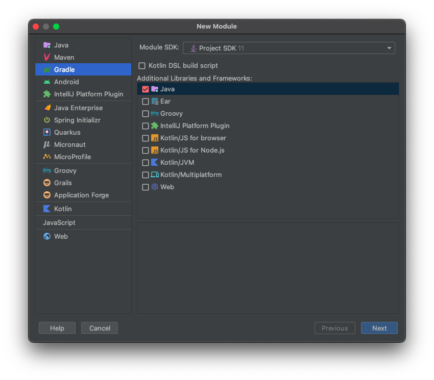
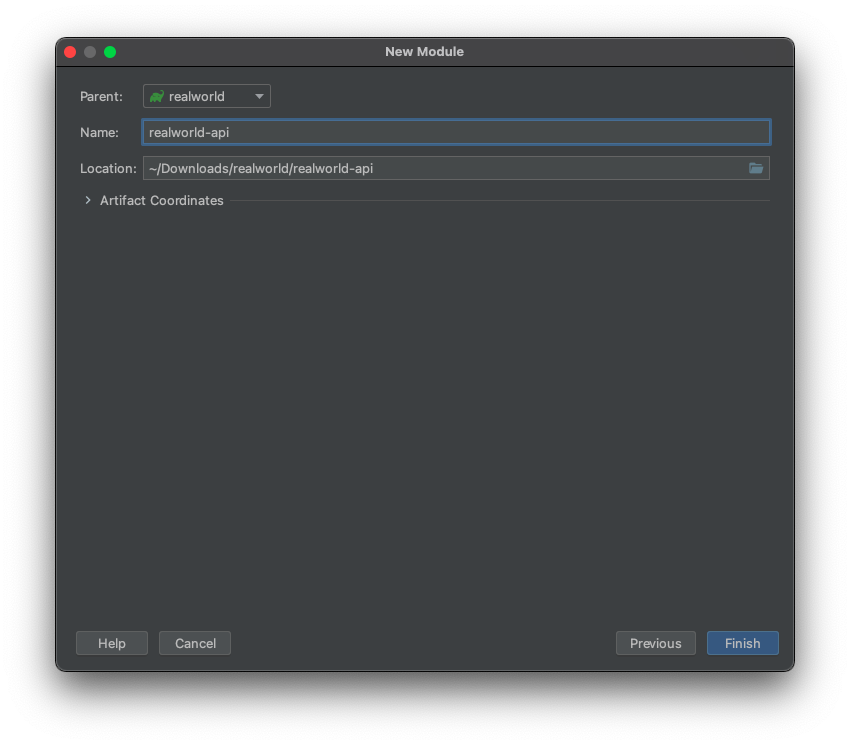
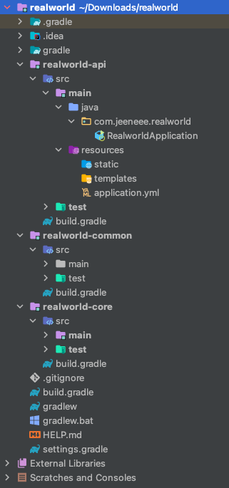

데모 프로젝트인 [realworld](https://github.com/gothinkster/realworld/tree/master/api)를 기반으로 글을 작성해보려 한다.

비록 작은 규모의 프로젝트지만 단일 프로젝트가 아닌 멀티모듈로 구성해보자.

멀티모듈에 대한 자세한 설명과 장점은 [멀티모듈 설계 이야기 with Spring, Gradle](https://techblog.woowahan.com/2637/) 블로깅을 참고하면 좋다.

여기선 realworld란 root 프로젝트 안에 realworld-api, realworld-common, realworld-core란 서브모듈을 둘 것이다.

### 버전

java 11

springboot 2.5.2

gradle 7.1.1











위와 같이 세 개의 모듈을 생성하고 기존에 있던 src 디렉토리를 api모듈에 넣으면 다음과 같은 프로젝트 구조로 구성된다.



그리고 settings.gradle을 보면 아래와 같이 적혀있는데, realworld란 루트 프로젝트에 api, common, core란 하위 모듈을 포함한다는 뜻이다. 한 줄로 써도 무방하다.

```groovy
rootProject.name = 'realworld'
include 'realworld-api'
include 'realworld-common'
include 'realworld-core'
```

이제 build.gradle을 수정해보자.

먼저 루트 프로젝트의 build.gradle은 다음과 같다.

```groovy
plugins {
    id 'java'
    id 'org.springframework.boot' version '2.5.2'
    id 'io.spring.dependency-management' version '1.0.11.RELEASE'
}

group = 'com.jeeneee'
version = '0.0.1'
sourceCompatibility = '11'

subprojects {
    apply plugin: 'java'
    apply plugin: 'org.springframework.boot'
    apply plugin: 'io.spring.dependency-management'

    repositories {
        mavenCentral()
    }

    dependencies {
        compileOnly 'org.projectlombok:lombok'
        annotationProcessor 'org.springframework.boot:spring-boot-configuration-processor'
        annotationProcessor 'org.projectlombok:lombok'
        testImplementation('org.springframework.boot:spring-boot-starter-test') {
            exclude group: 'org.junit.vintage', module: 'junit-vintage-engine'
        }
    }

    configurations {
        compileOnly {
            extendsFrom annotationProcessor
        }
    }

    test {
        useJUnitPlatform()
    }
}

project(':realworld-api') {
    dependencies {
        implementation project(':realworld-common')
        implementation project(':realworld-core')
    }
}

project(':realworld-core') {
    dependencies {
        implementation project(':realworld-common')
    }
}
```

`subprojects`는 settings.gradle에 포함된 모듈을 공통적으로 관리하는 항목이다. 모두 자바와 스프링부트 의존성을 갖으므로 해당 플러그인을 적용하였다. 그리고 롬복과 테스트 관련 의존성을 추가하였다.

`project()`는 프로젝트간의 의존성을 관리하는 항목이다. 여기에 포함된 하위 모듈의 코드를 가져다 쓸 수 있게 된다. 따라서 common 모듈은 모든 모듈에 포함되며, core모듈과 마찬가지로 실행될 필요가 없는 모듈이기에 realworld-common, realworld-core 각 모듈에 위치한 build.gradle에 다음과 같은 구문을 추가한다.

```groovy
bootJar.enabled false
jar.enabled true
```

이제 각 모듈에 필요한 의존성을 각각의 build.gradle을 통해 관리할 수 있다.
