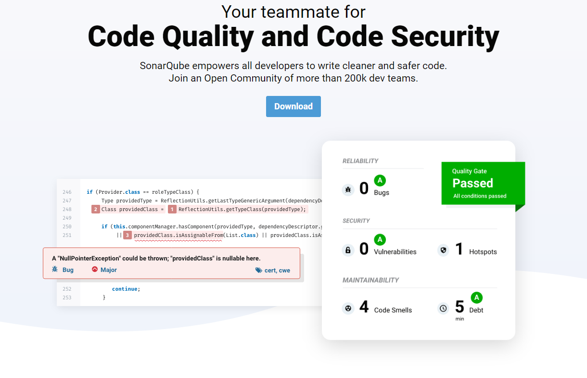
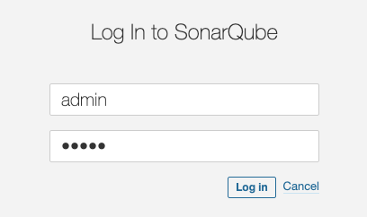
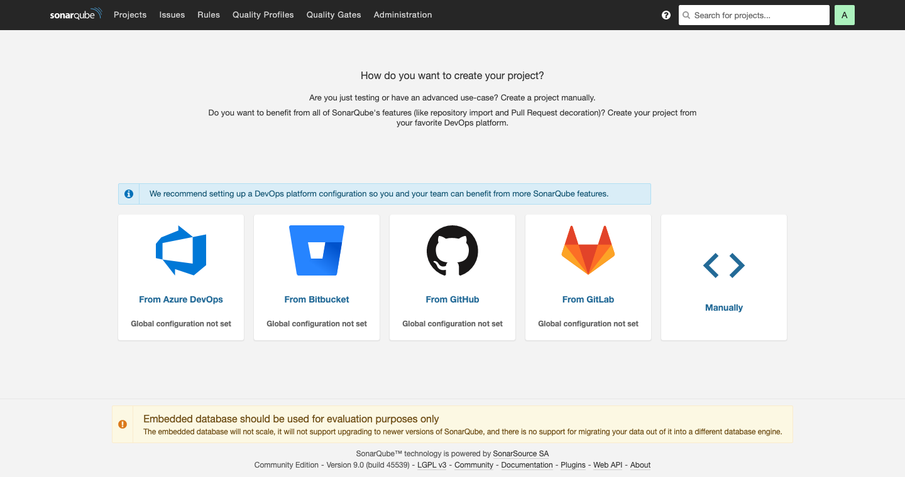
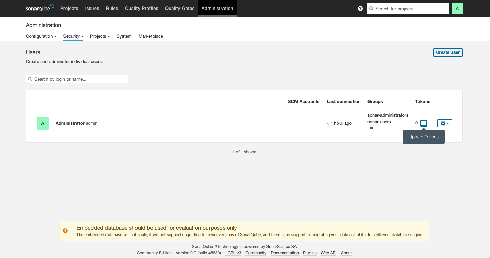
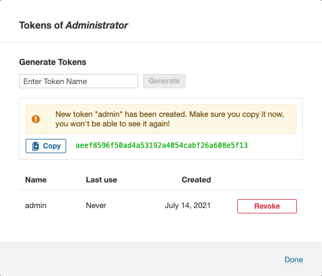
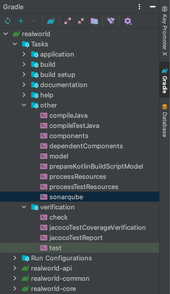
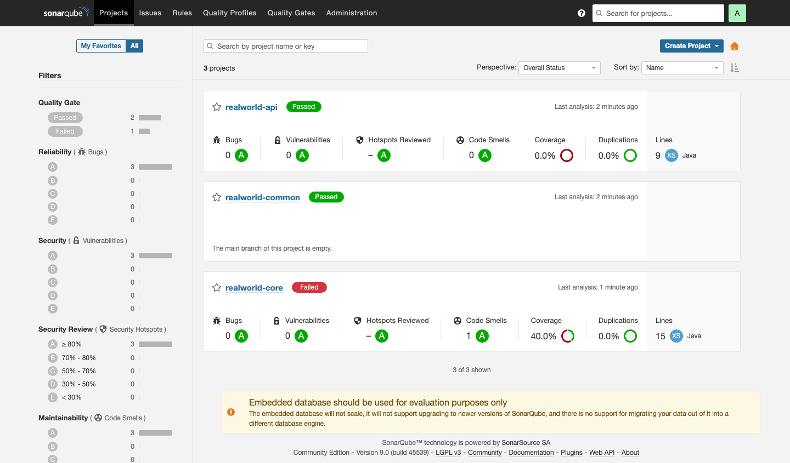
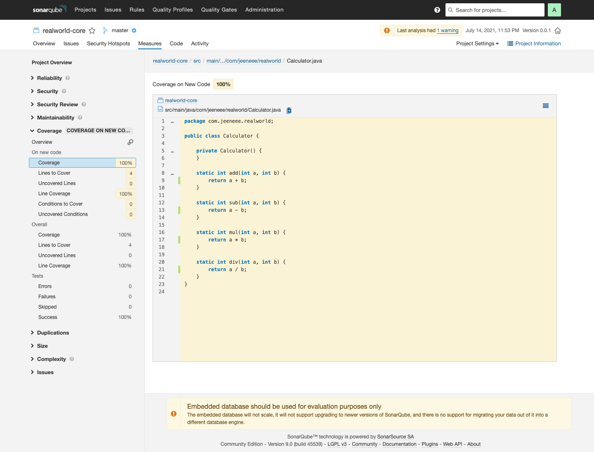

# 소나큐브란?



소나큐브는 현재 기준으로 27개 프로그래밍 언어에서 버그, 냄새나는 코드, 보안 취약점 등을 리뷰하는 정적 코드 분석 도구이다. 정적 코드 분석 도구도 여러 가지가 있는데, 소나큐브는 커뮤니티 버전이 있어 일부 제한적이지만 개인이 쓰기엔 더할 나위 없이 좋은 툴이다.

위의 이미지는 홈페이지에 들어가면 바로 보이는 이미지인데, 말 그대로 개발하는 데 있어서 코드 품질과 보안 측면에 많은 도움을 준다.

# 소나큐브 실행

```bash
$ docker run -d --name sonarqube -p 9000:9000 sonarqube
```

설치 파일을 다운로드하여 로컬에 설치할 수도 있지만 간편하게 도커를 통해 소나큐브를 실행한다. `docker run`명령은 이미지를 컨테이너로 만들어 실행하는 명령어이다. 이미지가 존재하지 않으면 가져오는 것까지 수행한다.

- `-d` 데몬 모드로, 백그라운드에서 실행하는 옵션
- `—-name` 컨테이너 이름을 설정하는 옵션
- `-p host port : container port` 포트를 설정하는 옵션

이제 http://localhost:9000 으로 접속하면 로그인 창이 나온다. 초기 아이디와 비밀번호는 admin이다.



절차에 따라 설정을 진행하고 나면



# 소나큐브 설정(+JaCoCo)

프로젝트에 소나큐브를 설정하기 위해선 권한이 있어야 한다. 소나큐브 메인 페이지 헤더의 Administration으로 들어가 Security-Users를 클릭하면 아래와 같이 유저별 권한을 볼 수 있다.



Update Tokens를 클릭한다.



토큰 이름은 마음대로 작성하고 Generate 버튼을 누르면 토큰이 생성된다. 이 토큰값은 경고창에서 보다시피 다시는 볼 수 없기 때문에 잠시 복사해두자.

이제 빌드 스크립트를 작성해보자.

**build.gradle**

```groovy
buildscript {
    repositories {
        mavenCentral()
    }
    dependencies {
        classpath "org.springframework.boot:spring-boot-gradle-plugin:2.5.2"
        classpath "io.spring.gradle:dependency-management-plugin:1.0.11.RELEASE"
        classpath "org.sonarsource.scanner.gradle:sonarqube-gradle-plugin:3.0"
    }
}

subprojects {
    apply plugin: 'java'
    apply plugin: 'org.springframework.boot'
    apply plugin: 'io.spring.dependency-management'
    apply plugin: 'org.sonarqube'
    apply plugin: 'jacoco'

    group = 'com.jeeneee'
    version = '0.0.1'
    sourceCompatibility = '11'

    repositories {
        mavenCentral()
    }

    dependencies {
        compileOnly 'org.projectlombok:lombok'
        annotationProcessor 'org.springframework.boot:spring-boot-configuration-processor'
        annotationProcessor 'org.projectlombok:lombok'
        testImplementation('org.springframework.boot:spring-boot-starter-test') {
            exclude group: 'org.junit.vintage', module: 'junit-vintage-engine'
        }
    }

    configurations {
        compileOnly {
            extendsFrom annotationProcessor
        }
    }

    test {
        useJUnitPlatform()
        finalizedBy 'jacocoTestReport'
    }

    jacoco {
        toolVersion = "0.8.7"
    }

    jacocoTestReport {
        reports {
            xml.enabled true
            csv.enabled false
            html.enabled false
        }
    }

    sonarqube {
        properties {
            property "sonar.host.url", "http://localhost:9000"
            property "sonar.login", "aeef8596f50ad4a53192a4054cabf26a608e5f13"
            property "sonar.sources", "src"
            property "sonar.language", "java"
            property "sonar.sourceEncoding", "UTF-8"
            property "sonar.profile", "Sonar way"
            property "sonar.test.inclusions", "**/*Test.java"
            property 'sonar.coverage.jacoco.xmlReportPaths', "${buildDir}/reports/jacoco/test/jacocoTestReport.xml"
        }
    }
}

project(':realworld-api') {
    dependencies {
        implementation project(':realworld-common')
        implementation project(':realworld-core')
    }
}

project(':realworld-core') {
    dependencies {
        implementation project(':realworld-common')
    }
}
```

### 개발 환경

- Java 11
- Spring Boot 2.5.2
- Gradle 7.1.1
- SonarQube Server 9.0 Community

> 소나큐브7.9버전 이상부터 자바11만을 지원하고 9.0버전은 sonarqube-gradle-plugin 버전이 3.0 이상이어야 한다.

프로젝트가 멀티모듈로 구성돼있지만 단일 프로젝트도 위와 크게 다르지 않다. subprojects를 지우고 dependencies 또는 플러그인을 합쳐주면 된다.

```groovy
apply plugin: 'org.sonarqube'
apply plugin: 'jacoco'
```

'jacoco'는 Java Code Coverage툴로써 프로젝트의 코드 커버리지를 계산해준다. 이는 gradle에서 기본적으로 제공하므로 바로 참조 가능하다.

```groovy
test {
    useJUnitPlatform()
    finalizedBy 'jacocoTestReport'
}

jacoco {
    toolVersion = "0.8.7"
}

jacocoTestReport {
    reports {
        xml.enabled true
        csv.enabled false
        html.enabled false
    }
}
```

test Task에서 `useJUnitPlatform`(JUnit5 사용) 다음에 gradle dsl인 `finalizedBy`가 실행되는데, 말그대로 마무리한다는 뜻으로 `jacocoTestReport`Task를 실행한다는 의미이다.

현재 jacoco의 가장 최신 버전은 0.8.7이다.

JaCoCo는 총 3가지 포맷의 코드 커버리지 결과 보고서를 생성한다. 예전 버전의 소나큐브는 test.exec를 읽어들여 분석했지만 최신 버전은 jacocoTestReport.xml 파일만 읽도록 변경되었다.

물론 소나큐브를 사용하지 않는다면 html로도 충분히 볼만한 UI를 제공한다.

```groovy
sonarqube {
    properties {
        property "sonar.host.url", "http://localhost:9000"
        property "sonar.login", "aeef8596f50ad4a53192a4054cabf26a608e5f13"
        property "sonar.sources", "src"
        property "sonar.language", "java"
        property "sonar.sourceEncoding", "UTF-8"
        property "sonar.profile", "Sonar way"
        property "sonar.test.inclusions", "**/*Test.java"
        property 'sonar.coverage.jacoco.xmlReportPaths', "${buildDir}/reports/jacoco/test/jacocoTestReport.xml"
    }
}
```

소나큐브에 대한 설정이다. 현재 띄워진 소나큐브 서버와 위에서 복사한 토큰 값이 들어가고 스캔할 소스 타겟과 규칙들이 포함된다. 더 자세한 정보는 [SonarScanner for Gradle](https://docs.sonarqube.org/latest/analysis/scan/sonarscanner-for-gradle/)에서 참고하길 바란다. 여기서 중요한 속성은 JaCoCo의 xml파일 경로를 명시하는 `sonar.coverage.jacoco.xmlReportPaths`이다.

여기에 `jacocoTestCoverageVerification` Task도 추가하여 Querydsl의 Q도메인을 테스트에서 제외한다던지 코드 커버리지가 80%를 넘지 못하면 빌드 실패를 유발하게 할 수도 있다.

# 소나큐브 적용

core 모듈에 간단한 계산기 클래스를 예제로 작성해본다.

**Calculator.java**

```java
package com.jeeneee.realworld;

public class Calculator {

    static int add(int a, int b) {
        return a + b;
    }

    static int sub(int a, int b) {
        return a - b;
    }

    static int mul(int a, int b) {
        return a * b;
    }

    static int div(int a, int b) {
        return a / b;
    }
}
```

**CalculatorTest.java**

```java
package com.jeeneee.realworld;

import static org.junit.jupiter.api.Assertions.*;

import org.junit.jupiter.api.Test;

class CalculatorTest {

    @Test
    void add() {
        assertEquals(5, Calculator.add(2, 3));
    }

    @Test
    void div() {
        assertEquals(3, Calculator.div(6, 2));
        assertThrows(ArithmeticException.class, () -> Calculator.div(6, 0));
    }
}
```

여기서 덧셈, 나눗셈에 대한 테스트 코드만을 작성하였다. 이제 gradle을 통해 빌드하고 소나큐브 태스크를 실행해보자. 방법은 두 가지가 있다.

- `./gradlew test sonarqube`(권한이 없는 경우, `chmod +x gradlew`)
- IntelliJ(Tasks에서 test → sonarqube)

  



이제 다시 브라우저에서 소나큐브로 들어가보면 각 모듈의 분석 결과가 한 눈에 보인다.

위의 빌드 스크립트에서 `sonar.profile`을 소나큐브의 default quality gate인 Sonar way로 설정하였는데, 이는 커버리지가 80%가 넘어가야 Pass하는 규칙을 포함한다. 또한, 소나큐브는 새로운 코드에 대해서만 통과/실패를 나누기 때문에 api 모듈이 통과된 것으로 나타나는 것이다.

이제 덧셈과 곱셈 메서드에 대한 테스트 코드를 작성하고, Calculator의 기본 생성자를 private으로 바꾸면 100%가 되어 통과됨을 확인할 수 있을 것이다.



정적 코드 분석 도구인 소나큐브를 프로젝트에 도입함으로써 자신이 작성한 코드가 제대로 짜여지고 있는지와 클래스마다의 코드 커버리지도 쉽게 알 수 있어 심적으로 안심도 되고 유지 보수 측면에서 큰 도움이 될 것이라 생각한다.

> 여기에 Sonar Lint까지 더하면 냄새나는 코드를 바로바로 잡아주기 때문에 꼭 사용하길 바란다.
