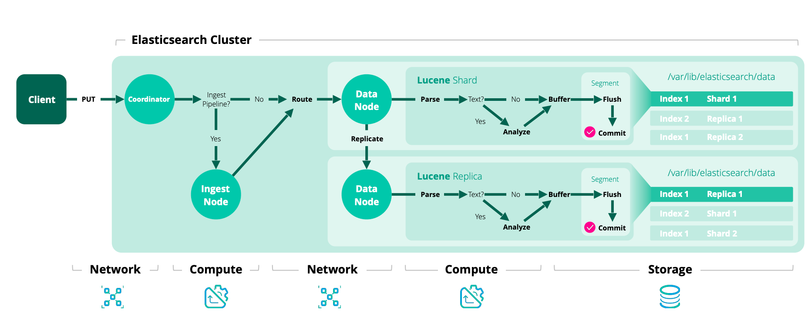

Elasticsearch에 대한 기초적인 설명과 구성 및 설정 등을 다룹니다.

## Elasticsearch란?
> [공식 문서](https://www.elastic.co/elasticsearch)에서는 Elasticsearch(이하 ES)에 대해 분산형 검색 및 분석 엔진으로,
데이터를 중앙화하여 빠르고 정확한 검색을 제공하는 오픈소스 프로젝트라 소개하고 있습니다.

ES는 Elastic Stack(Beats, ES, Kibana, Logstash)의 핵심으로, 가공된 데이터를 분석하고 저장(색인)하여 검색 할 수 있습니다.


## 인덱스(index)와 문서(document)
ES에서의 인덱스란 데이터를 저장하고 관리하기 위한 논리적 공간입니다. DB의 table 또는 collection과 비슷한 개념으로 이해 할 수 있고, 반드시 인덱스에
데이터(이하 문서, document)를 저장해야 합니다. 앞으로는 문서를 색인한다고 표현하겠습니다.
여기서의 문서는 데이터를 저장하는 최소 단위며, JSON 형식으로 표현됩니다.
```json
{
  "messageId": 10000,
  "chatId": 100,
  "userId": 10,
  "content": "안녕하세요",
  "createdAt": "2025-02-16T12:34:56.789Z"
}
```

### 문서 색인
es-head, REST API, kibana의 dev tools 등을 통해 문서를 색인할 수 있습니다. 이 중 dev tools를 통해 예제를 작성할 것입니다.
* kibana 메뉴 > Dev Tools
```
# 1. 텍스트 분석
GET /message_v0-20250216/_analyze
{
  "text": "elasticsearch는 분산형 검색 및 분석 엔진입니다."
}
## 결과: ["elasticsearch는", "분산형", "검색", "및", "분석", "엔진입니다"]

# 2. 문서 색인
POST /message_v0-20250216/_doc
{
  "messageId": 10000,
  "chatId": 100,
  "userId": 10,
  "content": "elasticsearch는 분산형 검색 및 분석 엔진입니다.",
  "createdAt": "2025-01-01T12:34:56.789Z"
}

# 3. 생성된 인덱스 조회
GET /message_v0-20250216

# 4. 색인된 문서 조회
## _id 조회
GET /message_v0-20250216/_doc/<id>
## 검색
GET /message_v0-20250216/_search
{
  "query": {
    "match_all": {}
  }
}
```
1. 기본적으로 text 필드를 통해 분석(역색인)된 결과를 확인할 수 있습니다. analyzer를 별도로 지정하지 않았으므로 기본값인 standard analyzer가 사용됩니다. (띄어쓰기만 구분)
2. _id를 지정하지 않고 색인하면 ES 내부에서 생성한 hash 기반 _id가 됩니다.
3. 생성된 인덱스를 조회하면 content 필드가 text, keyword 두 가지 타입인 멀티 필드로 생성된 것을 볼 수 있습니다. 모두 문자열 데이터를 저장하고 검색하는 데 사용되지만 차이점이 있습니다.
    - text: 분석(analyze)을 거쳐 분리된 토큰을 각각 색인하여 전문 검색 시 활용합니다.
    - keyword: 분석을 거치지 않고 있는 그대로 색인합니다. 정확한 값 매칭, 집계, 필터링 등의 용도로 활용합니다.
4. 조회 및 검색. 후에 서술하지만 목적과 동작 방식에 차이가 있습니다.
    - _id 조회: 기본적으로 shard routing이 _id를 기반으로 결정되기에 특정 샤드로 바로 이동해 문서를 가져옵니다. 따라서 빠를 수 밖에 없습니다.
    - 검색: Query DSL을 사용하여 원하는 여러 조건을 추가할 수 있습니다. 당연히 모든 샤드에서 모든 문서를 확인해야 하므로 속도가 느릴 수 있습니다.


es-head에서 시각화된 인덱스 구성을 보면, data node가 4개이고 `number_of_shards`, `number_of_replicas`가 각각 4와 1인 것을 볼 수 있습니다.
bold 처리된 사각형이 primary shard 입니다.


다음과 같은 색인 과정이 이루어집니다.
1. ingest pipeline. 문서 전처리로, ingest node에서 처리됩니다.
2. shard routing. 기본적으로 `hash(_id) % number_of_shards`로 결정됩니다.
3. parse. 텍스트는 analyzer에 의해 분석 및 역색인
4. replicate. replica node로 복제 시작
5. buffer: 메모리 버퍼 적재
6. flush(lucene), refresh(es): 시스템 캐시에 세그먼트 생성되어 검색 가능한 상태가 되지만 유실 가능성이 있습니다.
7. commit(lucene), flush(es): 물리 디스크에 저장하여 안전한 상태가 됩니다.

### 문서 분석
위에서 언급한 analyzer는 text field 내용에 대해 분석합니다.

analyzer = character filters + tokenizer + token filters
- character filters: 텍스트 토큰화 전에 전처리. HTML 태그 제거, 특정 문자 변환 등을 수행합니다.
- tokenizer: 텍스트를 검색 가능한 단위(토큰)으로 나눕니다. 기본적으로 다양한 토크나이저를 제공하는데 검색 목적에 맞게 사용해야 합니다. 특히 한글은 주로 별도의 라이브러리를 사용합니다.
- token filters: 토큰을 후처리. 정규화 작업을 수행합니다.

한글은 `nori`라는 한글 형태소 분석기를 주로 사용합니다. 참고 자료가 많으니 자세한 내용은 생략하고 위의 내용들을 종합한 인덱스를 생성해 보겠습니다.
```
# 1. 인덱스 생성
PUT /message_v0-20250216
{
  "settings": {
    "refresh_interval": "1s", // refresh 주기
    "number_of_shards": 4, // primary shard 수
    "number_of_replicas": 1, // replica shard 수
    "index": {
      "analysis": {
        "tokenizer": { // tokenizer 정의
          "nori_tokenizer": {
            "type": "nori_tokenizer", // ES 기본 제공(없는 버전은 plugin 설치)
            "decompound_mode": "none" // 복합어 어근 분해(none | discard | mixed)
          }
        },
        "analyzer": {
          "nori_analyzer": { // analyzer 정의
            "type": "custom",
            "tokenizer": "nori_tokenizer", // 위의 tokenizer
            "filter": [
              "lowercase", // 소문자 변환
              "nori_part_of_speech" // stoptags 필드에 정의된 품사 제거(기본값 사용)
              ]
          }
        }
      }
    }
  },
  "mappings": {
    "dynamic": "strict", // 명시적 mapping. null은 가능하지만 정의되지 않은 필드 예외 발생
    "properties": {
      "messageId": { "type": "long" },
      "chatId": { "type": "long" },
      "userId": { "type": "long" },
      "content": {
        "type": "text",
        "analyzer": "nori_analyzer", // 색인용 분석기
        "search_analyzer": "nori_analyzer" // 검색용 분석기. 생략하면 analyzer 사용
      },
      "createdAt": { "type": "date" }
    }
  }
}

# 2. 텍스트 분석
GET /message_v0-20250216/_analyze
{
  "text": "elasticsearch는 분산형 검색 및 분석 엔진입니다.",
  "analyzer": "nori_analyzer"
}
## 결과: ["elasticsearch", "분산", "검색", "분석", "엔진", "입니다"]

# 3. 문서 색인
POST /message_v0-20250216/_doc/10000 // _id 명시적 정의
{
  "messageId": 10000,
  "chatId": 100,
  "userId": 10,
  "content": "elasticsearch는 분산형 검색 및 분석 엔진입니다.",
  "createdAt": "2025-01-01T12:34:56.789Z"
}

# 4. 색인된 문서 조회
## _id 조회
GET /message_v0-20250216/_doc/10000
## 검색
GET /message_v0-20250216/_search
{
  "query": {
    "term": {
      "userId": {
        "value": 10
      }
    }
  }
}

GET /message_v0-20250216/_search
{
  "query": {
    "match": {
      "content": "엔진"
    }
  }
}
```
> 문서 색인 시 _id를 명시적으로 정의한 이유는 messageId가 고르게 분포되어 있는 가정 하에 색인 후 메시지 수정 또는 삭제가 바로 발생할 경우 즉각 조치하기 위함입니다.
_id 기반 작업은 문서 검색 가능 여부와 관계없이 수행 가능합니다.

위 인덱스에 버전과 날짜를 추가한 것을 볼 수 있습니다. reindex를 대비하여 버전을 추가하였고, 날짜는 효율적인 문서 관리를 위해 추가하였습니다.
es curator나 배치를 통해 오래된 인덱스를 제거하거나 ILM 기능과 결합하여 hot-warm-cold 데이터 구조를 구성할 수도 있습니다.
물론 인덱스가 너무 많이 생성되지 않도록 적절한 보관 주기를 고려해야 합니다.

### alias
그렇다면 `..., message_v0-20250215, message_v0-20250216` 인덱스들에 대한 검색을 어떻게 할까요?

```
GET /message_v0-*/_search
{
  "query": {
    "match": {
      "content": "엔진"
    }
  }
}
```
위와 같이 와일드카드 패턴을 지원합니다. 따라서 색인은 명확한 인덱스에, 검색은 와일드카드 패턴이나 alias(별칭)을 추가해서 호출합니다.
```
POST /_aliases
{
  "actions": [
    {
      "add": {
        "index": "message_v0-*",
        "alias": "message"
      }
    }
  ]
}
```

## 인덱스 템플릿(index template)
지금까지 내용으로는 인덱스를 매번 생성해줘야 합니다. 날짜가 포함됐다면 늦어도 자정 전에는 미리 만들어야겠죠.
인덱스 템플릿을 사용하면 정의된 새로운 인덱스에 대한 색인 시, 인덱스 패턴에 매칭되는 경우 해당 인덱스를 자동으로 생성합니다.

최종적으로 아래와 같은 인덱스 템플릿을 만들 수 있습니다.

```
PUT /_index_template/message_v0_template
{
  "index_patterns": ["message_v0-*"],
  "template": {
    "aliases": {
      "message": {}
    },
    "settings": {
      "refresh_interval": "1s",
      "number_of_shards": 4,
      "number_of_replicas": 1,
      "index": {
        "sort.field": "messageId",
        "sort.order": "desc",
        "analysis": {
          "tokenizer": {
            "nori_tokenizer": {
              "type": "nori_tokenizer",
              "decompound_mode": "none"
            }
          },
          "analyzer": {
            "nori_analyzer": {
              "type": "custom",
              "tokenizer": "nori_tokenizer",
              "filter": ["lowercase", "nori_part_of_speech"]
            }
          }
        }
      }
    },
    "mappings": {
      "dynamic": "strict",
      "properties": {
        "messageId": { "type": "long" },
        "chatId": { "type": "long" },
        "userId": { "type": "long" },
        "content": {
          "type": "text",
          "analyzer": "nori_analyzer",
          "search_analyzer": "nori_analyzer"
        },
        "createdAt": { "type": "date" }
      }
    }
  }
}
```

다음 편에서는 스프링을 통해 ES와 연동하는 방법을 알아보겠습니다🤗