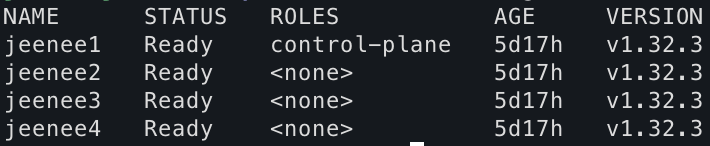

## Intro
작년 라즈베리파이4 4대를 이용하여 쿠버네티스 클러스터를 구축했습니다.

당시엔 노션에 대충 정리만 했었는데, 이번 기회에 최신 버전으로 마이그레이션하면서 구축 과정에 대해 자세히 다뤄보려 합니다.
꼭 라즈베리파이가 아니더라도 미니PC에서 k8s를 설치하고 싶은 분들에게도 도움이 될 것 같습니다.


아래 장비로 구성했습니다.
- 라즈베리파이4, 4(마스터 노드 1 + 워커 노드 3)
- M.2 NVMe SSD 128GB, 4(nfs 구성x)
- SSD Enclosure, 4
- 8포트 기가비트 스위치

## 1. 라즈베리파이 기본 설정
### OS 설치
[Raspberry Pi Imager](https://www.raspberrypi.com/software)를 통해 SSD에 Ubuntu OS를 설치합니다.
저는 Ubuntu Server 24.04.2 LTS(64bit)로 선택하고 공개키 인증 기반 ssh 설정도 했습니다.
각 host 뒤에 숫자를 붙이면 구분이 쉽습니다.
```bash
$ ssh-keygen -t rsa # 생성된 공개키 전문 복붙
```

### DHCP 고정 할당
사설 IP 변경 방지를 위해 DHCP 고정 할당을 해줍니다. 저는 각 호스트 번호에 맞게 192.168.219.13[1:4]로 지정하였습니다.

### ssh 접속
```bash
$ ssh -i .ssh/rasp username@192.168.219.131

# 또는 아래와 같이 .ssh/config에 추가하면 편합니다.
Host rasp1
    HostName 192.168.219.131
    User username
    IdentityFile ~/.ssh/rasp # 개인키
```
벌써부터 외부 접속을 원한다면 NAT 설정 후 공인 IP를 추가하면 됩니다.

모든 노드 대상으로 아래 명령어를 실행합니다. tmux같은 툴을 쓰면 편합니다.
```bash
$ sudo apt-get update
$ sudo apt-get upgrade

$ sudo rpi-eeprom-update -a
$ sudo rpi-eeprom-config --edit
# 마지막 줄 BOOT_ORDER=0xf14 변경 후 재부팅
```
노드 부팅 시 USB를 먼저 보도록 [라즈베리파이의 boot order](https://www.raspberrypi.com/documentation/computers/raspberry-pi.html#boot_order-examples)를 변경합니다.

### swap 메모리 비활성화
쿠버네티스는 기본적으로 스왑이 활성화되어 있으면 메모리 관리 예측이 어려워 해당 노드에서의 실행을 거부합니다.([참고](https://kubernetes.io/docs/setup/production-environment/tools/kubeadm/install-kubeadm/#swap-configuration))

따라서 모든 노드에 대해 swap memory를 비활성화합니다.
```bash
$ sudo swapoff -a
$ sudo sed -i.bak -r 's/(.+ swap .+)/#\1/' /etc/fstab # 영구 비활성화
```

## 2. 쿠버네티스 설치(v1.32)
pod에서 컨테이너를 실행하기 위해 쿠버네티스는 container runtime을 사용합니다. 기본적으로 인터페이스를 사용하기 때문에 이를 구현하는 [여러 runtime](https://kubernetes.io/docs/setup/production-environment/tools/kubeadm/install-kubeadm/#installing-runtime)
(containerd, CRI-O, cri-dockerd를 사용하는 도커 엔진) 중 원하는 것을 설치하면 됩니다.(v1.24 이후부터 그냥 도커 엔진은 지원 안함)

여기선 `containerd`를 설치합니다.

### containerd 설치
[containerd github](https://github.com/containerd/containerd/blob/main/docs/getting-started.md)을 참고하여 원하는 방법으로 설치하면 됩니다.

#### option 2: apt-get
docker 공식 문서에서 containerd만 설치합니다.
- step1: docker apt repository 추가
```bash
# Add Docker's official GPG key:
sudo apt-get update
sudo apt-get install ca-certificates curl
sudo install -m 0755 -d /etc/apt/keyrings
sudo curl -fsSL https://download.docker.com/linux/ubuntu/gpg -o /etc/apt/keyrings/docker.asc
sudo chmod a+r /etc/apt/keyrings/docker.asc

# Add the repository to Apt sources:
echo \
  "deb [arch=$(dpkg --print-architecture) signed-by=/etc/apt/keyrings/docker.asc] https://download.docker.com/linux/ubuntu \
  $(. /etc/os-release && echo "${UBUNTU_CODENAME:-$VERSION_CODENAME}") stable" | \
  sudo tee /etc/apt/sources.list.d/docker.list > /dev/null
sudo apt-get update
```
- step2: containerd 설치
```bash
sudo apt-get install containerd.io
```
- step3: CNI plugins 설치(CNI)
```bash
$ sudo mkdir -p /opt/cni/bin
$ wget https://github.com/containernetworking/plugins/releases/download/v1.6.2/cni-plugins-linux-arm64-v1.6.2.tgz
$ sudo tar Cxzvf /opt/cni/bin cni-plugins-linux-arm64-v1.6.2.tgz
$ rm cni-plugins-linux-arm64-v1.6.2.tgz
```

### cgroup 설정
#### containerd
`/etc/containerd/config.toml`을 보면 1)`disabled_plugins = ["cri"]` 되어 있고, 2)runc 관련 설정이 없습니다. 따라서 containerd의 기본 설정 파일로 교체하고,
[systemd cgroup driver 설정](https://kubernetes.io/docs/setup/production-environment/container-runtimes/#containerd-systemd)과 같이 systemCgroup 설정을 합니다.
```bash
$ sudo su
$ containerd config default >/etc/containerd/config.toml
$ vi /etc/containerd/config.toml # runc.options.systemCgroup false -> true 변경
$ systemctl restart containerd
$ systemctl enable containerd
```
#### 라즈베리파이
ARM 계열 리눅스는 보통 cgroup이 꺼져 있는 경우가 많다고 합니다. cgroup을 통해 리소스를 관리 및 제어해야 하므로 커널 부팅 옵션을 통해 이를 활성화 합니다.
```bash
$ cgroup="$(head -n1 /boot/firmware/cmdline.txt) cgroup_enable=cpuset cgroup_enable=memory cgroup_memory=1 swapaccount=1"
$ echo $cgroup | sudo tee /boot/firmware/cmdline.txt
$ sudo reboot
```
- cgroup_enable=cpuset: CPU 세트(CPU 분리 제어) 활성화.
- cgroup_enable=memory: 메모리 리소스 제어 활성화.
- cgroup_memory=1: 메모리 cgroup 세부 옵션.
- swapaccount=1: cgroup을 통해 swap 사용량까지 추적할 수 있게 해주는 옵션.(swap은 껐지만)

### [kubelet, kubeadm, kubectl 설치](https://kubernetes.io/docs/setup/production-environment/tools/kubeadm/install-kubeadm/#installing-kubeadm-kubelet-and-kubectl)
> - kubelet: 노드 에이전트(데몬 백그라운드)
> - kubeadm: k8s 클러스터 설치 툴
> - kubectl: k8s 클러스터 명령 툴

```bash
$ sudo apt-get update
$ sudo apt-get install -y apt-transport-https ca-certificates curl gpg
# sudo mkdir -p -m 755 /etc/apt/keyrings # `/etc/apt/keyrings` 없으면 반드시 생성
$ curl -fsSL https://pkgs.k8s.io/core:/stable:/v1.32/deb/Release.key | sudo gpg --dearmor -o /etc/apt/keyrings/kubernetes-apt-keyring.gpg
$ echo 'deb [signed-by=/etc/apt/keyrings/kubernetes-apt-keyring.gpg] https://pkgs.k8s.io/core:/stable:/v1.32/deb/ /' | sudo tee /etc/apt/sources.list.d/kubernetes.list
$ sudo apt-get update
$ sudo apt-get install -y kubelet kubeadm kubectl
$ sudo apt-mark hold kubelet kubeadm kubectl
$ sudo systemctl enable --now kubelet
```

#### [리눅스 커널 네트워크 설정](https://kubernetes.io/docs/setup/production-environment/container-runtimes/#network-configuration)
리눅스는 기본적으로 보안상 인터페이스 간 IP 패킷 포워딩(라우팅)을 허용하지 않지만, k8s 같은 네트워크 서비스가 필요하면 직접 열어줘야 합니다.
```bash
# 부팅 시 자동 로드
$ cat <<EOF | sudo tee /etc/modules-load.d/k8s.conf
overlay
br_netfilter
EOF

$ sudo modprobe overlay # 즉시 로드
$ sudo modprobe br_netfilter # 즉시 로드

# sysctl 커널 파라미터 설정
$ cat <<EOF | sudo tee /etc/sysctl.d/k8s.conf
net.bridge.bridge-nf-call-iptables  = 1
net.bridge.bridge-nf-call-ip6tables = 1
net.ipv4.ip_forward                 = 1
EOF

# 재부팅 없이 적용
$ sudo sysctl --system

$ sysctl net.ipv4.ip_forward # 1인지 확인
```
- overlay: 컨테이너 이미지 계층화(containerd 등이 사용하는 overlayfs)
- br_netfilter: bridge 네트워크 상의 트래픽도 iptables로 필터링

### 클러스터 구성
이제 클러스터를 구성합니다. [많은 CNI](https://kubernetes.io/docs/concepts/cluster-administration/addons/#networking-and-network-policy) 중에서 기본적이고 설정이 간단한 flannel을 사용합니다.

- 마스터 노드
flannel에서 기본적으로 권장하는 네트워크 대역을 kubeadm init 명령의 옵션으로 추가합니다. 도메인이 있다면 apiserver-cert-extra-sans도 추가하는 것을 추천합니다.
```bash
$ sudo kubeadm init --pod-network-cidr=10.244.0.0/16 --apiserver-cert-extra-sans={ip or dns names}

$ mkdir -p $HOME/.kube
$ sudo cp -i /etc/kubernetes/admin.conf $HOME/.kube/config
$ sudo chown $(id -u):$(id -g) $HOME/.kube/config
```

- 워커 노드
위에서 클러스터 초기화 성공 시 출력되는 명령어를 그대로 실행하면 됩니다.
```bash
$ kubeadm join ...

# deploy a pod network to the cluster ex)flannel
$ kubectl apply -f https://github.com/flannel-io/flannel/releases/latest/download/kube-flannel.yml
```
구성 완료🎊

### 외부에서 클러스터 접근
> 외부에서 클러스터 접근 = 마스터 노드(컨트롤 플레인)에서 실행되는 kube-apiserver 접근

kube-apiserver는 기본적으로 6443 포트를 사용하므로, 해당 포트에 대한 NAT 설정을 해줍니다.
```bash
$ vi /$HOME/.kube/config # kube config에 적힌 cluster, context, user를 로컬 해당 위치 파일에 추가. (기존에 없으면 생성)
$ kubectl get nodes
```

이제 외부에서도 접근할 수 있습니다🎉
