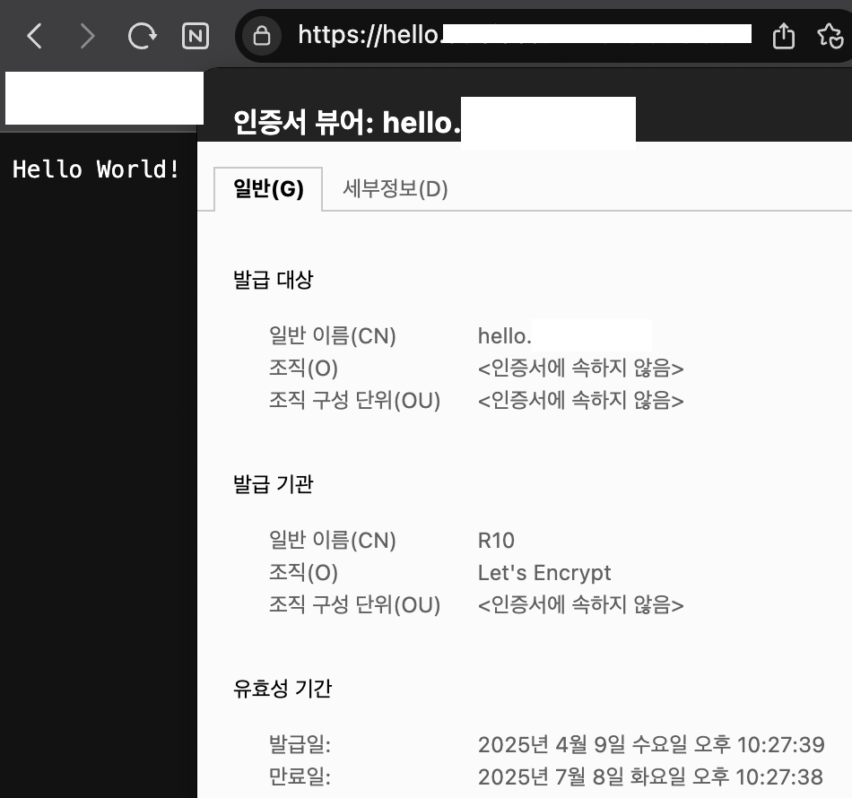

## Intro
이전 글인 [라즈베리파이4 k8s 클러스터 구축](../k8s-on-raspberry-pi/)에 이어 필요한 인프라 구성부터 CI/CD까지 시리즈로 작성할 예정입니다.

제가 AWS EC2를 처음 사용할 때도 가장 먼저 한 일이 nginx 설치와 TLS 인증서 발급이였는데, 쿠버네티스에서도 마찬가지로 이 작업을 먼저 하려고 합니다.

## MetalLB
여러 IaaS 플랫폼(AWS, GCP, Azure...)에서는 네트워크 로드밸런서를 제공하지만, 당연히 베어메탈은 그렇지 않습니다. `MetalLB`는 이름에서 알 수 있듯이,
베어메탈을 위한 로드밸런서입니다. 즉, MetalLB는 클러스터 외부에서 접근 가능한 IP 주소를 서비스에 할당하고, 해당 IP로 들어오는 트래픽을 클러스터 내부로 라우팅해줍니다.

### BGP & Layer2
MetalLB는 BGP 모드와 L2(Layer2) 모드에 따라 동작 방식이 다릅니다.
- **BGP**
1. BGP 피어링: MetalLB의 speaker pod가 외부 라우터와 BGP 피어링을 맺음.
2. 서비스 생성: LoadBalancer 타입의 Kubernetes Service를 생성하면 MetalLB가 사전에 설정된 IP 풀에서 하나의 IP(10.20.30.40) 할당.
3. L3 광고: 10.20.30.40은 MetalLB speaker Pod가 실행 중인 노드에 있다고 BGP를 통해 외부 라우터에 광고.
4. 라우팅 테이블 업데이트: 외부 라우터는 10.20.30.40 -> 해당 노드 IP로 라우팅 경로 설정.

- **L2**
1. L2 네트워크: 모든 노드가 같은 서브넷/브로드캐스트 도메인 안에 존재
2. 서비스 생성: LoadBalancer 타입의 Kubernetes Service를 생성하면 MetalLB가 사전에 설정된 IP 풀에서 하나의 IP(10.20.30.40) 할당.
3. 리더 선출: speaker pod 중 하나가 10.20.30.40의 소유자 역할을 맡음. (IP 마다 개별적으로 리더 노드 선출)
4. L2 응답: 리더 노드가 ARP/NDP 요청에 응답하여 10.20.30.40은 자신에게 있다고 알림.
이 응답을 받은 라우터나 클라이언트는 해당 MAC 주소를 ARP 캐시에 저장하고, 이후 트래픽은 해당 노드로 전달.
> 한 서비스 IP를 한 노드가 소유하여 트래픽을 받으므로, 해당 노드의 네트워크 대역폭이 곧 그 서비스의 최대 처리량이 된다는 단점이 있습니다.

### 설치
BGP 모드는 별도의 라우터 설정 등 네트워크 지식이 필요하므로 여기선 간단히 L2 모드로 설치하겠습니다.
MetalLB는 ARM 아키텍처를 지원하므로 [공식 문서의 설치 방법](https://metallb.io/installation/)을 따르면 됩니다.

**설치 환경**
- k8s v1.32
- flannel CNI([지원하는 CNI](https://metallb.universe.tf/installation/network-addons/))
- kube-proxy ipvs mode([설정 방법](https://metallb.io/installation/#preparation))

여러 설치 방법 중 manifest로 설치하였습니다.
```bash
kubectl apply -f https://raw.githubusercontent.com/metallb/metallb/v0.14.9/config/manifests/metallb-native.yaml
```
metallb-system 네임스페이스에 speaker DaemonSet이 생성되고, 각 노드마다 speaker pod가 실행됩니다.
```yaml
apiVersion: metallb.io/v1beta1
kind: IPAddressPool
metadata:
  name: ip-address-pool
  namespace: metallb-system
spec:
  addresses:
    - 192.168.219.190-192.168.219.210
  autoAssign: true
---
apiVersion: metallb.io/v1beta1
kind: L2Advertisement
metadata:
  name: layer2-advertisement
  namespace: metallb-system
spec:
  ipAddressPools:
    - ip-address-pool
```
위에서 언급한 IP 풀을 생성합니다. `autoAssign: true`를 추가하면 LoadBalancer 타입의 Service 생성 시 IP 풀에서 IP를 자동 할당 합니다.
이후에 다룰 Ingress Controller 설치 시 할당이 잘 되는지 확인해 보겠습니다.

## Ingress Controller
Ingress Controller는 Kubernetes에서 외부 트래픽을 클러스터 내부의 서비스로 라우팅하는 역할을 하는 컴포넌트입니다.
- **Ingress**: Kubernetes 리소스 중 하나로, HTTP(S) 기반의 라우팅 규칙을 정의
- **Ingress Controller**: Ingress 리소스를 실제로 동작하게 해주는 컨트롤러

[여러 Ingress Controller](https://kubernetes.io/docs/concepts/services-networking/ingress-controllers/#additional-controllers) 중 흔히 사용하는 **NGINX Ingress Controller**를 설치하겠습니다.

### 설치
[k8s 버전에 맞는 버전](https://github.com/kubernetes/ingress-nginx?tab=readme-ov-file#supported-versions-table)으로 설치해야 합니다.
Helm 또는 manifest로 설치 가능한데, 저는 manifest로 1.12.1 버전을 설치하겠습니다.
```bash
kubectl apply -f https://raw.githubusercontent.com/kubernetes/ingress-nginx/controller-v1.12.1/deploy/static/provider/cloud/deploy.yaml
```
[여러 provider](https://github.com/kubernetes/ingress-nginx/tree/main/deploy/static/provider) 중 환경에 맞는 것을 선택하면 됩니다. 이 중에 baremetal도 있습니다만, Ingress Controller의 Service 타입(LoadBalancer/NodePort) 차이 뿐입니다.
MetalLB를 설치했으므로 LoadBalancer로 정의된 cloud로 설치하였습니다.

위의 명령을 실행하면 ingres-nginx-controller Deployment가 생성되어 pod가 하나 생성된 것을 확인할 수 있습니다. replica 수를 조정하려면 Deployment의 spec.replicas를 추가해 줍니다.

MetalLB에 의해 IP 할당이 잘 되었는지 확인해 봅시다.
```bash
kubectl get svc -n ingress-nginx
NAME                                 TYPE           CLUSTER-IP       EXTERNAL-IP       PORT(S)                      AGE
ingress-nginx-controller             LoadBalancer   10.98.149.121    192.168.219.190   80:32167/TCP,443:30692/TCP   15m
```
LoadBalancer 타입으로 192.168.219.190으로 외부 아이피가 할당된 것을 볼 수 있습니다. 저는 공유기의 포트포워딩 설정을 통해 해당 IP, port를 외부로 열어주었습니다.

## cert-manager
이제 클러스터 외부에서 내부 서비스에 접속할 수 있게 되었으니, 다음 단계로 HTTPS 연결 설정을 해야 합니다. 여기선 Let's Encrypt의 TLS 인증서를 자동으로 받아서 갱신까지 해주는 cert-manager를 설치해 보겠습니다.

### 설치
1. **cert-manager 배포**
    ```bash
    kubectl apply -f https://github.com/cert-manager/cert-manager/releases/download/v1.17.0/cert-manager.yaml
    ```
    [많은 설치 방법](https://cert-manager.io/docs/installation/) 중에, [버전을 참고하여](https://cert-manager.io/docs/releases/) manifest로 1.17.0 버전을 설치하였습니다.
    설치하면 cert-manager라는 namespace와 세 컴포넌트(controller, webhook, CA Injector)를 실행합니다.
    - **controller**: 인증서 생성, 갱신, Issuer 처리
    - **webhook**: 리소스 유효성 검증(admission webhook)
    - **CA Injector**: k8s 리소스에 CA 인증서 자동 주입

2. **Issuer 생성**

    Issuer는 "어떤 방법으로, 어떤 CA에게 인증서를 발급받을 것인가"를 나타내며, 클러스터 범위로 적용하려면 ClusterIssuer를 생성합니다. 저는 클러스터 전역에서 사용할 것이므로 ClusterIssuer를 선택했습니다.
    본인 이메일, ACME 서버 URL, 키 저장용 시크릿, 그리고 챌린지(challenge) 방법(HTTP-01, DNS-01) 등을 설정합니다.
    - **HTTP-01 Challenge**: 웹 서버를 통해 확인하는 방식(와일드카드 불가능). Let's Encrypt가 지정한 임의의 토큰 값을 `http://<domain>/.well-known/acme-challenge/<token>` 경로에서 호스팅하면, CA가 해당 URL에 HTTP 요청을 보내 확인합니다.
        Ingres NGINX의 경우, cert-manager는 ingress-class에 속하는 임시 ingress를 생성해 챌린지 요청을 가로채고 solver가 응답하게 해줍니다.
    - **DNS-01 Challenge**: 웹 서버 구동 없이 DNS 레코드로 확인하는 방식(와일드카드 가능). CA가 지정한 값으로 도메인의 _acme-challenge 하위에 TXT 레코드를 생성하면 CA가 DNS 조회를 통해 확인합니다.

    제가 사용하는 DNS Provider는 자동 갱신이 불가하므로 HTTP-01 챌린지로 ClusterIssuer를 생성하겠습니다.
    ```yaml
    apiVersion: cert-manager.io/v1
    kind: ClusterIssuer
    metadata:
      name: letsencrypt
    spec:
      acme:
        email: email # 실제 알림 받을 이메일
        server: https://acme-v02.api.letsencrypt.org/directory # 프로덕션 서버(스테이징 별도)
        privateKeySecretRef:
          name: letsencrypt
        solvers:
          - http01:
              ingress:
                class: nginx # ingress class(위 방법으로 설치하면 기본값인 nginx)
    ```
    `k apply`하면 해당 ClusterIssuer CRD와 secret이 생긴 것을 확인할 수 있습니다.

3. **Ingress TLS 설정**

    테스트를 위해 매우 간단한 HTTP 서버를 배포하고 Service, Ingress 까지 생성해봅시다.
    ```yaml
    apiVersion: apps/v1
    kind: Deployment
    metadata:
      name: echo
    spec:
      replicas: 1
      selector:
        matchLabels:
          app: echo
      template:
        metadata:
          labels:
            app: echo
        spec:
          containers:
            - name: echo
              image: hashicorp/http-echo
              args:
                - "-text=Hello World!"
              ports:
                - containerPort: 5678
    ---
    apiVersion: v1
    kind: Service
    metadata:
      name: echo
    spec:
      selector:
        app: echo
      ports:
        - port: 80
          targetPort: 5678
    ---
    apiVersion: networking.k8s.io/v1
    kind: Ingress
    metadata:
      name: echo-ingress
      annotations:
        cert-manager.io/cluster-issuer: letsencrypt
    spec:
      ingressClassName: nginx
      tls:
        - hosts:
            - hello.domain.com
          secretName: hello-tls
      rules:
        - host: hello.domain.com
          http:
            paths:
              - path: /
                pathType: Prefix
                backend:
                  service:
                    name: echo
                    port:
                      number: 80
    ```
    cert-manager.io/CertificateRequest CRD를 보면 hello-tls-1의 Ready가 아직 false인 것을 볼 수 있습니다.
    와일드카드 인증서가 아니기 때문에 해당 도메인의 DNS 설정을 추가하고 브라우저에서 `https://hello.domain.com`에 접속해보면 Hello World!
    
