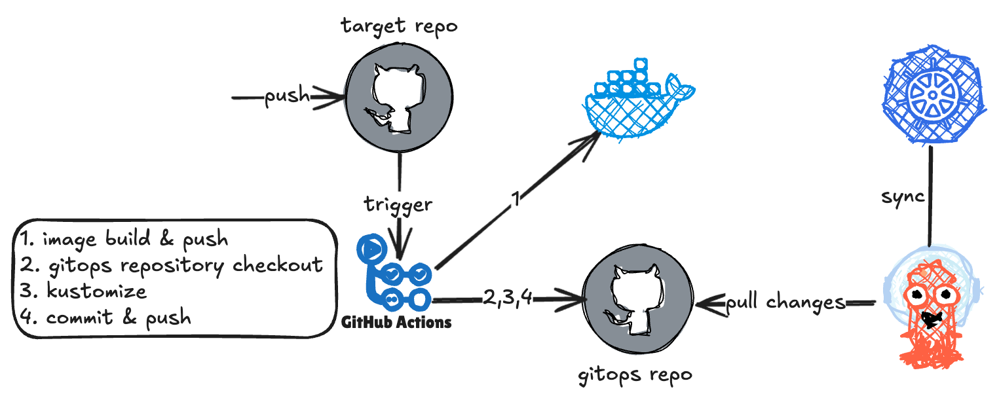
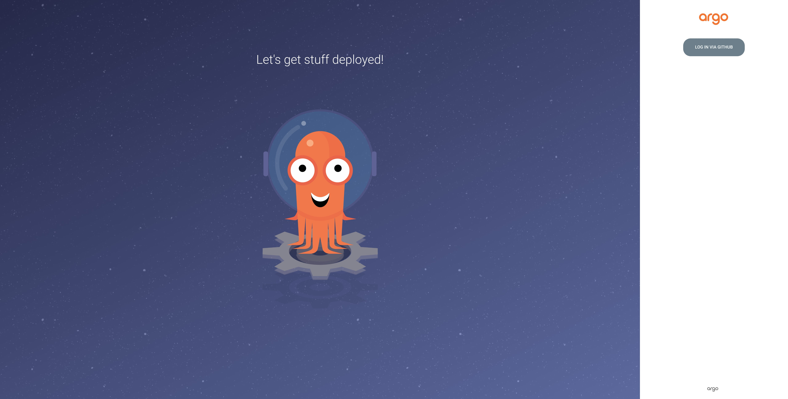
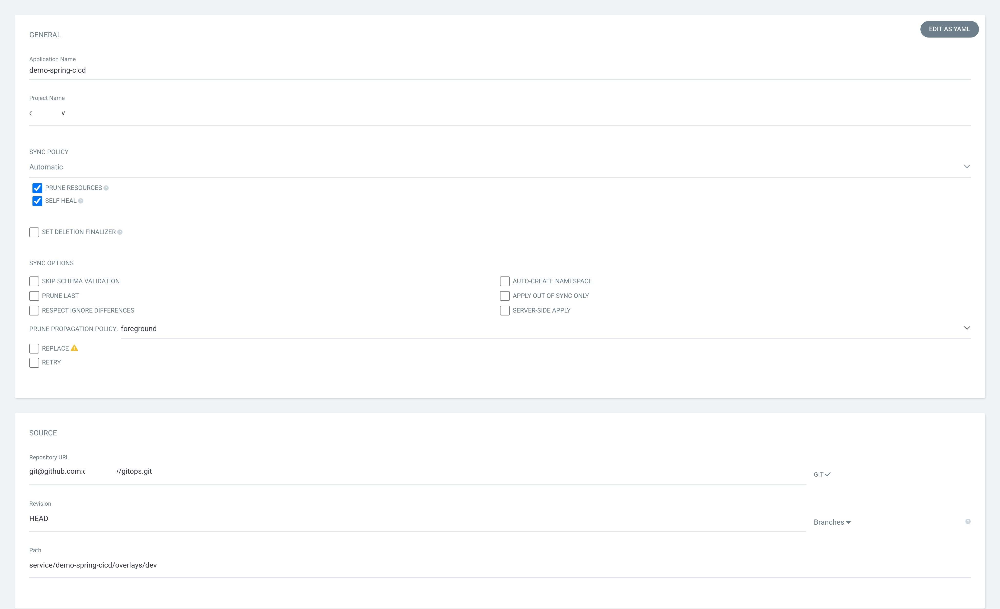
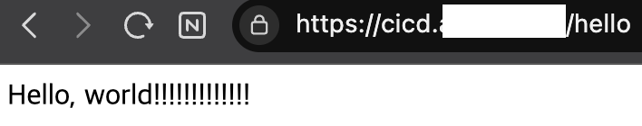

## Intro
[이전 글](../metallb-ingress-controller-and-cert-manager/)에 이어 CI/CD를 구성해 봅시다.

사용할 기술 스택은 다음과 같습니다.
- Github Action
- kustomize
- ArgoCD



## ArgoCD
> ArgoCD란 쿠버네티스 애플리케이션의 배포를 Git 저장소의 상태에 기반하여 자동으로 동기화하고 관리해 주는 도구입니다.

### ArgoCD 설치
[여러 설치 방법](https://argo-cd.readthedocs.io/en/stable/operator-manual/installation/) 중에 manifest를 이용해 설치합니다.
해당 문서를 참고하여 설치 버전을 선택해야 하는데, 저는 쿠버네티스 v1.32에 맞는 v2.14.9를 설치할 예정입니다.(https://raw.githubusercontent.com/argoproj/argo-cd/v2.14.9/manifests/install.yaml)
파일을 다운로드하고 필요한 리소스를 추가 또는 수정합니다.

보통 권한, 배포 알림 등을 수정하는데, 여기서는 간단히 github SSO를 설정하겠습니다. github token의 권한 및 생성 과정은 참고할 자료가 많아 생략합니다.

- argocd-cm
```yaml
apiVersion: v1
kind: ConfigMap
metadata:
  labels:
    app.kubernetes.io/name: argocd-cm
    app.kubernetes.io/part-of: argocd
  name: argocd-cm
  namespace: argocd
data:
  admin.enabled: "false"
  dex.config: |
    connectors:
      - type: github
        id: github
        name: GitHub
        config:
          clientID: ${GITHUB_CLIENT_ID}
          clientSecret: ${GITHUB_CLIENT_SECRET}
          loadAllGroups: true
```

- argocd-rbac-cm
```yaml
apiVersion: v1
kind: ConfigMap
metadata:
  labels:
    app.kubernetes.io/name: argocd-rbac-cm
    app.kubernetes.io/part-of: argocd
  name: argocd-rbac-cm
data:
  policy.csv: |
    g, ${GITHUB_ORGANIZATION}, role:admin
```

이제 해당 manifest와 ingress(생략)를 적용하고 접속하면 아래와 같이 깃헙 로그인 버튼만 활성화됩니다.


manifest 설치 시 생성되는 주요 pods
- argocd-server: API 서버 및 웹 UI 제공
- argocd-repo-server: git 저장소에서 애플리케이션 정의를 가져와서 최종 yaml로 변환
- argocd-application-controller: 정의된 상태(git)와 실제 상태(k8s)를 비교하고 동기화
- argocd-dex-server: 로그인 인증을 위한 OIDC provider
- argocd-redis: ArgoCD 내부 캐시 저장소
- argocd-notification-controller: slack, discord, email 등으로 배포 알림 전송

### k8s cluster 추가
쿠버네티스 클러스터를 추가하기 위해선 argocd cli를 설치해야 합니다.
[공식 문서](https://argo-cd.readthedocs.io/en/stable/cli_installation/)를 참고하여 argocd cli를 로컬에 설치합니다.

```shell
argocd login {your domain} --sso
argocd cluster add {your context}

# kube-system namespace에 리소스 생성이 불가한 경우 별도의 namespace 생성
kubectl create namespace {another namespace}
argocd cluster add {your context} --system-namespace {another namespace}
```
이제 argoCD UI에서 **Settings-Clusters** 로 가보면 해당 컨텍스트가 추가된 것을 볼 수 있습니다.

### Repositories, Projects 추가
argoCD UI의 **Settings-Repositories**에서 gitops 레포지토리를 등록합니다. SSH, HTTPS, GITHUB APP 등을 통해 등록할 수 있습니다.

**Settings-Projects**에서는 위에서 연결한 레포지토리와 클러스터를 연결한 프로젝트를 생성합니다.

### rollouts 설치
ArgoCD rollouts는 점진적 배포를 k8s 환경에서 안전하고 자동으로 수행할 수 있게 도와주는 CRDs입니다. Canary, Blue-Green 배포를 지원합니다.
자세한 설명은 [Argo Rollouts](https://argoproj.github.io/rollouts/)를 참고해 주세요.
```shell
kubectl create namespace argo-rollouts
kubectl apply -n argo-rollouts -f https://github.com/argoproj/argo-rollouts/releases/download/v1.8.2/install.yaml
```
이렇게 ArgoCD 설치 및 설정은 완료하였습니다🥳

애플리케이션 배포는 CI/CD 파이프라인 구성 후에 해보겠습니다.

## Github Actions
최상단 이미지와 같이 Github actions + ArgoCD를 통해 CI/CD 파이프라인을 구축하고 spring applciation을 blue-green 방식으로 배포해 보겠습니다.

### 서비스 애플리케이션
Dockerfile이 아닌 jib로 OCI 이미지를 생성할 것이므로 build.gradle.kts 에 아래와 같이 정의합니다.
```kotlin
plugins {
    id("com.google.cloud.tools.jib") version "3.4.5"
}

dependencies {
    implementation("org.springframework.boot:spring-boot-starter-web")
    implementation("org.springframework.boot:spring-boot-starter-actuator") // health check
}

jib {
    val username = project.findProperty("username").toString()
    val password = project.findProperty("password").toString()
    val image = project.findProperty("image").toString()
    val tag = project.findProperty("tag").toString()

    from {
        this.image = "eclipse-temurin:21-jre-jammy"
        platforms {
            platform {
                architecture = "arm64"
                os = "linux"
            }
        }
    }

    to {
        this.image = image
        this.tags = setOf(tag)
        auth {
            this.username = username
            this.password = password
        }
    }

    container {
        format = com.google.cloud.tools.jib.api.buildplan.ImageFormat.OCI
        ports = listOf("8080")
        workingDirectory = "/app"
    }
}
```

.github/workflows 하위 디렉토리에 워크플로우 yaml 파일을 생성합니다.
```yaml
name: CI/CD dev

on:
  push:
    branches: ["develop"]

env:
  PHASE: dev
  REGISTRY_TAG: dev-${{ github.run_number }}-${{ github.run_attempt }}
  REGISTRY_IMAGE: ghcr.io/${{ github.repository }} # github registry

jobs:
  build-api:
    runs-on: ubuntu-latest
    env:
      SERVICE_NAME: ${{ github.event.repository.name }} # demo-spring-cicd
    steps:
      - uses: actions/checkout@v4
      - uses: actions/setup-java@v4
        with:
          distribution: 'temurin'
          java-version: '21'

      - name: Gradle jib # github repository Settings-Actions secrets and variables-Repository secrets 등록
        run: ./gradlew jib -P username=${{ secrets.REGISTRY_USERNAME }} -P password=${{ secrets.REGISTRY_PASSWORD }} -P image=${{ env.REGISTRY_IMAGE }} -P tag=${{ env.REGISTRY_TAG }}

      - name: Setup Kustomize # shell script에서 사용할 kustomize 툴 설정
        uses: imranismail/setup-kustomize@v2

      - name: Checkout Gitops Repository # gitops 레포지토리 체크아웃
        uses: actions/checkout@v4
        with:
          repository: ${{ github.repository_owner }}/gitops
          ref: main
          token: ${{ secrets.GH_TOKEN }}
          path: gitops

      - name: Execute Shell Script # 셸 스크립트에 세 개 인자 전달하여 실행(kustomize로 이미지 태그 변경)
        run: |
          ./gitops/.github-actions/deploy.sh ${{ env.SERVICE_NAME }} ${{ env.PHASE }} ${{ env.REGISTRY_IMAGE }}:${{ env.REGISTRY_TAG }}

      - name: Git Commit & Push # 태그 수정 반영하여 커밋 푸시
        run: |
          cd gitops
          git config user.name "GITHUB_ACTION"
          git config user.email "github-action@github.com"
          git commit -am "updated by GITHUB_ACTION(${{ env.SERVICE_NAME }}:${{ env.REGISTRY_TAG }})"
          git push -u origin main
```

### gitops
#### 프로젝트 구조
```text
.
├── .github-actions
│   └── deploy.sh
└── service
    ├── demo-spring-cicd
    │   ├── base
    │   │   ├── kustomization.yaml
    │   │   ├── rollout.yaml
    │   │   └── service.yaml
    │   └── overlays
    │       └── dev
    │           ├── ingress.yaml
    │           └── kustomization.yaml
```

#### deploy.sh
상단 github actions workflow 내 셸 스크립트 실행 스텝에서 사용하는 스크립트입니다.
인자를 통해 해당 디렉토리로 이동하여 이미지 태그를 변경합니다.
```shell
#!/usr/bin/env bash

set -e

SERVICE_NAME="$1"
PHASE="$2"
IMAGE_URL="$3"

if [[ -z "$SERVICE_NAME" || -z "$PHASE" || -z "$IMAGE_URL" ]]; then
  echo "Usage: $0 <service-name> <phase> <image-url>"
  exit 1
fi

CURRENT_PATH="$(cd "$(dirname "$0")" && pwd)"

cd "$CURRENT_PATH/../service/$SERVICE_NAME/overlays/$PHASE" || exit 1

echo "Deploy PHASE: $PHASE"
echo "Working directory: $(pwd)"
echo "Setting image to: $IMAGE_URL"

kustomize edit set image "$IMAGE_URL"
```

#### base/kustomization.yaml
kustomize를 통해 상위에서 재사용 가능한 공통 리소스를 정의합니다.
```yaml
apiVersion: kustomize.config.k8s.io/v1beta1
kind: Kustomization
resources:
  - rollout.yaml
  - service.yaml
```

#### base/rollout.yaml
Argo Rollouts를 이용한 블루-그린 배포 전략을 정의한 manifest입니다.
readiness/liveness probe, 리소스 제한, 배포 전략 등을 포함합니다.
```yaml
apiVersion: argoproj.io/v1alpha1
kind: Rollout
metadata:
  name: demo-spring-cicd
spec:
  replicas: 1
  revisionHistoryLimit: 3
  rollbackWindow:
    revisions: 3
  progressDeadlineSeconds: 300
  selector:
    matchLabels:
      app: demo-spring-cicd
  template:
    metadata:
      labels:
        app: demo-spring-cicd
    spec:
      imagePullSecrets:
        - name: ghcr-secret # docker-registry secret을 미리 생성해야 합니다
      containers:
        - name: demo-spring-cicd
          image: ghcr.io/code-b-dev/demo-spring-cicd:latest
          imagePullPolicy: IfNotPresent
          ports:
            - containerPort: 8080
          readinessProbe:
            httpGet:
              path: /actuator/health/readiness
              port: 8080
            initialDelaySeconds: 60
            periodSeconds: 30
            successThreshold: 1
            failureThreshold: 3
            timeoutSeconds: 2
          livenessProbe:
            httpGet:
              path: /actuator/health/liveness
              port: 8080
            initialDelaySeconds: 60
            periodSeconds: 30
            successThreshold: 1
            failureThreshold: 3
            timeoutSeconds: 2
          resources:
            requests:
              memory: 2G
              cpu: 1
            limits:
              memory: 2G
              cpu: 1
      dnsPolicy: ClusterFirst
      restartPolicy: Always
  strategy:
    blueGreen: # blue-green 배포 전략
      activeService: demo-spring-cicd
      autoPromotionEnabled: true
```

#### /base/service.yaml
ClusterIP 타입의 서비스
```yaml
apiVersion: v1
kind: Service
metadata:
  name: demo-spring-cicd
  namespace: backend
  labels:
    app: demo-spring-cicd
spec:
  type: ClusterIP
  ports:
    - port: 80
      targetPort: 8080
      protocol: TCP
      name: http
  selector:
    app: demo-spring-cicd
```

#### /overlays/dev/ingress.yaml
TLS 설정을 포함한 인그레스
```yaml
apiVersion: networking.k8s.io/v1
kind: Ingress
metadata:
  name: demo-spring-cicd
  namespace: backend
  annotations:
    cert-manager.io/cluster-issuer: letsencrypt
    nginx.ingress.kubernetes.io/ssl-redirect: "false"
spec:
  ingressClassName: nginx
  rules:
    - host: {host}
      http:
        paths:
          - path: /
            pathType: Prefix
            backend:
              service:
                name: demo-spring-cicd
                port:
                  name: http
  tls:
    - secretName: demo-spring-cicd-tls
      hosts:
        - cicd.xxx.xxx
```

#### /overlays/dev/kustomization.yaml
dev 환경 오버레이 설정. base를 불러오고 리소스 제한 등을 수정합니다.
```yaml
apiVersion: kustomize.config.k8s.io/v1beta1
kind: Kustomization
namespace: backend

resources:
- ../../base
- ingress.yaml

images:
- name: ghcr.io/code-b-dev/demo-spring-cicd
  newTag: dev-1-1

patches:
- patch: |-
    - op: replace
      path: /spec/replicas
      value: 1
    - op: replace
      path: /spec/template/spec/containers/0/resources/requests/memory
      value: 2G
    - op: replace
      path: /spec/template/spec/containers/0/resources/requests/cpu
      value: 1
    - op: replace
      path: /spec/template/spec/containers/0/resources/limits/memory
      value: 2G
    - op: replace
      path: /spec/template/spec/containers/0/resources/limits/cpu
      value: 1
  target: # patch target
    kind: Rollout
    name: demo-spring-cicd
```

## 배포
gitops 코드 반영도 끝났으니 이제 ArgoCD에 Application을 추가하여 배포해 보겠습니다.
<mark>NEW APP</mark> 버튼을 눌러서 아래와 같이 내용을 채워줍니다.



애플리케이션을 생성하면 관련된 모든 리소스를 한눈에 볼 수 있습니다.


배포 후 미리 만들어둔 api path로 접속하면


이제 CI/CD 파이프라인이 잘 동작하는지 확인하기 위해 develop 브랜치에 새 커밋을 push하고 접속하면 변경된 것을 확인할 수 있습니다~


